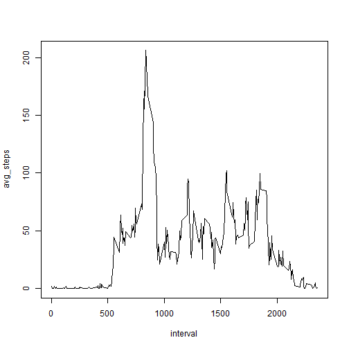
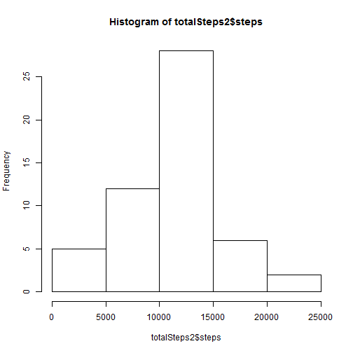
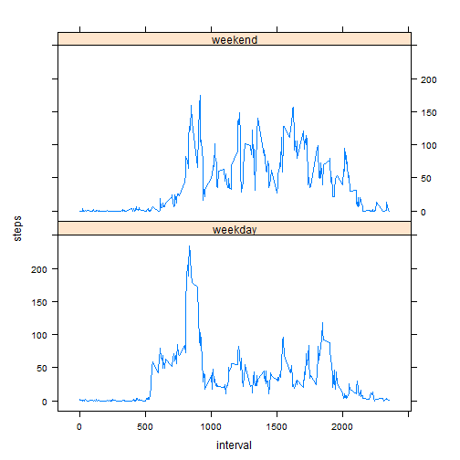

```r
library(knitr)
```

## Loading and preprocessing the data

### 1. Load the data (i.e. read.csv())


```r
activity = read.csv("~/repdata-data-activity/activity.csv")
```

### 2. Process/transform the data (if necessary) into a format suitable for your analysis


## What is mean total number of steps taken per day?

### 1. Calculate the total number of steps taken per day


```r
totalSteps <- aggregate(steps ~ date, data = activity, sum, na.rm = TRUE)
totalSteps
```

```
##          date steps
## 1  2012-10-02   126
## 2  2012-10-03 11352
## 3  2012-10-04 12116
## 4  2012-10-05 13294
## 5  2012-10-06 15420
## 6  2012-10-07 11015
## 7  2012-10-09 12811
## 8  2012-10-10  9900
## 9  2012-10-11 10304
## 10 2012-10-12 17382
## 11 2012-10-13 12426
## 12 2012-10-14 15098
## 13 2012-10-15 10139
## 14 2012-10-16 15084
## 15 2012-10-17 13452
## 16 2012-10-18 10056
## 17 2012-10-19 11829
## 18 2012-10-20 10395
## 19 2012-10-21  8821
## 20 2012-10-22 13460
## 21 2012-10-23  8918
## 22 2012-10-24  8355
## 23 2012-10-25  2492
## 24 2012-10-26  6778
## 25 2012-10-27 10119
## 26 2012-10-28 11458
## 27 2012-10-29  5018
## 28 2012-10-30  9819
## 29 2012-10-31 15414
## 30 2012-11-02 10600
## 31 2012-11-03 10571
## 32 2012-11-05 10439
## 33 2012-11-06  8334
## 34 2012-11-07 12883
## 35 2012-11-08  3219
## 36 2012-11-11 12608
## 37 2012-11-12 10765
## 38 2012-11-13  7336
## 39 2012-11-15    41
## 40 2012-11-16  5441
## 41 2012-11-17 14339
## 42 2012-11-18 15110
## 43 2012-11-19  8841
## 44 2012-11-20  4472
## 45 2012-11-21 12787
## 46 2012-11-22 20427
## 47 2012-11-23 21194
## 48 2012-11-24 14478
## 49 2012-11-25 11834
## 50 2012-11-26 11162
## 51 2012-11-27 13646
## 52 2012-11-28 10183
## 53 2012-11-29  7047
```

### 2. If you do not understand the difference between a histogram and a barplot, research the difference between them. Make a histogram of the total number of steps taken each day

```r
hist(totalSteps$steps)
```

 

### 3. Calculate and report the mean and median of the total number of steps taken per day

```r
mean(totalSteps$steps)
```

```
## [1] 10766.19
```

The mean of the total number of steps taken per day is **10766.19**.


```r
median(totalSteps$steps)
```

```
## [1] 10765
```

The median of the total number of steps taken per day is **10765**.


## What is the average daily activity pattern?

### 1. Make a time series plot (i.e. type = "l") of the 5-minute interval (x-axis) and the average number of steps taken, averaged across all days (y-axis)

```r
library(dplyr)
intervalSteps <- group_by(activity, interval) %>% summarize(avg_steps = mean(steps, na.rm = TRUE))
with(intervalSteps, plot(interval, avg_steps, type = "l"))
```

 

### 2. Which 5-minute interval, on average across all the days in the dataset, contains the maximum number of steps?

```r
intervalSteps[which.max(intervalSteps$avg_steps), ]
```

```
## Source: local data frame [1 x 2]
## 
##   interval avg_steps
## 1      835  206.1698
```

Interval **835** contains the maximum number of steps (206.1698) on average across all the days in the dataset.


## Imputing missing values

### 1. Calculate and report the total number of missing values in the dataset (i.e. the total number of rows with NAs)

```r
sum(is.na(activity$steps))
```

```
## [1] 2304
```
Total 2304 rows are missing.


### 2. Devise a strategy for filling in all of the missing values in the dataset. The strategy does not need to be sophisticated. For example, you could use the mean/median for that day, or the mean for that 5-minute interval, etc.

I picked the strategy of replacing NA's with the mean for that 5-minute interval. First of all, I made a function "interval2steps" to get the mean steps for particular 5-minute interval.

```r
interval2steps <- function(interval) {
    intervalSteps[intervalSteps$interval == interval, ]$steps
}
```


### 3. Create a new dataset that is equal to the original dataset but with the missing data filled in.

```r
activity_imputed <- activity  # Make a new dataset with the original data
count = 0  # Count the number of data imputed
for (i in 1:nrow(activity_imputed)) {
    if (is.na(activity_imputed[i, ]$steps)) {
        activity_imputed[i, ]$steps <- interval2steps(activity_imputed[i, ]$interval)
        count = count + 1
    }
}
```

```
## Warning in `[<-.factor`(`*tmp*`, iseq, value = 0L): invalid factor level,
## NA generated
```

```
## Warning in `[<-.factor`(`*tmp*`, iseq, value = 5L): invalid factor level,
## NA generated
```

```
## Warning in `[<-.factor`(`*tmp*`, iseq, value = 10L): invalid factor level,
## NA generated
```

```
## Warning in `[<-.factor`(`*tmp*`, iseq, value = 15L): invalid factor level,
## NA generated
```

```
## Warning in `[<-.factor`(`*tmp*`, iseq, value = 20L): invalid factor level,
## NA generated
```

```
## Warning in `[<-.factor`(`*tmp*`, iseq, value = 25L): invalid factor level,
## NA generated
```

```
## Warning in `[<-.factor`(`*tmp*`, iseq, value = 30L): invalid factor level,
## NA generated
```

```
## Warning in `[<-.factor`(`*tmp*`, iseq, value = 35L): invalid factor level,
## NA generated
```

```
## Warning in `[<-.factor`(`*tmp*`, iseq, value = 40L): invalid factor level,
## NA generated
```

```
## Warning in `[<-.factor`(`*tmp*`, iseq, value = 45L): invalid factor level,
## NA generated
```

```
## Warning in `[<-.factor`(`*tmp*`, iseq, value = 50L): invalid factor level,
## NA generated
```

```
## Warning in `[<-.factor`(`*tmp*`, iseq, value = 55L): invalid factor level,
## NA generated
```

```
## Warning in `[<-.factor`(`*tmp*`, iseq, value = 100L): invalid factor level,
## NA generated
```

```
## Warning in `[<-.factor`(`*tmp*`, iseq, value = 105L): invalid factor level,
## NA generated
```

```
## Warning in `[<-.factor`(`*tmp*`, iseq, value = 110L): invalid factor level,
## NA generated
```

```
## Warning in `[<-.factor`(`*tmp*`, iseq, value = 115L): invalid factor level,
## NA generated
```

```
## Warning in `[<-.factor`(`*tmp*`, iseq, value = 120L): invalid factor level,
## NA generated
```

```
## Warning in `[<-.factor`(`*tmp*`, iseq, value = 125L): invalid factor level,
## NA generated
```

```
## Warning in `[<-.factor`(`*tmp*`, iseq, value = 130L): invalid factor level,
## NA generated
```

```
## Warning in `[<-.factor`(`*tmp*`, iseq, value = 135L): invalid factor level,
## NA generated
```

```
## Warning in `[<-.factor`(`*tmp*`, iseq, value = 140L): invalid factor level,
## NA generated
```

```
## Warning in `[<-.factor`(`*tmp*`, iseq, value = 145L): invalid factor level,
## NA generated
```

```
## Warning in `[<-.factor`(`*tmp*`, iseq, value = 150L): invalid factor level,
## NA generated
```

```
## Warning in `[<-.factor`(`*tmp*`, iseq, value = 155L): invalid factor level,
## NA generated
```

```
## Warning in `[<-.factor`(`*tmp*`, iseq, value = 200L): invalid factor level,
## NA generated
```

```
## Warning in `[<-.factor`(`*tmp*`, iseq, value = 205L): invalid factor level,
## NA generated
```

```
## Warning in `[<-.factor`(`*tmp*`, iseq, value = 210L): invalid factor level,
## NA generated
```

```
## Warning in `[<-.factor`(`*tmp*`, iseq, value = 215L): invalid factor level,
## NA generated
```

```
## Warning in `[<-.factor`(`*tmp*`, iseq, value = 220L): invalid factor level,
## NA generated
```

```
## Warning in `[<-.factor`(`*tmp*`, iseq, value = 225L): invalid factor level,
## NA generated
```

```
## Warning in `[<-.factor`(`*tmp*`, iseq, value = 230L): invalid factor level,
## NA generated
```

```
## Warning in `[<-.factor`(`*tmp*`, iseq, value = 235L): invalid factor level,
## NA generated
```

```
## Warning in `[<-.factor`(`*tmp*`, iseq, value = 240L): invalid factor level,
## NA generated
```

```
## Warning in `[<-.factor`(`*tmp*`, iseq, value = 245L): invalid factor level,
## NA generated
```

```
## Warning in `[<-.factor`(`*tmp*`, iseq, value = 250L): invalid factor level,
## NA generated
```

```
## Warning in `[<-.factor`(`*tmp*`, iseq, value = 255L): invalid factor level,
## NA generated
```

```
## Warning in `[<-.factor`(`*tmp*`, iseq, value = 300L): invalid factor level,
## NA generated
```

```
## Warning in `[<-.factor`(`*tmp*`, iseq, value = 305L): invalid factor level,
## NA generated
```

```
## Warning in `[<-.factor`(`*tmp*`, iseq, value = 310L): invalid factor level,
## NA generated
```

```
## Warning in `[<-.factor`(`*tmp*`, iseq, value = 315L): invalid factor level,
## NA generated
```

```
## Warning in `[<-.factor`(`*tmp*`, iseq, value = 320L): invalid factor level,
## NA generated
```

```
## Warning in `[<-.factor`(`*tmp*`, iseq, value = 325L): invalid factor level,
## NA generated
```

```
## Warning in `[<-.factor`(`*tmp*`, iseq, value = 330L): invalid factor level,
## NA generated
```

```
## Warning in `[<-.factor`(`*tmp*`, iseq, value = 335L): invalid factor level,
## NA generated
```

```
## Warning in `[<-.factor`(`*tmp*`, iseq, value = 340L): invalid factor level,
## NA generated
```

```
## Warning in `[<-.factor`(`*tmp*`, iseq, value = 345L): invalid factor level,
## NA generated
```

```
## Warning in `[<-.factor`(`*tmp*`, iseq, value = 350L): invalid factor level,
## NA generated
```

```
## Warning in `[<-.factor`(`*tmp*`, iseq, value = 355L): invalid factor level,
## NA generated
```

```
## Warning in `[<-.factor`(`*tmp*`, iseq, value = 400L): invalid factor level,
## NA generated
```

```
## Warning in `[<-.factor`(`*tmp*`, iseq, value = 405L): invalid factor level,
## NA generated
```

```
## Warning in `[<-.factor`(`*tmp*`, iseq, value = 410L): invalid factor level,
## NA generated
```

```
## Warning in `[<-.factor`(`*tmp*`, iseq, value = 415L): invalid factor level,
## NA generated
```

```
## Warning in `[<-.factor`(`*tmp*`, iseq, value = 420L): invalid factor level,
## NA generated
```

```
## Warning in `[<-.factor`(`*tmp*`, iseq, value = 425L): invalid factor level,
## NA generated
```

```
## Warning in `[<-.factor`(`*tmp*`, iseq, value = 430L): invalid factor level,
## NA generated
```

```
## Warning in `[<-.factor`(`*tmp*`, iseq, value = 435L): invalid factor level,
## NA generated
```

```
## Warning in `[<-.factor`(`*tmp*`, iseq, value = 440L): invalid factor level,
## NA generated
```

```
## Warning in `[<-.factor`(`*tmp*`, iseq, value = 445L): invalid factor level,
## NA generated
```

```
## Warning in `[<-.factor`(`*tmp*`, iseq, value = 450L): invalid factor level,
## NA generated
```

```
## Warning in `[<-.factor`(`*tmp*`, iseq, value = 455L): invalid factor level,
## NA generated
```

```
## Warning in `[<-.factor`(`*tmp*`, iseq, value = 500L): invalid factor level,
## NA generated
```

```
## Warning in `[<-.factor`(`*tmp*`, iseq, value = 505L): invalid factor level,
## NA generated
```

```
## Warning in `[<-.factor`(`*tmp*`, iseq, value = 510L): invalid factor level,
## NA generated
```

```
## Warning in `[<-.factor`(`*tmp*`, iseq, value = 515L): invalid factor level,
## NA generated
```

```
## Warning in `[<-.factor`(`*tmp*`, iseq, value = 520L): invalid factor level,
## NA generated
```

```
## Warning in `[<-.factor`(`*tmp*`, iseq, value = 525L): invalid factor level,
## NA generated
```

```
## Warning in `[<-.factor`(`*tmp*`, iseq, value = 530L): invalid factor level,
## NA generated
```

```
## Warning in `[<-.factor`(`*tmp*`, iseq, value = 535L): invalid factor level,
## NA generated
```

```
## Warning in `[<-.factor`(`*tmp*`, iseq, value = 540L): invalid factor level,
## NA generated
```

```
## Warning in `[<-.factor`(`*tmp*`, iseq, value = 545L): invalid factor level,
## NA generated
```

```
## Warning in `[<-.factor`(`*tmp*`, iseq, value = 550L): invalid factor level,
## NA generated
```

```
## Warning in `[<-.factor`(`*tmp*`, iseq, value = 555L): invalid factor level,
## NA generated
```

```
## Warning in `[<-.factor`(`*tmp*`, iseq, value = 600L): invalid factor level,
## NA generated
```

```
## Warning in `[<-.factor`(`*tmp*`, iseq, value = 605L): invalid factor level,
## NA generated
```

```
## Warning in `[<-.factor`(`*tmp*`, iseq, value = 610L): invalid factor level,
## NA generated
```

```
## Warning in `[<-.factor`(`*tmp*`, iseq, value = 615L): invalid factor level,
## NA generated
```

```
## Warning in `[<-.factor`(`*tmp*`, iseq, value = 620L): invalid factor level,
## NA generated
```

```
## Warning in `[<-.factor`(`*tmp*`, iseq, value = 625L): invalid factor level,
## NA generated
```

```
## Warning in `[<-.factor`(`*tmp*`, iseq, value = 630L): invalid factor level,
## NA generated
```

```
## Warning in `[<-.factor`(`*tmp*`, iseq, value = 635L): invalid factor level,
## NA generated
```

```
## Warning in `[<-.factor`(`*tmp*`, iseq, value = 640L): invalid factor level,
## NA generated
```

```
## Warning in `[<-.factor`(`*tmp*`, iseq, value = 645L): invalid factor level,
## NA generated
```

```
## Warning in `[<-.factor`(`*tmp*`, iseq, value = 650L): invalid factor level,
## NA generated
```

```
## Warning in `[<-.factor`(`*tmp*`, iseq, value = 655L): invalid factor level,
## NA generated
```

```
## Warning in `[<-.factor`(`*tmp*`, iseq, value = 700L): invalid factor level,
## NA generated
```

```
## Warning in `[<-.factor`(`*tmp*`, iseq, value = 705L): invalid factor level,
## NA generated
```

```
## Warning in `[<-.factor`(`*tmp*`, iseq, value = 710L): invalid factor level,
## NA generated
```

```
## Warning in `[<-.factor`(`*tmp*`, iseq, value = 715L): invalid factor level,
## NA generated
```

```
## Warning in `[<-.factor`(`*tmp*`, iseq, value = 720L): invalid factor level,
## NA generated
```

```
## Warning in `[<-.factor`(`*tmp*`, iseq, value = 725L): invalid factor level,
## NA generated
```

```
## Warning in `[<-.factor`(`*tmp*`, iseq, value = 730L): invalid factor level,
## NA generated
```

```
## Warning in `[<-.factor`(`*tmp*`, iseq, value = 735L): invalid factor level,
## NA generated
```

```
## Warning in `[<-.factor`(`*tmp*`, iseq, value = 740L): invalid factor level,
## NA generated
```

```
## Warning in `[<-.factor`(`*tmp*`, iseq, value = 745L): invalid factor level,
## NA generated
```

```
## Warning in `[<-.factor`(`*tmp*`, iseq, value = 750L): invalid factor level,
## NA generated
```

```
## Warning in `[<-.factor`(`*tmp*`, iseq, value = 755L): invalid factor level,
## NA generated
```

```
## Warning in `[<-.factor`(`*tmp*`, iseq, value = 800L): invalid factor level,
## NA generated
```

```
## Warning in `[<-.factor`(`*tmp*`, iseq, value = 805L): invalid factor level,
## NA generated
```

```
## Warning in `[<-.factor`(`*tmp*`, iseq, value = 810L): invalid factor level,
## NA generated
```

```
## Warning in `[<-.factor`(`*tmp*`, iseq, value = 815L): invalid factor level,
## NA generated
```

```
## Warning in `[<-.factor`(`*tmp*`, iseq, value = 820L): invalid factor level,
## NA generated
```

```
## Warning in `[<-.factor`(`*tmp*`, iseq, value = 825L): invalid factor level,
## NA generated
```

```
## Warning in `[<-.factor`(`*tmp*`, iseq, value = 830L): invalid factor level,
## NA generated
```

```
## Warning in `[<-.factor`(`*tmp*`, iseq, value = 835L): invalid factor level,
## NA generated
```

```
## Warning in `[<-.factor`(`*tmp*`, iseq, value = 840L): invalid factor level,
## NA generated
```

```
## Warning in `[<-.factor`(`*tmp*`, iseq, value = 845L): invalid factor level,
## NA generated
```

```
## Warning in `[<-.factor`(`*tmp*`, iseq, value = 850L): invalid factor level,
## NA generated
```

```
## Warning in `[<-.factor`(`*tmp*`, iseq, value = 855L): invalid factor level,
## NA generated
```

```
## Warning in `[<-.factor`(`*tmp*`, iseq, value = 900L): invalid factor level,
## NA generated
```

```
## Warning in `[<-.factor`(`*tmp*`, iseq, value = 905L): invalid factor level,
## NA generated
```

```
## Warning in `[<-.factor`(`*tmp*`, iseq, value = 910L): invalid factor level,
## NA generated
```

```
## Warning in `[<-.factor`(`*tmp*`, iseq, value = 915L): invalid factor level,
## NA generated
```

```
## Warning in `[<-.factor`(`*tmp*`, iseq, value = 920L): invalid factor level,
## NA generated
```

```
## Warning in `[<-.factor`(`*tmp*`, iseq, value = 925L): invalid factor level,
## NA generated
```

```
## Warning in `[<-.factor`(`*tmp*`, iseq, value = 930L): invalid factor level,
## NA generated
```

```
## Warning in `[<-.factor`(`*tmp*`, iseq, value = 935L): invalid factor level,
## NA generated
```

```
## Warning in `[<-.factor`(`*tmp*`, iseq, value = 940L): invalid factor level,
## NA generated
```

```
## Warning in `[<-.factor`(`*tmp*`, iseq, value = 945L): invalid factor level,
## NA generated
```

```
## Warning in `[<-.factor`(`*tmp*`, iseq, value = 950L): invalid factor level,
## NA generated
```

```
## Warning in `[<-.factor`(`*tmp*`, iseq, value = 955L): invalid factor level,
## NA generated
```

```
## Warning in `[<-.factor`(`*tmp*`, iseq, value = 1000L): invalid factor
## level, NA generated
```

```
## Warning in `[<-.factor`(`*tmp*`, iseq, value = 1005L): invalid factor
## level, NA generated
```

```
## Warning in `[<-.factor`(`*tmp*`, iseq, value = 1010L): invalid factor
## level, NA generated
```

```
## Warning in `[<-.factor`(`*tmp*`, iseq, value = 1015L): invalid factor
## level, NA generated
```

```
## Warning in `[<-.factor`(`*tmp*`, iseq, value = 1020L): invalid factor
## level, NA generated
```

```
## Warning in `[<-.factor`(`*tmp*`, iseq, value = 1025L): invalid factor
## level, NA generated
```

```
## Warning in `[<-.factor`(`*tmp*`, iseq, value = 1030L): invalid factor
## level, NA generated
```

```
## Warning in `[<-.factor`(`*tmp*`, iseq, value = 1035L): invalid factor
## level, NA generated
```

```
## Warning in `[<-.factor`(`*tmp*`, iseq, value = 1040L): invalid factor
## level, NA generated
```

```
## Warning in `[<-.factor`(`*tmp*`, iseq, value = 1045L): invalid factor
## level, NA generated
```

```
## Warning in `[<-.factor`(`*tmp*`, iseq, value = 1050L): invalid factor
## level, NA generated
```

```
## Warning in `[<-.factor`(`*tmp*`, iseq, value = 1055L): invalid factor
## level, NA generated
```

```
## Warning in `[<-.factor`(`*tmp*`, iseq, value = 1100L): invalid factor
## level, NA generated
```

```
## Warning in `[<-.factor`(`*tmp*`, iseq, value = 1105L): invalid factor
## level, NA generated
```

```
## Warning in `[<-.factor`(`*tmp*`, iseq, value = 1110L): invalid factor
## level, NA generated
```

```
## Warning in `[<-.factor`(`*tmp*`, iseq, value = 1115L): invalid factor
## level, NA generated
```

```
## Warning in `[<-.factor`(`*tmp*`, iseq, value = 1120L): invalid factor
## level, NA generated
```

```
## Warning in `[<-.factor`(`*tmp*`, iseq, value = 1125L): invalid factor
## level, NA generated
```

```
## Warning in `[<-.factor`(`*tmp*`, iseq, value = 1130L): invalid factor
## level, NA generated
```

```
## Warning in `[<-.factor`(`*tmp*`, iseq, value = 1135L): invalid factor
## level, NA generated
```

```
## Warning in `[<-.factor`(`*tmp*`, iseq, value = 1140L): invalid factor
## level, NA generated
```

```
## Warning in `[<-.factor`(`*tmp*`, iseq, value = 1145L): invalid factor
## level, NA generated
```

```
## Warning in `[<-.factor`(`*tmp*`, iseq, value = 1150L): invalid factor
## level, NA generated
```

```
## Warning in `[<-.factor`(`*tmp*`, iseq, value = 1155L): invalid factor
## level, NA generated
```

```
## Warning in `[<-.factor`(`*tmp*`, iseq, value = 1200L): invalid factor
## level, NA generated
```

```
## Warning in `[<-.factor`(`*tmp*`, iseq, value = 1205L): invalid factor
## level, NA generated
```

```
## Warning in `[<-.factor`(`*tmp*`, iseq, value = 1210L): invalid factor
## level, NA generated
```

```
## Warning in `[<-.factor`(`*tmp*`, iseq, value = 1215L): invalid factor
## level, NA generated
```

```
## Warning in `[<-.factor`(`*tmp*`, iseq, value = 1220L): invalid factor
## level, NA generated
```

```
## Warning in `[<-.factor`(`*tmp*`, iseq, value = 1225L): invalid factor
## level, NA generated
```

```
## Warning in `[<-.factor`(`*tmp*`, iseq, value = 1230L): invalid factor
## level, NA generated
```

```
## Warning in `[<-.factor`(`*tmp*`, iseq, value = 1235L): invalid factor
## level, NA generated
```

```
## Warning in `[<-.factor`(`*tmp*`, iseq, value = 1240L): invalid factor
## level, NA generated
```

```
## Warning in `[<-.factor`(`*tmp*`, iseq, value = 1245L): invalid factor
## level, NA generated
```

```
## Warning in `[<-.factor`(`*tmp*`, iseq, value = 1250L): invalid factor
## level, NA generated
```

```
## Warning in `[<-.factor`(`*tmp*`, iseq, value = 1255L): invalid factor
## level, NA generated
```

```
## Warning in `[<-.factor`(`*tmp*`, iseq, value = 1300L): invalid factor
## level, NA generated
```

```
## Warning in `[<-.factor`(`*tmp*`, iseq, value = 1305L): invalid factor
## level, NA generated
```

```
## Warning in `[<-.factor`(`*tmp*`, iseq, value = 1310L): invalid factor
## level, NA generated
```

```
## Warning in `[<-.factor`(`*tmp*`, iseq, value = 1315L): invalid factor
## level, NA generated
```

```
## Warning in `[<-.factor`(`*tmp*`, iseq, value = 1320L): invalid factor
## level, NA generated
```

```
## Warning in `[<-.factor`(`*tmp*`, iseq, value = 1325L): invalid factor
## level, NA generated
```

```
## Warning in `[<-.factor`(`*tmp*`, iseq, value = 1330L): invalid factor
## level, NA generated
```

```
## Warning in `[<-.factor`(`*tmp*`, iseq, value = 1335L): invalid factor
## level, NA generated
```

```
## Warning in `[<-.factor`(`*tmp*`, iseq, value = 1340L): invalid factor
## level, NA generated
```

```
## Warning in `[<-.factor`(`*tmp*`, iseq, value = 1345L): invalid factor
## level, NA generated
```

```
## Warning in `[<-.factor`(`*tmp*`, iseq, value = 1350L): invalid factor
## level, NA generated
```

```
## Warning in `[<-.factor`(`*tmp*`, iseq, value = 1355L): invalid factor
## level, NA generated
```

```
## Warning in `[<-.factor`(`*tmp*`, iseq, value = 1400L): invalid factor
## level, NA generated
```

```
## Warning in `[<-.factor`(`*tmp*`, iseq, value = 1405L): invalid factor
## level, NA generated
```

```
## Warning in `[<-.factor`(`*tmp*`, iseq, value = 1410L): invalid factor
## level, NA generated
```

```
## Warning in `[<-.factor`(`*tmp*`, iseq, value = 1415L): invalid factor
## level, NA generated
```

```
## Warning in `[<-.factor`(`*tmp*`, iseq, value = 1420L): invalid factor
## level, NA generated
```

```
## Warning in `[<-.factor`(`*tmp*`, iseq, value = 1425L): invalid factor
## level, NA generated
```

```
## Warning in `[<-.factor`(`*tmp*`, iseq, value = 1430L): invalid factor
## level, NA generated
```

```
## Warning in `[<-.factor`(`*tmp*`, iseq, value = 1435L): invalid factor
## level, NA generated
```

```
## Warning in `[<-.factor`(`*tmp*`, iseq, value = 1440L): invalid factor
## level, NA generated
```

```
## Warning in `[<-.factor`(`*tmp*`, iseq, value = 1445L): invalid factor
## level, NA generated
```

```
## Warning in `[<-.factor`(`*tmp*`, iseq, value = 1450L): invalid factor
## level, NA generated
```

```
## Warning in `[<-.factor`(`*tmp*`, iseq, value = 1455L): invalid factor
## level, NA generated
```

```
## Warning in `[<-.factor`(`*tmp*`, iseq, value = 1500L): invalid factor
## level, NA generated
```

```
## Warning in `[<-.factor`(`*tmp*`, iseq, value = 1505L): invalid factor
## level, NA generated
```

```
## Warning in `[<-.factor`(`*tmp*`, iseq, value = 1510L): invalid factor
## level, NA generated
```

```
## Warning in `[<-.factor`(`*tmp*`, iseq, value = 1515L): invalid factor
## level, NA generated
```

```
## Warning in `[<-.factor`(`*tmp*`, iseq, value = 1520L): invalid factor
## level, NA generated
```

```
## Warning in `[<-.factor`(`*tmp*`, iseq, value = 1525L): invalid factor
## level, NA generated
```

```
## Warning in `[<-.factor`(`*tmp*`, iseq, value = 1530L): invalid factor
## level, NA generated
```

```
## Warning in `[<-.factor`(`*tmp*`, iseq, value = 1535L): invalid factor
## level, NA generated
```

```
## Warning in `[<-.factor`(`*tmp*`, iseq, value = 1540L): invalid factor
## level, NA generated
```

```
## Warning in `[<-.factor`(`*tmp*`, iseq, value = 1545L): invalid factor
## level, NA generated
```

```
## Warning in `[<-.factor`(`*tmp*`, iseq, value = 1550L): invalid factor
## level, NA generated
```

```
## Warning in `[<-.factor`(`*tmp*`, iseq, value = 1555L): invalid factor
## level, NA generated
```

```
## Warning in `[<-.factor`(`*tmp*`, iseq, value = 1600L): invalid factor
## level, NA generated
```

```
## Warning in `[<-.factor`(`*tmp*`, iseq, value = 1605L): invalid factor
## level, NA generated
```

```
## Warning in `[<-.factor`(`*tmp*`, iseq, value = 1610L): invalid factor
## level, NA generated
```

```
## Warning in `[<-.factor`(`*tmp*`, iseq, value = 1615L): invalid factor
## level, NA generated
```

```
## Warning in `[<-.factor`(`*tmp*`, iseq, value = 1620L): invalid factor
## level, NA generated
```

```
## Warning in `[<-.factor`(`*tmp*`, iseq, value = 1625L): invalid factor
## level, NA generated
```

```
## Warning in `[<-.factor`(`*tmp*`, iseq, value = 1630L): invalid factor
## level, NA generated
```

```
## Warning in `[<-.factor`(`*tmp*`, iseq, value = 1635L): invalid factor
## level, NA generated
```

```
## Warning in `[<-.factor`(`*tmp*`, iseq, value = 1640L): invalid factor
## level, NA generated
```

```
## Warning in `[<-.factor`(`*tmp*`, iseq, value = 1645L): invalid factor
## level, NA generated
```

```
## Warning in `[<-.factor`(`*tmp*`, iseq, value = 1650L): invalid factor
## level, NA generated
```

```
## Warning in `[<-.factor`(`*tmp*`, iseq, value = 1655L): invalid factor
## level, NA generated
```

```
## Warning in `[<-.factor`(`*tmp*`, iseq, value = 1700L): invalid factor
## level, NA generated
```

```
## Warning in `[<-.factor`(`*tmp*`, iseq, value = 1705L): invalid factor
## level, NA generated
```

```
## Warning in `[<-.factor`(`*tmp*`, iseq, value = 1710L): invalid factor
## level, NA generated
```

```
## Warning in `[<-.factor`(`*tmp*`, iseq, value = 1715L): invalid factor
## level, NA generated
```

```
## Warning in `[<-.factor`(`*tmp*`, iseq, value = 1720L): invalid factor
## level, NA generated
```

```
## Warning in `[<-.factor`(`*tmp*`, iseq, value = 1725L): invalid factor
## level, NA generated
```

```
## Warning in `[<-.factor`(`*tmp*`, iseq, value = 1730L): invalid factor
## level, NA generated
```

```
## Warning in `[<-.factor`(`*tmp*`, iseq, value = 1735L): invalid factor
## level, NA generated
```

```
## Warning in `[<-.factor`(`*tmp*`, iseq, value = 1740L): invalid factor
## level, NA generated
```

```
## Warning in `[<-.factor`(`*tmp*`, iseq, value = 1745L): invalid factor
## level, NA generated
```

```
## Warning in `[<-.factor`(`*tmp*`, iseq, value = 1750L): invalid factor
## level, NA generated
```

```
## Warning in `[<-.factor`(`*tmp*`, iseq, value = 1755L): invalid factor
## level, NA generated
```

```
## Warning in `[<-.factor`(`*tmp*`, iseq, value = 1800L): invalid factor
## level, NA generated
```

```
## Warning in `[<-.factor`(`*tmp*`, iseq, value = 1805L): invalid factor
## level, NA generated
```

```
## Warning in `[<-.factor`(`*tmp*`, iseq, value = 1810L): invalid factor
## level, NA generated
```

```
## Warning in `[<-.factor`(`*tmp*`, iseq, value = 1815L): invalid factor
## level, NA generated
```

```
## Warning in `[<-.factor`(`*tmp*`, iseq, value = 1820L): invalid factor
## level, NA generated
```

```
## Warning in `[<-.factor`(`*tmp*`, iseq, value = 1825L): invalid factor
## level, NA generated
```

```
## Warning in `[<-.factor`(`*tmp*`, iseq, value = 1830L): invalid factor
## level, NA generated
```

```
## Warning in `[<-.factor`(`*tmp*`, iseq, value = 1835L): invalid factor
## level, NA generated
```

```
## Warning in `[<-.factor`(`*tmp*`, iseq, value = 1840L): invalid factor
## level, NA generated
```

```
## Warning in `[<-.factor`(`*tmp*`, iseq, value = 1845L): invalid factor
## level, NA generated
```

```
## Warning in `[<-.factor`(`*tmp*`, iseq, value = 1850L): invalid factor
## level, NA generated
```

```
## Warning in `[<-.factor`(`*tmp*`, iseq, value = 1855L): invalid factor
## level, NA generated
```

```
## Warning in `[<-.factor`(`*tmp*`, iseq, value = 1900L): invalid factor
## level, NA generated
```

```
## Warning in `[<-.factor`(`*tmp*`, iseq, value = 1905L): invalid factor
## level, NA generated
```

```
## Warning in `[<-.factor`(`*tmp*`, iseq, value = 1910L): invalid factor
## level, NA generated
```

```
## Warning in `[<-.factor`(`*tmp*`, iseq, value = 1915L): invalid factor
## level, NA generated
```

```
## Warning in `[<-.factor`(`*tmp*`, iseq, value = 1920L): invalid factor
## level, NA generated
```

```
## Warning in `[<-.factor`(`*tmp*`, iseq, value = 1925L): invalid factor
## level, NA generated
```

```
## Warning in `[<-.factor`(`*tmp*`, iseq, value = 1930L): invalid factor
## level, NA generated
```

```
## Warning in `[<-.factor`(`*tmp*`, iseq, value = 1935L): invalid factor
## level, NA generated
```

```
## Warning in `[<-.factor`(`*tmp*`, iseq, value = 1940L): invalid factor
## level, NA generated
```

```
## Warning in `[<-.factor`(`*tmp*`, iseq, value = 1945L): invalid factor
## level, NA generated
```

```
## Warning in `[<-.factor`(`*tmp*`, iseq, value = 1950L): invalid factor
## level, NA generated
```

```
## Warning in `[<-.factor`(`*tmp*`, iseq, value = 1955L): invalid factor
## level, NA generated
```

```
## Warning in `[<-.factor`(`*tmp*`, iseq, value = 2000L): invalid factor
## level, NA generated
```

```
## Warning in `[<-.factor`(`*tmp*`, iseq, value = 2005L): invalid factor
## level, NA generated
```

```
## Warning in `[<-.factor`(`*tmp*`, iseq, value = 2010L): invalid factor
## level, NA generated
```

```
## Warning in `[<-.factor`(`*tmp*`, iseq, value = 2015L): invalid factor
## level, NA generated
```

```
## Warning in `[<-.factor`(`*tmp*`, iseq, value = 2020L): invalid factor
## level, NA generated
```

```
## Warning in `[<-.factor`(`*tmp*`, iseq, value = 2025L): invalid factor
## level, NA generated
```

```
## Warning in `[<-.factor`(`*tmp*`, iseq, value = 2030L): invalid factor
## level, NA generated
```

```
## Warning in `[<-.factor`(`*tmp*`, iseq, value = 2035L): invalid factor
## level, NA generated
```

```
## Warning in `[<-.factor`(`*tmp*`, iseq, value = 2040L): invalid factor
## level, NA generated
```

```
## Warning in `[<-.factor`(`*tmp*`, iseq, value = 2045L): invalid factor
## level, NA generated
```

```
## Warning in `[<-.factor`(`*tmp*`, iseq, value = 2050L): invalid factor
## level, NA generated
```

```
## Warning in `[<-.factor`(`*tmp*`, iseq, value = 2055L): invalid factor
## level, NA generated
```

```
## Warning in `[<-.factor`(`*tmp*`, iseq, value = 2100L): invalid factor
## level, NA generated
```

```
## Warning in `[<-.factor`(`*tmp*`, iseq, value = 2105L): invalid factor
## level, NA generated
```

```
## Warning in `[<-.factor`(`*tmp*`, iseq, value = 2110L): invalid factor
## level, NA generated
```

```
## Warning in `[<-.factor`(`*tmp*`, iseq, value = 2115L): invalid factor
## level, NA generated
```

```
## Warning in `[<-.factor`(`*tmp*`, iseq, value = 2120L): invalid factor
## level, NA generated
```

```
## Warning in `[<-.factor`(`*tmp*`, iseq, value = 2125L): invalid factor
## level, NA generated
```

```
## Warning in `[<-.factor`(`*tmp*`, iseq, value = 2130L): invalid factor
## level, NA generated
```

```
## Warning in `[<-.factor`(`*tmp*`, iseq, value = 2135L): invalid factor
## level, NA generated
```

```
## Warning in `[<-.factor`(`*tmp*`, iseq, value = 2140L): invalid factor
## level, NA generated
```

```
## Warning in `[<-.factor`(`*tmp*`, iseq, value = 2145L): invalid factor
## level, NA generated
```

```
## Warning in `[<-.factor`(`*tmp*`, iseq, value = 2150L): invalid factor
## level, NA generated
```

```
## Warning in `[<-.factor`(`*tmp*`, iseq, value = 2155L): invalid factor
## level, NA generated
```

```
## Warning in `[<-.factor`(`*tmp*`, iseq, value = 2200L): invalid factor
## level, NA generated
```

```
## Warning in `[<-.factor`(`*tmp*`, iseq, value = 2205L): invalid factor
## level, NA generated
```

```
## Warning in `[<-.factor`(`*tmp*`, iseq, value = 2210L): invalid factor
## level, NA generated
```

```
## Warning in `[<-.factor`(`*tmp*`, iseq, value = 2215L): invalid factor
## level, NA generated
```

```
## Warning in `[<-.factor`(`*tmp*`, iseq, value = 2220L): invalid factor
## level, NA generated
```

```
## Warning in `[<-.factor`(`*tmp*`, iseq, value = 2225L): invalid factor
## level, NA generated
```

```
## Warning in `[<-.factor`(`*tmp*`, iseq, value = 2230L): invalid factor
## level, NA generated
```

```
## Warning in `[<-.factor`(`*tmp*`, iseq, value = 2235L): invalid factor
## level, NA generated
```

```
## Warning in `[<-.factor`(`*tmp*`, iseq, value = 2240L): invalid factor
## level, NA generated
```

```
## Warning in `[<-.factor`(`*tmp*`, iseq, value = 2245L): invalid factor
## level, NA generated
```

```
## Warning in `[<-.factor`(`*tmp*`, iseq, value = 2250L): invalid factor
## level, NA generated
```

```
## Warning in `[<-.factor`(`*tmp*`, iseq, value = 2255L): invalid factor
## level, NA generated
```

```
## Warning in `[<-.factor`(`*tmp*`, iseq, value = 2300L): invalid factor
## level, NA generated
```

```
## Warning in `[<-.factor`(`*tmp*`, iseq, value = 2305L): invalid factor
## level, NA generated
```

```
## Warning in `[<-.factor`(`*tmp*`, iseq, value = 2310L): invalid factor
## level, NA generated
```

```
## Warning in `[<-.factor`(`*tmp*`, iseq, value = 2315L): invalid factor
## level, NA generated
```

```
## Warning in `[<-.factor`(`*tmp*`, iseq, value = 2320L): invalid factor
## level, NA generated
```

```
## Warning in `[<-.factor`(`*tmp*`, iseq, value = 2325L): invalid factor
## level, NA generated
```

```
## Warning in `[<-.factor`(`*tmp*`, iseq, value = 2330L): invalid factor
## level, NA generated
```

```
## Warning in `[<-.factor`(`*tmp*`, iseq, value = 2335L): invalid factor
## level, NA generated
```

```
## Warning in `[<-.factor`(`*tmp*`, iseq, value = 2340L): invalid factor
## level, NA generated
```

```
## Warning in `[<-.factor`(`*tmp*`, iseq, value = 2345L): invalid factor
## level, NA generated
```

```
## Warning in `[<-.factor`(`*tmp*`, iseq, value = 2350L): invalid factor
## level, NA generated
```

```
## Warning in `[<-.factor`(`*tmp*`, iseq, value = 2355L): invalid factor
## level, NA generated
```

```
## Warning in `[<-.factor`(`*tmp*`, iseq, value = 0L): invalid factor level,
## NA generated
```

```
## Warning in `[<-.factor`(`*tmp*`, iseq, value = 5L): invalid factor level,
## NA generated
```

```
## Warning in `[<-.factor`(`*tmp*`, iseq, value = 10L): invalid factor level,
## NA generated
```

```
## Warning in `[<-.factor`(`*tmp*`, iseq, value = 15L): invalid factor level,
## NA generated
```

```
## Warning in `[<-.factor`(`*tmp*`, iseq, value = 20L): invalid factor level,
## NA generated
```

```
## Warning in `[<-.factor`(`*tmp*`, iseq, value = 25L): invalid factor level,
## NA generated
```

```
## Warning in `[<-.factor`(`*tmp*`, iseq, value = 30L): invalid factor level,
## NA generated
```

```
## Warning in `[<-.factor`(`*tmp*`, iseq, value = 35L): invalid factor level,
## NA generated
```

```
## Warning in `[<-.factor`(`*tmp*`, iseq, value = 40L): invalid factor level,
## NA generated
```

```
## Warning in `[<-.factor`(`*tmp*`, iseq, value = 45L): invalid factor level,
## NA generated
```

```
## Warning in `[<-.factor`(`*tmp*`, iseq, value = 50L): invalid factor level,
## NA generated
```

```
## Warning in `[<-.factor`(`*tmp*`, iseq, value = 55L): invalid factor level,
## NA generated
```

```
## Warning in `[<-.factor`(`*tmp*`, iseq, value = 100L): invalid factor level,
## NA generated
```

```
## Warning in `[<-.factor`(`*tmp*`, iseq, value = 105L): invalid factor level,
## NA generated
```

```
## Warning in `[<-.factor`(`*tmp*`, iseq, value = 110L): invalid factor level,
## NA generated
```

```
## Warning in `[<-.factor`(`*tmp*`, iseq, value = 115L): invalid factor level,
## NA generated
```

```
## Warning in `[<-.factor`(`*tmp*`, iseq, value = 120L): invalid factor level,
## NA generated
```

```
## Warning in `[<-.factor`(`*tmp*`, iseq, value = 125L): invalid factor level,
## NA generated
```

```
## Warning in `[<-.factor`(`*tmp*`, iseq, value = 130L): invalid factor level,
## NA generated
```

```
## Warning in `[<-.factor`(`*tmp*`, iseq, value = 135L): invalid factor level,
## NA generated
```

```
## Warning in `[<-.factor`(`*tmp*`, iseq, value = 140L): invalid factor level,
## NA generated
```

```
## Warning in `[<-.factor`(`*tmp*`, iseq, value = 145L): invalid factor level,
## NA generated
```

```
## Warning in `[<-.factor`(`*tmp*`, iseq, value = 150L): invalid factor level,
## NA generated
```

```
## Warning in `[<-.factor`(`*tmp*`, iseq, value = 155L): invalid factor level,
## NA generated
```

```
## Warning in `[<-.factor`(`*tmp*`, iseq, value = 200L): invalid factor level,
## NA generated
```

```
## Warning in `[<-.factor`(`*tmp*`, iseq, value = 205L): invalid factor level,
## NA generated
```

```
## Warning in `[<-.factor`(`*tmp*`, iseq, value = 210L): invalid factor level,
## NA generated
```

```
## Warning in `[<-.factor`(`*tmp*`, iseq, value = 215L): invalid factor level,
## NA generated
```

```
## Warning in `[<-.factor`(`*tmp*`, iseq, value = 220L): invalid factor level,
## NA generated
```

```
## Warning in `[<-.factor`(`*tmp*`, iseq, value = 225L): invalid factor level,
## NA generated
```

```
## Warning in `[<-.factor`(`*tmp*`, iseq, value = 230L): invalid factor level,
## NA generated
```

```
## Warning in `[<-.factor`(`*tmp*`, iseq, value = 235L): invalid factor level,
## NA generated
```

```
## Warning in `[<-.factor`(`*tmp*`, iseq, value = 240L): invalid factor level,
## NA generated
```

```
## Warning in `[<-.factor`(`*tmp*`, iseq, value = 245L): invalid factor level,
## NA generated
```

```
## Warning in `[<-.factor`(`*tmp*`, iseq, value = 250L): invalid factor level,
## NA generated
```

```
## Warning in `[<-.factor`(`*tmp*`, iseq, value = 255L): invalid factor level,
## NA generated
```

```
## Warning in `[<-.factor`(`*tmp*`, iseq, value = 300L): invalid factor level,
## NA generated
```

```
## Warning in `[<-.factor`(`*tmp*`, iseq, value = 305L): invalid factor level,
## NA generated
```

```
## Warning in `[<-.factor`(`*tmp*`, iseq, value = 310L): invalid factor level,
## NA generated
```

```
## Warning in `[<-.factor`(`*tmp*`, iseq, value = 315L): invalid factor level,
## NA generated
```

```
## Warning in `[<-.factor`(`*tmp*`, iseq, value = 320L): invalid factor level,
## NA generated
```

```
## Warning in `[<-.factor`(`*tmp*`, iseq, value = 325L): invalid factor level,
## NA generated
```

```
## Warning in `[<-.factor`(`*tmp*`, iseq, value = 330L): invalid factor level,
## NA generated
```

```
## Warning in `[<-.factor`(`*tmp*`, iseq, value = 335L): invalid factor level,
## NA generated
```

```
## Warning in `[<-.factor`(`*tmp*`, iseq, value = 340L): invalid factor level,
## NA generated
```

```
## Warning in `[<-.factor`(`*tmp*`, iseq, value = 345L): invalid factor level,
## NA generated
```

```
## Warning in `[<-.factor`(`*tmp*`, iseq, value = 350L): invalid factor level,
## NA generated
```

```
## Warning in `[<-.factor`(`*tmp*`, iseq, value = 355L): invalid factor level,
## NA generated
```

```
## Warning in `[<-.factor`(`*tmp*`, iseq, value = 400L): invalid factor level,
## NA generated
```

```
## Warning in `[<-.factor`(`*tmp*`, iseq, value = 405L): invalid factor level,
## NA generated
```

```
## Warning in `[<-.factor`(`*tmp*`, iseq, value = 410L): invalid factor level,
## NA generated
```

```
## Warning in `[<-.factor`(`*tmp*`, iseq, value = 415L): invalid factor level,
## NA generated
```

```
## Warning in `[<-.factor`(`*tmp*`, iseq, value = 420L): invalid factor level,
## NA generated
```

```
## Warning in `[<-.factor`(`*tmp*`, iseq, value = 425L): invalid factor level,
## NA generated
```

```
## Warning in `[<-.factor`(`*tmp*`, iseq, value = 430L): invalid factor level,
## NA generated
```

```
## Warning in `[<-.factor`(`*tmp*`, iseq, value = 435L): invalid factor level,
## NA generated
```

```
## Warning in `[<-.factor`(`*tmp*`, iseq, value = 440L): invalid factor level,
## NA generated
```

```
## Warning in `[<-.factor`(`*tmp*`, iseq, value = 445L): invalid factor level,
## NA generated
```

```
## Warning in `[<-.factor`(`*tmp*`, iseq, value = 450L): invalid factor level,
## NA generated
```

```
## Warning in `[<-.factor`(`*tmp*`, iseq, value = 455L): invalid factor level,
## NA generated
```

```
## Warning in `[<-.factor`(`*tmp*`, iseq, value = 500L): invalid factor level,
## NA generated
```

```
## Warning in `[<-.factor`(`*tmp*`, iseq, value = 505L): invalid factor level,
## NA generated
```

```
## Warning in `[<-.factor`(`*tmp*`, iseq, value = 510L): invalid factor level,
## NA generated
```

```
## Warning in `[<-.factor`(`*tmp*`, iseq, value = 515L): invalid factor level,
## NA generated
```

```
## Warning in `[<-.factor`(`*tmp*`, iseq, value = 520L): invalid factor level,
## NA generated
```

```
## Warning in `[<-.factor`(`*tmp*`, iseq, value = 525L): invalid factor level,
## NA generated
```

```
## Warning in `[<-.factor`(`*tmp*`, iseq, value = 530L): invalid factor level,
## NA generated
```

```
## Warning in `[<-.factor`(`*tmp*`, iseq, value = 535L): invalid factor level,
## NA generated
```

```
## Warning in `[<-.factor`(`*tmp*`, iseq, value = 540L): invalid factor level,
## NA generated
```

```
## Warning in `[<-.factor`(`*tmp*`, iseq, value = 545L): invalid factor level,
## NA generated
```

```
## Warning in `[<-.factor`(`*tmp*`, iseq, value = 550L): invalid factor level,
## NA generated
```

```
## Warning in `[<-.factor`(`*tmp*`, iseq, value = 555L): invalid factor level,
## NA generated
```

```
## Warning in `[<-.factor`(`*tmp*`, iseq, value = 600L): invalid factor level,
## NA generated
```

```
## Warning in `[<-.factor`(`*tmp*`, iseq, value = 605L): invalid factor level,
## NA generated
```

```
## Warning in `[<-.factor`(`*tmp*`, iseq, value = 610L): invalid factor level,
## NA generated
```

```
## Warning in `[<-.factor`(`*tmp*`, iseq, value = 615L): invalid factor level,
## NA generated
```

```
## Warning in `[<-.factor`(`*tmp*`, iseq, value = 620L): invalid factor level,
## NA generated
```

```
## Warning in `[<-.factor`(`*tmp*`, iseq, value = 625L): invalid factor level,
## NA generated
```

```
## Warning in `[<-.factor`(`*tmp*`, iseq, value = 630L): invalid factor level,
## NA generated
```

```
## Warning in `[<-.factor`(`*tmp*`, iseq, value = 635L): invalid factor level,
## NA generated
```

```
## Warning in `[<-.factor`(`*tmp*`, iseq, value = 640L): invalid factor level,
## NA generated
```

```
## Warning in `[<-.factor`(`*tmp*`, iseq, value = 645L): invalid factor level,
## NA generated
```

```
## Warning in `[<-.factor`(`*tmp*`, iseq, value = 650L): invalid factor level,
## NA generated
```

```
## Warning in `[<-.factor`(`*tmp*`, iseq, value = 655L): invalid factor level,
## NA generated
```

```
## Warning in `[<-.factor`(`*tmp*`, iseq, value = 700L): invalid factor level,
## NA generated
```

```
## Warning in `[<-.factor`(`*tmp*`, iseq, value = 705L): invalid factor level,
## NA generated
```

```
## Warning in `[<-.factor`(`*tmp*`, iseq, value = 710L): invalid factor level,
## NA generated
```

```
## Warning in `[<-.factor`(`*tmp*`, iseq, value = 715L): invalid factor level,
## NA generated
```

```
## Warning in `[<-.factor`(`*tmp*`, iseq, value = 720L): invalid factor level,
## NA generated
```

```
## Warning in `[<-.factor`(`*tmp*`, iseq, value = 725L): invalid factor level,
## NA generated
```

```
## Warning in `[<-.factor`(`*tmp*`, iseq, value = 730L): invalid factor level,
## NA generated
```

```
## Warning in `[<-.factor`(`*tmp*`, iseq, value = 735L): invalid factor level,
## NA generated
```

```
## Warning in `[<-.factor`(`*tmp*`, iseq, value = 740L): invalid factor level,
## NA generated
```

```
## Warning in `[<-.factor`(`*tmp*`, iseq, value = 745L): invalid factor level,
## NA generated
```

```
## Warning in `[<-.factor`(`*tmp*`, iseq, value = 750L): invalid factor level,
## NA generated
```

```
## Warning in `[<-.factor`(`*tmp*`, iseq, value = 755L): invalid factor level,
## NA generated
```

```
## Warning in `[<-.factor`(`*tmp*`, iseq, value = 800L): invalid factor level,
## NA generated
```

```
## Warning in `[<-.factor`(`*tmp*`, iseq, value = 805L): invalid factor level,
## NA generated
```

```
## Warning in `[<-.factor`(`*tmp*`, iseq, value = 810L): invalid factor level,
## NA generated
```

```
## Warning in `[<-.factor`(`*tmp*`, iseq, value = 815L): invalid factor level,
## NA generated
```

```
## Warning in `[<-.factor`(`*tmp*`, iseq, value = 820L): invalid factor level,
## NA generated
```

```
## Warning in `[<-.factor`(`*tmp*`, iseq, value = 825L): invalid factor level,
## NA generated
```

```
## Warning in `[<-.factor`(`*tmp*`, iseq, value = 830L): invalid factor level,
## NA generated
```

```
## Warning in `[<-.factor`(`*tmp*`, iseq, value = 835L): invalid factor level,
## NA generated
```

```
## Warning in `[<-.factor`(`*tmp*`, iseq, value = 840L): invalid factor level,
## NA generated
```

```
## Warning in `[<-.factor`(`*tmp*`, iseq, value = 845L): invalid factor level,
## NA generated
```

```
## Warning in `[<-.factor`(`*tmp*`, iseq, value = 850L): invalid factor level,
## NA generated
```

```
## Warning in `[<-.factor`(`*tmp*`, iseq, value = 855L): invalid factor level,
## NA generated
```

```
## Warning in `[<-.factor`(`*tmp*`, iseq, value = 900L): invalid factor level,
## NA generated
```

```
## Warning in `[<-.factor`(`*tmp*`, iseq, value = 905L): invalid factor level,
## NA generated
```

```
## Warning in `[<-.factor`(`*tmp*`, iseq, value = 910L): invalid factor level,
## NA generated
```

```
## Warning in `[<-.factor`(`*tmp*`, iseq, value = 915L): invalid factor level,
## NA generated
```

```
## Warning in `[<-.factor`(`*tmp*`, iseq, value = 920L): invalid factor level,
## NA generated
```

```
## Warning in `[<-.factor`(`*tmp*`, iseq, value = 925L): invalid factor level,
## NA generated
```

```
## Warning in `[<-.factor`(`*tmp*`, iseq, value = 930L): invalid factor level,
## NA generated
```

```
## Warning in `[<-.factor`(`*tmp*`, iseq, value = 935L): invalid factor level,
## NA generated
```

```
## Warning in `[<-.factor`(`*tmp*`, iseq, value = 940L): invalid factor level,
## NA generated
```

```
## Warning in `[<-.factor`(`*tmp*`, iseq, value = 945L): invalid factor level,
## NA generated
```

```
## Warning in `[<-.factor`(`*tmp*`, iseq, value = 950L): invalid factor level,
## NA generated
```

```
## Warning in `[<-.factor`(`*tmp*`, iseq, value = 955L): invalid factor level,
## NA generated
```

```
## Warning in `[<-.factor`(`*tmp*`, iseq, value = 1000L): invalid factor
## level, NA generated
```

```
## Warning in `[<-.factor`(`*tmp*`, iseq, value = 1005L): invalid factor
## level, NA generated
```

```
## Warning in `[<-.factor`(`*tmp*`, iseq, value = 1010L): invalid factor
## level, NA generated
```

```
## Warning in `[<-.factor`(`*tmp*`, iseq, value = 1015L): invalid factor
## level, NA generated
```

```
## Warning in `[<-.factor`(`*tmp*`, iseq, value = 1020L): invalid factor
## level, NA generated
```

```
## Warning in `[<-.factor`(`*tmp*`, iseq, value = 1025L): invalid factor
## level, NA generated
```

```
## Warning in `[<-.factor`(`*tmp*`, iseq, value = 1030L): invalid factor
## level, NA generated
```

```
## Warning in `[<-.factor`(`*tmp*`, iseq, value = 1035L): invalid factor
## level, NA generated
```

```
## Warning in `[<-.factor`(`*tmp*`, iseq, value = 1040L): invalid factor
## level, NA generated
```

```
## Warning in `[<-.factor`(`*tmp*`, iseq, value = 1045L): invalid factor
## level, NA generated
```

```
## Warning in `[<-.factor`(`*tmp*`, iseq, value = 1050L): invalid factor
## level, NA generated
```

```
## Warning in `[<-.factor`(`*tmp*`, iseq, value = 1055L): invalid factor
## level, NA generated
```

```
## Warning in `[<-.factor`(`*tmp*`, iseq, value = 1100L): invalid factor
## level, NA generated
```

```
## Warning in `[<-.factor`(`*tmp*`, iseq, value = 1105L): invalid factor
## level, NA generated
```

```
## Warning in `[<-.factor`(`*tmp*`, iseq, value = 1110L): invalid factor
## level, NA generated
```

```
## Warning in `[<-.factor`(`*tmp*`, iseq, value = 1115L): invalid factor
## level, NA generated
```

```
## Warning in `[<-.factor`(`*tmp*`, iseq, value = 1120L): invalid factor
## level, NA generated
```

```
## Warning in `[<-.factor`(`*tmp*`, iseq, value = 1125L): invalid factor
## level, NA generated
```

```
## Warning in `[<-.factor`(`*tmp*`, iseq, value = 1130L): invalid factor
## level, NA generated
```

```
## Warning in `[<-.factor`(`*tmp*`, iseq, value = 1135L): invalid factor
## level, NA generated
```

```
## Warning in `[<-.factor`(`*tmp*`, iseq, value = 1140L): invalid factor
## level, NA generated
```

```
## Warning in `[<-.factor`(`*tmp*`, iseq, value = 1145L): invalid factor
## level, NA generated
```

```
## Warning in `[<-.factor`(`*tmp*`, iseq, value = 1150L): invalid factor
## level, NA generated
```

```
## Warning in `[<-.factor`(`*tmp*`, iseq, value = 1155L): invalid factor
## level, NA generated
```

```
## Warning in `[<-.factor`(`*tmp*`, iseq, value = 1200L): invalid factor
## level, NA generated
```

```
## Warning in `[<-.factor`(`*tmp*`, iseq, value = 1205L): invalid factor
## level, NA generated
```

```
## Warning in `[<-.factor`(`*tmp*`, iseq, value = 1210L): invalid factor
## level, NA generated
```

```
## Warning in `[<-.factor`(`*tmp*`, iseq, value = 1215L): invalid factor
## level, NA generated
```

```
## Warning in `[<-.factor`(`*tmp*`, iseq, value = 1220L): invalid factor
## level, NA generated
```

```
## Warning in `[<-.factor`(`*tmp*`, iseq, value = 1225L): invalid factor
## level, NA generated
```

```
## Warning in `[<-.factor`(`*tmp*`, iseq, value = 1230L): invalid factor
## level, NA generated
```

```
## Warning in `[<-.factor`(`*tmp*`, iseq, value = 1235L): invalid factor
## level, NA generated
```

```
## Warning in `[<-.factor`(`*tmp*`, iseq, value = 1240L): invalid factor
## level, NA generated
```

```
## Warning in `[<-.factor`(`*tmp*`, iseq, value = 1245L): invalid factor
## level, NA generated
```

```
## Warning in `[<-.factor`(`*tmp*`, iseq, value = 1250L): invalid factor
## level, NA generated
```

```
## Warning in `[<-.factor`(`*tmp*`, iseq, value = 1255L): invalid factor
## level, NA generated
```

```
## Warning in `[<-.factor`(`*tmp*`, iseq, value = 1300L): invalid factor
## level, NA generated
```

```
## Warning in `[<-.factor`(`*tmp*`, iseq, value = 1305L): invalid factor
## level, NA generated
```

```
## Warning in `[<-.factor`(`*tmp*`, iseq, value = 1310L): invalid factor
## level, NA generated
```

```
## Warning in `[<-.factor`(`*tmp*`, iseq, value = 1315L): invalid factor
## level, NA generated
```

```
## Warning in `[<-.factor`(`*tmp*`, iseq, value = 1320L): invalid factor
## level, NA generated
```

```
## Warning in `[<-.factor`(`*tmp*`, iseq, value = 1325L): invalid factor
## level, NA generated
```

```
## Warning in `[<-.factor`(`*tmp*`, iseq, value = 1330L): invalid factor
## level, NA generated
```

```
## Warning in `[<-.factor`(`*tmp*`, iseq, value = 1335L): invalid factor
## level, NA generated
```

```
## Warning in `[<-.factor`(`*tmp*`, iseq, value = 1340L): invalid factor
## level, NA generated
```

```
## Warning in `[<-.factor`(`*tmp*`, iseq, value = 1345L): invalid factor
## level, NA generated
```

```
## Warning in `[<-.factor`(`*tmp*`, iseq, value = 1350L): invalid factor
## level, NA generated
```

```
## Warning in `[<-.factor`(`*tmp*`, iseq, value = 1355L): invalid factor
## level, NA generated
```

```
## Warning in `[<-.factor`(`*tmp*`, iseq, value = 1400L): invalid factor
## level, NA generated
```

```
## Warning in `[<-.factor`(`*tmp*`, iseq, value = 1405L): invalid factor
## level, NA generated
```

```
## Warning in `[<-.factor`(`*tmp*`, iseq, value = 1410L): invalid factor
## level, NA generated
```

```
## Warning in `[<-.factor`(`*tmp*`, iseq, value = 1415L): invalid factor
## level, NA generated
```

```
## Warning in `[<-.factor`(`*tmp*`, iseq, value = 1420L): invalid factor
## level, NA generated
```

```
## Warning in `[<-.factor`(`*tmp*`, iseq, value = 1425L): invalid factor
## level, NA generated
```

```
## Warning in `[<-.factor`(`*tmp*`, iseq, value = 1430L): invalid factor
## level, NA generated
```

```
## Warning in `[<-.factor`(`*tmp*`, iseq, value = 1435L): invalid factor
## level, NA generated
```

```
## Warning in `[<-.factor`(`*tmp*`, iseq, value = 1440L): invalid factor
## level, NA generated
```

```
## Warning in `[<-.factor`(`*tmp*`, iseq, value = 1445L): invalid factor
## level, NA generated
```

```
## Warning in `[<-.factor`(`*tmp*`, iseq, value = 1450L): invalid factor
## level, NA generated
```

```
## Warning in `[<-.factor`(`*tmp*`, iseq, value = 1455L): invalid factor
## level, NA generated
```

```
## Warning in `[<-.factor`(`*tmp*`, iseq, value = 1500L): invalid factor
## level, NA generated
```

```
## Warning in `[<-.factor`(`*tmp*`, iseq, value = 1505L): invalid factor
## level, NA generated
```

```
## Warning in `[<-.factor`(`*tmp*`, iseq, value = 1510L): invalid factor
## level, NA generated
```

```
## Warning in `[<-.factor`(`*tmp*`, iseq, value = 1515L): invalid factor
## level, NA generated
```

```
## Warning in `[<-.factor`(`*tmp*`, iseq, value = 1520L): invalid factor
## level, NA generated
```

```
## Warning in `[<-.factor`(`*tmp*`, iseq, value = 1525L): invalid factor
## level, NA generated
```

```
## Warning in `[<-.factor`(`*tmp*`, iseq, value = 1530L): invalid factor
## level, NA generated
```

```
## Warning in `[<-.factor`(`*tmp*`, iseq, value = 1535L): invalid factor
## level, NA generated
```

```
## Warning in `[<-.factor`(`*tmp*`, iseq, value = 1540L): invalid factor
## level, NA generated
```

```
## Warning in `[<-.factor`(`*tmp*`, iseq, value = 1545L): invalid factor
## level, NA generated
```

```
## Warning in `[<-.factor`(`*tmp*`, iseq, value = 1550L): invalid factor
## level, NA generated
```

```
## Warning in `[<-.factor`(`*tmp*`, iseq, value = 1555L): invalid factor
## level, NA generated
```

```
## Warning in `[<-.factor`(`*tmp*`, iseq, value = 1600L): invalid factor
## level, NA generated
```

```
## Warning in `[<-.factor`(`*tmp*`, iseq, value = 1605L): invalid factor
## level, NA generated
```

```
## Warning in `[<-.factor`(`*tmp*`, iseq, value = 1610L): invalid factor
## level, NA generated
```

```
## Warning in `[<-.factor`(`*tmp*`, iseq, value = 1615L): invalid factor
## level, NA generated
```

```
## Warning in `[<-.factor`(`*tmp*`, iseq, value = 1620L): invalid factor
## level, NA generated
```

```
## Warning in `[<-.factor`(`*tmp*`, iseq, value = 1625L): invalid factor
## level, NA generated
```

```
## Warning in `[<-.factor`(`*tmp*`, iseq, value = 1630L): invalid factor
## level, NA generated
```

```
## Warning in `[<-.factor`(`*tmp*`, iseq, value = 1635L): invalid factor
## level, NA generated
```

```
## Warning in `[<-.factor`(`*tmp*`, iseq, value = 1640L): invalid factor
## level, NA generated
```

```
## Warning in `[<-.factor`(`*tmp*`, iseq, value = 1645L): invalid factor
## level, NA generated
```

```
## Warning in `[<-.factor`(`*tmp*`, iseq, value = 1650L): invalid factor
## level, NA generated
```

```
## Warning in `[<-.factor`(`*tmp*`, iseq, value = 1655L): invalid factor
## level, NA generated
```

```
## Warning in `[<-.factor`(`*tmp*`, iseq, value = 1700L): invalid factor
## level, NA generated
```

```
## Warning in `[<-.factor`(`*tmp*`, iseq, value = 1705L): invalid factor
## level, NA generated
```

```
## Warning in `[<-.factor`(`*tmp*`, iseq, value = 1710L): invalid factor
## level, NA generated
```

```
## Warning in `[<-.factor`(`*tmp*`, iseq, value = 1715L): invalid factor
## level, NA generated
```

```
## Warning in `[<-.factor`(`*tmp*`, iseq, value = 1720L): invalid factor
## level, NA generated
```

```
## Warning in `[<-.factor`(`*tmp*`, iseq, value = 1725L): invalid factor
## level, NA generated
```

```
## Warning in `[<-.factor`(`*tmp*`, iseq, value = 1730L): invalid factor
## level, NA generated
```

```
## Warning in `[<-.factor`(`*tmp*`, iseq, value = 1735L): invalid factor
## level, NA generated
```

```
## Warning in `[<-.factor`(`*tmp*`, iseq, value = 1740L): invalid factor
## level, NA generated
```

```
## Warning in `[<-.factor`(`*tmp*`, iseq, value = 1745L): invalid factor
## level, NA generated
```

```
## Warning in `[<-.factor`(`*tmp*`, iseq, value = 1750L): invalid factor
## level, NA generated
```

```
## Warning in `[<-.factor`(`*tmp*`, iseq, value = 1755L): invalid factor
## level, NA generated
```

```
## Warning in `[<-.factor`(`*tmp*`, iseq, value = 1800L): invalid factor
## level, NA generated
```

```
## Warning in `[<-.factor`(`*tmp*`, iseq, value = 1805L): invalid factor
## level, NA generated
```

```
## Warning in `[<-.factor`(`*tmp*`, iseq, value = 1810L): invalid factor
## level, NA generated
```

```
## Warning in `[<-.factor`(`*tmp*`, iseq, value = 1815L): invalid factor
## level, NA generated
```

```
## Warning in `[<-.factor`(`*tmp*`, iseq, value = 1820L): invalid factor
## level, NA generated
```

```
## Warning in `[<-.factor`(`*tmp*`, iseq, value = 1825L): invalid factor
## level, NA generated
```

```
## Warning in `[<-.factor`(`*tmp*`, iseq, value = 1830L): invalid factor
## level, NA generated
```

```
## Warning in `[<-.factor`(`*tmp*`, iseq, value = 1835L): invalid factor
## level, NA generated
```

```
## Warning in `[<-.factor`(`*tmp*`, iseq, value = 1840L): invalid factor
## level, NA generated
```

```
## Warning in `[<-.factor`(`*tmp*`, iseq, value = 1845L): invalid factor
## level, NA generated
```

```
## Warning in `[<-.factor`(`*tmp*`, iseq, value = 1850L): invalid factor
## level, NA generated
```

```
## Warning in `[<-.factor`(`*tmp*`, iseq, value = 1855L): invalid factor
## level, NA generated
```

```
## Warning in `[<-.factor`(`*tmp*`, iseq, value = 1900L): invalid factor
## level, NA generated
```

```
## Warning in `[<-.factor`(`*tmp*`, iseq, value = 1905L): invalid factor
## level, NA generated
```

```
## Warning in `[<-.factor`(`*tmp*`, iseq, value = 1910L): invalid factor
## level, NA generated
```

```
## Warning in `[<-.factor`(`*tmp*`, iseq, value = 1915L): invalid factor
## level, NA generated
```

```
## Warning in `[<-.factor`(`*tmp*`, iseq, value = 1920L): invalid factor
## level, NA generated
```

```
## Warning in `[<-.factor`(`*tmp*`, iseq, value = 1925L): invalid factor
## level, NA generated
```

```
## Warning in `[<-.factor`(`*tmp*`, iseq, value = 1930L): invalid factor
## level, NA generated
```

```
## Warning in `[<-.factor`(`*tmp*`, iseq, value = 1935L): invalid factor
## level, NA generated
```

```
## Warning in `[<-.factor`(`*tmp*`, iseq, value = 1940L): invalid factor
## level, NA generated
```

```
## Warning in `[<-.factor`(`*tmp*`, iseq, value = 1945L): invalid factor
## level, NA generated
```

```
## Warning in `[<-.factor`(`*tmp*`, iseq, value = 1950L): invalid factor
## level, NA generated
```

```
## Warning in `[<-.factor`(`*tmp*`, iseq, value = 1955L): invalid factor
## level, NA generated
```

```
## Warning in `[<-.factor`(`*tmp*`, iseq, value = 2000L): invalid factor
## level, NA generated
```

```
## Warning in `[<-.factor`(`*tmp*`, iseq, value = 2005L): invalid factor
## level, NA generated
```

```
## Warning in `[<-.factor`(`*tmp*`, iseq, value = 2010L): invalid factor
## level, NA generated
```

```
## Warning in `[<-.factor`(`*tmp*`, iseq, value = 2015L): invalid factor
## level, NA generated
```

```
## Warning in `[<-.factor`(`*tmp*`, iseq, value = 2020L): invalid factor
## level, NA generated
```

```
## Warning in `[<-.factor`(`*tmp*`, iseq, value = 2025L): invalid factor
## level, NA generated
```

```
## Warning in `[<-.factor`(`*tmp*`, iseq, value = 2030L): invalid factor
## level, NA generated
```

```
## Warning in `[<-.factor`(`*tmp*`, iseq, value = 2035L): invalid factor
## level, NA generated
```

```
## Warning in `[<-.factor`(`*tmp*`, iseq, value = 2040L): invalid factor
## level, NA generated
```

```
## Warning in `[<-.factor`(`*tmp*`, iseq, value = 2045L): invalid factor
## level, NA generated
```

```
## Warning in `[<-.factor`(`*tmp*`, iseq, value = 2050L): invalid factor
## level, NA generated
```

```
## Warning in `[<-.factor`(`*tmp*`, iseq, value = 2055L): invalid factor
## level, NA generated
```

```
## Warning in `[<-.factor`(`*tmp*`, iseq, value = 2100L): invalid factor
## level, NA generated
```

```
## Warning in `[<-.factor`(`*tmp*`, iseq, value = 2105L): invalid factor
## level, NA generated
```

```
## Warning in `[<-.factor`(`*tmp*`, iseq, value = 2110L): invalid factor
## level, NA generated
```

```
## Warning in `[<-.factor`(`*tmp*`, iseq, value = 2115L): invalid factor
## level, NA generated
```

```
## Warning in `[<-.factor`(`*tmp*`, iseq, value = 2120L): invalid factor
## level, NA generated
```

```
## Warning in `[<-.factor`(`*tmp*`, iseq, value = 2125L): invalid factor
## level, NA generated
```

```
## Warning in `[<-.factor`(`*tmp*`, iseq, value = 2130L): invalid factor
## level, NA generated
```

```
## Warning in `[<-.factor`(`*tmp*`, iseq, value = 2135L): invalid factor
## level, NA generated
```

```
## Warning in `[<-.factor`(`*tmp*`, iseq, value = 2140L): invalid factor
## level, NA generated
```

```
## Warning in `[<-.factor`(`*tmp*`, iseq, value = 2145L): invalid factor
## level, NA generated
```

```
## Warning in `[<-.factor`(`*tmp*`, iseq, value = 2150L): invalid factor
## level, NA generated
```

```
## Warning in `[<-.factor`(`*tmp*`, iseq, value = 2155L): invalid factor
## level, NA generated
```

```
## Warning in `[<-.factor`(`*tmp*`, iseq, value = 2200L): invalid factor
## level, NA generated
```

```
## Warning in `[<-.factor`(`*tmp*`, iseq, value = 2205L): invalid factor
## level, NA generated
```

```
## Warning in `[<-.factor`(`*tmp*`, iseq, value = 2210L): invalid factor
## level, NA generated
```

```
## Warning in `[<-.factor`(`*tmp*`, iseq, value = 2215L): invalid factor
## level, NA generated
```

```
## Warning in `[<-.factor`(`*tmp*`, iseq, value = 2220L): invalid factor
## level, NA generated
```

```
## Warning in `[<-.factor`(`*tmp*`, iseq, value = 2225L): invalid factor
## level, NA generated
```

```
## Warning in `[<-.factor`(`*tmp*`, iseq, value = 2230L): invalid factor
## level, NA generated
```

```
## Warning in `[<-.factor`(`*tmp*`, iseq, value = 2235L): invalid factor
## level, NA generated
```

```
## Warning in `[<-.factor`(`*tmp*`, iseq, value = 2240L): invalid factor
## level, NA generated
```

```
## Warning in `[<-.factor`(`*tmp*`, iseq, value = 2245L): invalid factor
## level, NA generated
```

```
## Warning in `[<-.factor`(`*tmp*`, iseq, value = 2250L): invalid factor
## level, NA generated
```

```
## Warning in `[<-.factor`(`*tmp*`, iseq, value = 2255L): invalid factor
## level, NA generated
```

```
## Warning in `[<-.factor`(`*tmp*`, iseq, value = 2300L): invalid factor
## level, NA generated
```

```
## Warning in `[<-.factor`(`*tmp*`, iseq, value = 2305L): invalid factor
## level, NA generated
```

```
## Warning in `[<-.factor`(`*tmp*`, iseq, value = 2310L): invalid factor
## level, NA generated
```

```
## Warning in `[<-.factor`(`*tmp*`, iseq, value = 2315L): invalid factor
## level, NA generated
```

```
## Warning in `[<-.factor`(`*tmp*`, iseq, value = 2320L): invalid factor
## level, NA generated
```

```
## Warning in `[<-.factor`(`*tmp*`, iseq, value = 2325L): invalid factor
## level, NA generated
```

```
## Warning in `[<-.factor`(`*tmp*`, iseq, value = 2330L): invalid factor
## level, NA generated
```

```
## Warning in `[<-.factor`(`*tmp*`, iseq, value = 2335L): invalid factor
## level, NA generated
```

```
## Warning in `[<-.factor`(`*tmp*`, iseq, value = 2340L): invalid factor
## level, NA generated
```

```
## Warning in `[<-.factor`(`*tmp*`, iseq, value = 2345L): invalid factor
## level, NA generated
```

```
## Warning in `[<-.factor`(`*tmp*`, iseq, value = 2350L): invalid factor
## level, NA generated
```

```
## Warning in `[<-.factor`(`*tmp*`, iseq, value = 2355L): invalid factor
## level, NA generated
```

```
## Warning in `[<-.factor`(`*tmp*`, iseq, value = 0L): invalid factor level,
## NA generated
```

```
## Warning in `[<-.factor`(`*tmp*`, iseq, value = 5L): invalid factor level,
## NA generated
```

```
## Warning in `[<-.factor`(`*tmp*`, iseq, value = 10L): invalid factor level,
## NA generated
```

```
## Warning in `[<-.factor`(`*tmp*`, iseq, value = 15L): invalid factor level,
## NA generated
```

```
## Warning in `[<-.factor`(`*tmp*`, iseq, value = 20L): invalid factor level,
## NA generated
```

```
## Warning in `[<-.factor`(`*tmp*`, iseq, value = 25L): invalid factor level,
## NA generated
```

```
## Warning in `[<-.factor`(`*tmp*`, iseq, value = 30L): invalid factor level,
## NA generated
```

```
## Warning in `[<-.factor`(`*tmp*`, iseq, value = 35L): invalid factor level,
## NA generated
```

```
## Warning in `[<-.factor`(`*tmp*`, iseq, value = 40L): invalid factor level,
## NA generated
```

```
## Warning in `[<-.factor`(`*tmp*`, iseq, value = 45L): invalid factor level,
## NA generated
```

```
## Warning in `[<-.factor`(`*tmp*`, iseq, value = 50L): invalid factor level,
## NA generated
```

```
## Warning in `[<-.factor`(`*tmp*`, iseq, value = 55L): invalid factor level,
## NA generated
```

```
## Warning in `[<-.factor`(`*tmp*`, iseq, value = 100L): invalid factor level,
## NA generated
```

```
## Warning in `[<-.factor`(`*tmp*`, iseq, value = 105L): invalid factor level,
## NA generated
```

```
## Warning in `[<-.factor`(`*tmp*`, iseq, value = 110L): invalid factor level,
## NA generated
```

```
## Warning in `[<-.factor`(`*tmp*`, iseq, value = 115L): invalid factor level,
## NA generated
```

```
## Warning in `[<-.factor`(`*tmp*`, iseq, value = 120L): invalid factor level,
## NA generated
```

```
## Warning in `[<-.factor`(`*tmp*`, iseq, value = 125L): invalid factor level,
## NA generated
```

```
## Warning in `[<-.factor`(`*tmp*`, iseq, value = 130L): invalid factor level,
## NA generated
```

```
## Warning in `[<-.factor`(`*tmp*`, iseq, value = 135L): invalid factor level,
## NA generated
```

```
## Warning in `[<-.factor`(`*tmp*`, iseq, value = 140L): invalid factor level,
## NA generated
```

```
## Warning in `[<-.factor`(`*tmp*`, iseq, value = 145L): invalid factor level,
## NA generated
```

```
## Warning in `[<-.factor`(`*tmp*`, iseq, value = 150L): invalid factor level,
## NA generated
```

```
## Warning in `[<-.factor`(`*tmp*`, iseq, value = 155L): invalid factor level,
## NA generated
```

```
## Warning in `[<-.factor`(`*tmp*`, iseq, value = 200L): invalid factor level,
## NA generated
```

```
## Warning in `[<-.factor`(`*tmp*`, iseq, value = 205L): invalid factor level,
## NA generated
```

```
## Warning in `[<-.factor`(`*tmp*`, iseq, value = 210L): invalid factor level,
## NA generated
```

```
## Warning in `[<-.factor`(`*tmp*`, iseq, value = 215L): invalid factor level,
## NA generated
```

```
## Warning in `[<-.factor`(`*tmp*`, iseq, value = 220L): invalid factor level,
## NA generated
```

```
## Warning in `[<-.factor`(`*tmp*`, iseq, value = 225L): invalid factor level,
## NA generated
```

```
## Warning in `[<-.factor`(`*tmp*`, iseq, value = 230L): invalid factor level,
## NA generated
```

```
## Warning in `[<-.factor`(`*tmp*`, iseq, value = 235L): invalid factor level,
## NA generated
```

```
## Warning in `[<-.factor`(`*tmp*`, iseq, value = 240L): invalid factor level,
## NA generated
```

```
## Warning in `[<-.factor`(`*tmp*`, iseq, value = 245L): invalid factor level,
## NA generated
```

```
## Warning in `[<-.factor`(`*tmp*`, iseq, value = 250L): invalid factor level,
## NA generated
```

```
## Warning in `[<-.factor`(`*tmp*`, iseq, value = 255L): invalid factor level,
## NA generated
```

```
## Warning in `[<-.factor`(`*tmp*`, iseq, value = 300L): invalid factor level,
## NA generated
```

```
## Warning in `[<-.factor`(`*tmp*`, iseq, value = 305L): invalid factor level,
## NA generated
```

```
## Warning in `[<-.factor`(`*tmp*`, iseq, value = 310L): invalid factor level,
## NA generated
```

```
## Warning in `[<-.factor`(`*tmp*`, iseq, value = 315L): invalid factor level,
## NA generated
```

```
## Warning in `[<-.factor`(`*tmp*`, iseq, value = 320L): invalid factor level,
## NA generated
```

```
## Warning in `[<-.factor`(`*tmp*`, iseq, value = 325L): invalid factor level,
## NA generated
```

```
## Warning in `[<-.factor`(`*tmp*`, iseq, value = 330L): invalid factor level,
## NA generated
```

```
## Warning in `[<-.factor`(`*tmp*`, iseq, value = 335L): invalid factor level,
## NA generated
```

```
## Warning in `[<-.factor`(`*tmp*`, iseq, value = 340L): invalid factor level,
## NA generated
```

```
## Warning in `[<-.factor`(`*tmp*`, iseq, value = 345L): invalid factor level,
## NA generated
```

```
## Warning in `[<-.factor`(`*tmp*`, iseq, value = 350L): invalid factor level,
## NA generated
```

```
## Warning in `[<-.factor`(`*tmp*`, iseq, value = 355L): invalid factor level,
## NA generated
```

```
## Warning in `[<-.factor`(`*tmp*`, iseq, value = 400L): invalid factor level,
## NA generated
```

```
## Warning in `[<-.factor`(`*tmp*`, iseq, value = 405L): invalid factor level,
## NA generated
```

```
## Warning in `[<-.factor`(`*tmp*`, iseq, value = 410L): invalid factor level,
## NA generated
```

```
## Warning in `[<-.factor`(`*tmp*`, iseq, value = 415L): invalid factor level,
## NA generated
```

```
## Warning in `[<-.factor`(`*tmp*`, iseq, value = 420L): invalid factor level,
## NA generated
```

```
## Warning in `[<-.factor`(`*tmp*`, iseq, value = 425L): invalid factor level,
## NA generated
```

```
## Warning in `[<-.factor`(`*tmp*`, iseq, value = 430L): invalid factor level,
## NA generated
```

```
## Warning in `[<-.factor`(`*tmp*`, iseq, value = 435L): invalid factor level,
## NA generated
```

```
## Warning in `[<-.factor`(`*tmp*`, iseq, value = 440L): invalid factor level,
## NA generated
```

```
## Warning in `[<-.factor`(`*tmp*`, iseq, value = 445L): invalid factor level,
## NA generated
```

```
## Warning in `[<-.factor`(`*tmp*`, iseq, value = 450L): invalid factor level,
## NA generated
```

```
## Warning in `[<-.factor`(`*tmp*`, iseq, value = 455L): invalid factor level,
## NA generated
```

```
## Warning in `[<-.factor`(`*tmp*`, iseq, value = 500L): invalid factor level,
## NA generated
```

```
## Warning in `[<-.factor`(`*tmp*`, iseq, value = 505L): invalid factor level,
## NA generated
```

```
## Warning in `[<-.factor`(`*tmp*`, iseq, value = 510L): invalid factor level,
## NA generated
```

```
## Warning in `[<-.factor`(`*tmp*`, iseq, value = 515L): invalid factor level,
## NA generated
```

```
## Warning in `[<-.factor`(`*tmp*`, iseq, value = 520L): invalid factor level,
## NA generated
```

```
## Warning in `[<-.factor`(`*tmp*`, iseq, value = 525L): invalid factor level,
## NA generated
```

```
## Warning in `[<-.factor`(`*tmp*`, iseq, value = 530L): invalid factor level,
## NA generated
```

```
## Warning in `[<-.factor`(`*tmp*`, iseq, value = 535L): invalid factor level,
## NA generated
```

```
## Warning in `[<-.factor`(`*tmp*`, iseq, value = 540L): invalid factor level,
## NA generated
```

```
## Warning in `[<-.factor`(`*tmp*`, iseq, value = 545L): invalid factor level,
## NA generated
```

```
## Warning in `[<-.factor`(`*tmp*`, iseq, value = 550L): invalid factor level,
## NA generated
```

```
## Warning in `[<-.factor`(`*tmp*`, iseq, value = 555L): invalid factor level,
## NA generated
```

```
## Warning in `[<-.factor`(`*tmp*`, iseq, value = 600L): invalid factor level,
## NA generated
```

```
## Warning in `[<-.factor`(`*tmp*`, iseq, value = 605L): invalid factor level,
## NA generated
```

```
## Warning in `[<-.factor`(`*tmp*`, iseq, value = 610L): invalid factor level,
## NA generated
```

```
## Warning in `[<-.factor`(`*tmp*`, iseq, value = 615L): invalid factor level,
## NA generated
```

```
## Warning in `[<-.factor`(`*tmp*`, iseq, value = 620L): invalid factor level,
## NA generated
```

```
## Warning in `[<-.factor`(`*tmp*`, iseq, value = 625L): invalid factor level,
## NA generated
```

```
## Warning in `[<-.factor`(`*tmp*`, iseq, value = 630L): invalid factor level,
## NA generated
```

```
## Warning in `[<-.factor`(`*tmp*`, iseq, value = 635L): invalid factor level,
## NA generated
```

```
## Warning in `[<-.factor`(`*tmp*`, iseq, value = 640L): invalid factor level,
## NA generated
```

```
## Warning in `[<-.factor`(`*tmp*`, iseq, value = 645L): invalid factor level,
## NA generated
```

```
## Warning in `[<-.factor`(`*tmp*`, iseq, value = 650L): invalid factor level,
## NA generated
```

```
## Warning in `[<-.factor`(`*tmp*`, iseq, value = 655L): invalid factor level,
## NA generated
```

```
## Warning in `[<-.factor`(`*tmp*`, iseq, value = 700L): invalid factor level,
## NA generated
```

```
## Warning in `[<-.factor`(`*tmp*`, iseq, value = 705L): invalid factor level,
## NA generated
```

```
## Warning in `[<-.factor`(`*tmp*`, iseq, value = 710L): invalid factor level,
## NA generated
```

```
## Warning in `[<-.factor`(`*tmp*`, iseq, value = 715L): invalid factor level,
## NA generated
```

```
## Warning in `[<-.factor`(`*tmp*`, iseq, value = 720L): invalid factor level,
## NA generated
```

```
## Warning in `[<-.factor`(`*tmp*`, iseq, value = 725L): invalid factor level,
## NA generated
```

```
## Warning in `[<-.factor`(`*tmp*`, iseq, value = 730L): invalid factor level,
## NA generated
```

```
## Warning in `[<-.factor`(`*tmp*`, iseq, value = 735L): invalid factor level,
## NA generated
```

```
## Warning in `[<-.factor`(`*tmp*`, iseq, value = 740L): invalid factor level,
## NA generated
```

```
## Warning in `[<-.factor`(`*tmp*`, iseq, value = 745L): invalid factor level,
## NA generated
```

```
## Warning in `[<-.factor`(`*tmp*`, iseq, value = 750L): invalid factor level,
## NA generated
```

```
## Warning in `[<-.factor`(`*tmp*`, iseq, value = 755L): invalid factor level,
## NA generated
```

```
## Warning in `[<-.factor`(`*tmp*`, iseq, value = 800L): invalid factor level,
## NA generated
```

```
## Warning in `[<-.factor`(`*tmp*`, iseq, value = 805L): invalid factor level,
## NA generated
```

```
## Warning in `[<-.factor`(`*tmp*`, iseq, value = 810L): invalid factor level,
## NA generated
```

```
## Warning in `[<-.factor`(`*tmp*`, iseq, value = 815L): invalid factor level,
## NA generated
```

```
## Warning in `[<-.factor`(`*tmp*`, iseq, value = 820L): invalid factor level,
## NA generated
```

```
## Warning in `[<-.factor`(`*tmp*`, iseq, value = 825L): invalid factor level,
## NA generated
```

```
## Warning in `[<-.factor`(`*tmp*`, iseq, value = 830L): invalid factor level,
## NA generated
```

```
## Warning in `[<-.factor`(`*tmp*`, iseq, value = 835L): invalid factor level,
## NA generated
```

```
## Warning in `[<-.factor`(`*tmp*`, iseq, value = 840L): invalid factor level,
## NA generated
```

```
## Warning in `[<-.factor`(`*tmp*`, iseq, value = 845L): invalid factor level,
## NA generated
```

```
## Warning in `[<-.factor`(`*tmp*`, iseq, value = 850L): invalid factor level,
## NA generated
```

```
## Warning in `[<-.factor`(`*tmp*`, iseq, value = 855L): invalid factor level,
## NA generated
```

```
## Warning in `[<-.factor`(`*tmp*`, iseq, value = 900L): invalid factor level,
## NA generated
```

```
## Warning in `[<-.factor`(`*tmp*`, iseq, value = 905L): invalid factor level,
## NA generated
```

```
## Warning in `[<-.factor`(`*tmp*`, iseq, value = 910L): invalid factor level,
## NA generated
```

```
## Warning in `[<-.factor`(`*tmp*`, iseq, value = 915L): invalid factor level,
## NA generated
```

```
## Warning in `[<-.factor`(`*tmp*`, iseq, value = 920L): invalid factor level,
## NA generated
```

```
## Warning in `[<-.factor`(`*tmp*`, iseq, value = 925L): invalid factor level,
## NA generated
```

```
## Warning in `[<-.factor`(`*tmp*`, iseq, value = 930L): invalid factor level,
## NA generated
```

```
## Warning in `[<-.factor`(`*tmp*`, iseq, value = 935L): invalid factor level,
## NA generated
```

```
## Warning in `[<-.factor`(`*tmp*`, iseq, value = 940L): invalid factor level,
## NA generated
```

```
## Warning in `[<-.factor`(`*tmp*`, iseq, value = 945L): invalid factor level,
## NA generated
```

```
## Warning in `[<-.factor`(`*tmp*`, iseq, value = 950L): invalid factor level,
## NA generated
```

```
## Warning in `[<-.factor`(`*tmp*`, iseq, value = 955L): invalid factor level,
## NA generated
```

```
## Warning in `[<-.factor`(`*tmp*`, iseq, value = 1000L): invalid factor
## level, NA generated
```

```
## Warning in `[<-.factor`(`*tmp*`, iseq, value = 1005L): invalid factor
## level, NA generated
```

```
## Warning in `[<-.factor`(`*tmp*`, iseq, value = 1010L): invalid factor
## level, NA generated
```

```
## Warning in `[<-.factor`(`*tmp*`, iseq, value = 1015L): invalid factor
## level, NA generated
```

```
## Warning in `[<-.factor`(`*tmp*`, iseq, value = 1020L): invalid factor
## level, NA generated
```

```
## Warning in `[<-.factor`(`*tmp*`, iseq, value = 1025L): invalid factor
## level, NA generated
```

```
## Warning in `[<-.factor`(`*tmp*`, iseq, value = 1030L): invalid factor
## level, NA generated
```

```
## Warning in `[<-.factor`(`*tmp*`, iseq, value = 1035L): invalid factor
## level, NA generated
```

```
## Warning in `[<-.factor`(`*tmp*`, iseq, value = 1040L): invalid factor
## level, NA generated
```

```
## Warning in `[<-.factor`(`*tmp*`, iseq, value = 1045L): invalid factor
## level, NA generated
```

```
## Warning in `[<-.factor`(`*tmp*`, iseq, value = 1050L): invalid factor
## level, NA generated
```

```
## Warning in `[<-.factor`(`*tmp*`, iseq, value = 1055L): invalid factor
## level, NA generated
```

```
## Warning in `[<-.factor`(`*tmp*`, iseq, value = 1100L): invalid factor
## level, NA generated
```

```
## Warning in `[<-.factor`(`*tmp*`, iseq, value = 1105L): invalid factor
## level, NA generated
```

```
## Warning in `[<-.factor`(`*tmp*`, iseq, value = 1110L): invalid factor
## level, NA generated
```

```
## Warning in `[<-.factor`(`*tmp*`, iseq, value = 1115L): invalid factor
## level, NA generated
```

```
## Warning in `[<-.factor`(`*tmp*`, iseq, value = 1120L): invalid factor
## level, NA generated
```

```
## Warning in `[<-.factor`(`*tmp*`, iseq, value = 1125L): invalid factor
## level, NA generated
```

```
## Warning in `[<-.factor`(`*tmp*`, iseq, value = 1130L): invalid factor
## level, NA generated
```

```
## Warning in `[<-.factor`(`*tmp*`, iseq, value = 1135L): invalid factor
## level, NA generated
```

```
## Warning in `[<-.factor`(`*tmp*`, iseq, value = 1140L): invalid factor
## level, NA generated
```

```
## Warning in `[<-.factor`(`*tmp*`, iseq, value = 1145L): invalid factor
## level, NA generated
```

```
## Warning in `[<-.factor`(`*tmp*`, iseq, value = 1150L): invalid factor
## level, NA generated
```

```
## Warning in `[<-.factor`(`*tmp*`, iseq, value = 1155L): invalid factor
## level, NA generated
```

```
## Warning in `[<-.factor`(`*tmp*`, iseq, value = 1200L): invalid factor
## level, NA generated
```

```
## Warning in `[<-.factor`(`*tmp*`, iseq, value = 1205L): invalid factor
## level, NA generated
```

```
## Warning in `[<-.factor`(`*tmp*`, iseq, value = 1210L): invalid factor
## level, NA generated
```

```
## Warning in `[<-.factor`(`*tmp*`, iseq, value = 1215L): invalid factor
## level, NA generated
```

```
## Warning in `[<-.factor`(`*tmp*`, iseq, value = 1220L): invalid factor
## level, NA generated
```

```
## Warning in `[<-.factor`(`*tmp*`, iseq, value = 1225L): invalid factor
## level, NA generated
```

```
## Warning in `[<-.factor`(`*tmp*`, iseq, value = 1230L): invalid factor
## level, NA generated
```

```
## Warning in `[<-.factor`(`*tmp*`, iseq, value = 1235L): invalid factor
## level, NA generated
```

```
## Warning in `[<-.factor`(`*tmp*`, iseq, value = 1240L): invalid factor
## level, NA generated
```

```
## Warning in `[<-.factor`(`*tmp*`, iseq, value = 1245L): invalid factor
## level, NA generated
```

```
## Warning in `[<-.factor`(`*tmp*`, iseq, value = 1250L): invalid factor
## level, NA generated
```

```
## Warning in `[<-.factor`(`*tmp*`, iseq, value = 1255L): invalid factor
## level, NA generated
```

```
## Warning in `[<-.factor`(`*tmp*`, iseq, value = 1300L): invalid factor
## level, NA generated
```

```
## Warning in `[<-.factor`(`*tmp*`, iseq, value = 1305L): invalid factor
## level, NA generated
```

```
## Warning in `[<-.factor`(`*tmp*`, iseq, value = 1310L): invalid factor
## level, NA generated
```

```
## Warning in `[<-.factor`(`*tmp*`, iseq, value = 1315L): invalid factor
## level, NA generated
```

```
## Warning in `[<-.factor`(`*tmp*`, iseq, value = 1320L): invalid factor
## level, NA generated
```

```
## Warning in `[<-.factor`(`*tmp*`, iseq, value = 1325L): invalid factor
## level, NA generated
```

```
## Warning in `[<-.factor`(`*tmp*`, iseq, value = 1330L): invalid factor
## level, NA generated
```

```
## Warning in `[<-.factor`(`*tmp*`, iseq, value = 1335L): invalid factor
## level, NA generated
```

```
## Warning in `[<-.factor`(`*tmp*`, iseq, value = 1340L): invalid factor
## level, NA generated
```

```
## Warning in `[<-.factor`(`*tmp*`, iseq, value = 1345L): invalid factor
## level, NA generated
```

```
## Warning in `[<-.factor`(`*tmp*`, iseq, value = 1350L): invalid factor
## level, NA generated
```

```
## Warning in `[<-.factor`(`*tmp*`, iseq, value = 1355L): invalid factor
## level, NA generated
```

```
## Warning in `[<-.factor`(`*tmp*`, iseq, value = 1400L): invalid factor
## level, NA generated
```

```
## Warning in `[<-.factor`(`*tmp*`, iseq, value = 1405L): invalid factor
## level, NA generated
```

```
## Warning in `[<-.factor`(`*tmp*`, iseq, value = 1410L): invalid factor
## level, NA generated
```

```
## Warning in `[<-.factor`(`*tmp*`, iseq, value = 1415L): invalid factor
## level, NA generated
```

```
## Warning in `[<-.factor`(`*tmp*`, iseq, value = 1420L): invalid factor
## level, NA generated
```

```
## Warning in `[<-.factor`(`*tmp*`, iseq, value = 1425L): invalid factor
## level, NA generated
```

```
## Warning in `[<-.factor`(`*tmp*`, iseq, value = 1430L): invalid factor
## level, NA generated
```

```
## Warning in `[<-.factor`(`*tmp*`, iseq, value = 1435L): invalid factor
## level, NA generated
```

```
## Warning in `[<-.factor`(`*tmp*`, iseq, value = 1440L): invalid factor
## level, NA generated
```

```
## Warning in `[<-.factor`(`*tmp*`, iseq, value = 1445L): invalid factor
## level, NA generated
```

```
## Warning in `[<-.factor`(`*tmp*`, iseq, value = 1450L): invalid factor
## level, NA generated
```

```
## Warning in `[<-.factor`(`*tmp*`, iseq, value = 1455L): invalid factor
## level, NA generated
```

```
## Warning in `[<-.factor`(`*tmp*`, iseq, value = 1500L): invalid factor
## level, NA generated
```

```
## Warning in `[<-.factor`(`*tmp*`, iseq, value = 1505L): invalid factor
## level, NA generated
```

```
## Warning in `[<-.factor`(`*tmp*`, iseq, value = 1510L): invalid factor
## level, NA generated
```

```
## Warning in `[<-.factor`(`*tmp*`, iseq, value = 1515L): invalid factor
## level, NA generated
```

```
## Warning in `[<-.factor`(`*tmp*`, iseq, value = 1520L): invalid factor
## level, NA generated
```

```
## Warning in `[<-.factor`(`*tmp*`, iseq, value = 1525L): invalid factor
## level, NA generated
```

```
## Warning in `[<-.factor`(`*tmp*`, iseq, value = 1530L): invalid factor
## level, NA generated
```

```
## Warning in `[<-.factor`(`*tmp*`, iseq, value = 1535L): invalid factor
## level, NA generated
```

```
## Warning in `[<-.factor`(`*tmp*`, iseq, value = 1540L): invalid factor
## level, NA generated
```

```
## Warning in `[<-.factor`(`*tmp*`, iseq, value = 1545L): invalid factor
## level, NA generated
```

```
## Warning in `[<-.factor`(`*tmp*`, iseq, value = 1550L): invalid factor
## level, NA generated
```

```
## Warning in `[<-.factor`(`*tmp*`, iseq, value = 1555L): invalid factor
## level, NA generated
```

```
## Warning in `[<-.factor`(`*tmp*`, iseq, value = 1600L): invalid factor
## level, NA generated
```

```
## Warning in `[<-.factor`(`*tmp*`, iseq, value = 1605L): invalid factor
## level, NA generated
```

```
## Warning in `[<-.factor`(`*tmp*`, iseq, value = 1610L): invalid factor
## level, NA generated
```

```
## Warning in `[<-.factor`(`*tmp*`, iseq, value = 1615L): invalid factor
## level, NA generated
```

```
## Warning in `[<-.factor`(`*tmp*`, iseq, value = 1620L): invalid factor
## level, NA generated
```

```
## Warning in `[<-.factor`(`*tmp*`, iseq, value = 1625L): invalid factor
## level, NA generated
```

```
## Warning in `[<-.factor`(`*tmp*`, iseq, value = 1630L): invalid factor
## level, NA generated
```

```
## Warning in `[<-.factor`(`*tmp*`, iseq, value = 1635L): invalid factor
## level, NA generated
```

```
## Warning in `[<-.factor`(`*tmp*`, iseq, value = 1640L): invalid factor
## level, NA generated
```

```
## Warning in `[<-.factor`(`*tmp*`, iseq, value = 1645L): invalid factor
## level, NA generated
```

```
## Warning in `[<-.factor`(`*tmp*`, iseq, value = 1650L): invalid factor
## level, NA generated
```

```
## Warning in `[<-.factor`(`*tmp*`, iseq, value = 1655L): invalid factor
## level, NA generated
```

```
## Warning in `[<-.factor`(`*tmp*`, iseq, value = 1700L): invalid factor
## level, NA generated
```

```
## Warning in `[<-.factor`(`*tmp*`, iseq, value = 1705L): invalid factor
## level, NA generated
```

```
## Warning in `[<-.factor`(`*tmp*`, iseq, value = 1710L): invalid factor
## level, NA generated
```

```
## Warning in `[<-.factor`(`*tmp*`, iseq, value = 1715L): invalid factor
## level, NA generated
```

```
## Warning in `[<-.factor`(`*tmp*`, iseq, value = 1720L): invalid factor
## level, NA generated
```

```
## Warning in `[<-.factor`(`*tmp*`, iseq, value = 1725L): invalid factor
## level, NA generated
```

```
## Warning in `[<-.factor`(`*tmp*`, iseq, value = 1730L): invalid factor
## level, NA generated
```

```
## Warning in `[<-.factor`(`*tmp*`, iseq, value = 1735L): invalid factor
## level, NA generated
```

```
## Warning in `[<-.factor`(`*tmp*`, iseq, value = 1740L): invalid factor
## level, NA generated
```

```
## Warning in `[<-.factor`(`*tmp*`, iseq, value = 1745L): invalid factor
## level, NA generated
```

```
## Warning in `[<-.factor`(`*tmp*`, iseq, value = 1750L): invalid factor
## level, NA generated
```

```
## Warning in `[<-.factor`(`*tmp*`, iseq, value = 1755L): invalid factor
## level, NA generated
```

```
## Warning in `[<-.factor`(`*tmp*`, iseq, value = 1800L): invalid factor
## level, NA generated
```

```
## Warning in `[<-.factor`(`*tmp*`, iseq, value = 1805L): invalid factor
## level, NA generated
```

```
## Warning in `[<-.factor`(`*tmp*`, iseq, value = 1810L): invalid factor
## level, NA generated
```

```
## Warning in `[<-.factor`(`*tmp*`, iseq, value = 1815L): invalid factor
## level, NA generated
```

```
## Warning in `[<-.factor`(`*tmp*`, iseq, value = 1820L): invalid factor
## level, NA generated
```

```
## Warning in `[<-.factor`(`*tmp*`, iseq, value = 1825L): invalid factor
## level, NA generated
```

```
## Warning in `[<-.factor`(`*tmp*`, iseq, value = 1830L): invalid factor
## level, NA generated
```

```
## Warning in `[<-.factor`(`*tmp*`, iseq, value = 1835L): invalid factor
## level, NA generated
```

```
## Warning in `[<-.factor`(`*tmp*`, iseq, value = 1840L): invalid factor
## level, NA generated
```

```
## Warning in `[<-.factor`(`*tmp*`, iseq, value = 1845L): invalid factor
## level, NA generated
```

```
## Warning in `[<-.factor`(`*tmp*`, iseq, value = 1850L): invalid factor
## level, NA generated
```

```
## Warning in `[<-.factor`(`*tmp*`, iseq, value = 1855L): invalid factor
## level, NA generated
```

```
## Warning in `[<-.factor`(`*tmp*`, iseq, value = 1900L): invalid factor
## level, NA generated
```

```
## Warning in `[<-.factor`(`*tmp*`, iseq, value = 1905L): invalid factor
## level, NA generated
```

```
## Warning in `[<-.factor`(`*tmp*`, iseq, value = 1910L): invalid factor
## level, NA generated
```

```
## Warning in `[<-.factor`(`*tmp*`, iseq, value = 1915L): invalid factor
## level, NA generated
```

```
## Warning in `[<-.factor`(`*tmp*`, iseq, value = 1920L): invalid factor
## level, NA generated
```

```
## Warning in `[<-.factor`(`*tmp*`, iseq, value = 1925L): invalid factor
## level, NA generated
```

```
## Warning in `[<-.factor`(`*tmp*`, iseq, value = 1930L): invalid factor
## level, NA generated
```

```
## Warning in `[<-.factor`(`*tmp*`, iseq, value = 1935L): invalid factor
## level, NA generated
```

```
## Warning in `[<-.factor`(`*tmp*`, iseq, value = 1940L): invalid factor
## level, NA generated
```

```
## Warning in `[<-.factor`(`*tmp*`, iseq, value = 1945L): invalid factor
## level, NA generated
```

```
## Warning in `[<-.factor`(`*tmp*`, iseq, value = 1950L): invalid factor
## level, NA generated
```

```
## Warning in `[<-.factor`(`*tmp*`, iseq, value = 1955L): invalid factor
## level, NA generated
```

```
## Warning in `[<-.factor`(`*tmp*`, iseq, value = 2000L): invalid factor
## level, NA generated
```

```
## Warning in `[<-.factor`(`*tmp*`, iseq, value = 2005L): invalid factor
## level, NA generated
```

```
## Warning in `[<-.factor`(`*tmp*`, iseq, value = 2010L): invalid factor
## level, NA generated
```

```
## Warning in `[<-.factor`(`*tmp*`, iseq, value = 2015L): invalid factor
## level, NA generated
```

```
## Warning in `[<-.factor`(`*tmp*`, iseq, value = 2020L): invalid factor
## level, NA generated
```

```
## Warning in `[<-.factor`(`*tmp*`, iseq, value = 2025L): invalid factor
## level, NA generated
```

```
## Warning in `[<-.factor`(`*tmp*`, iseq, value = 2030L): invalid factor
## level, NA generated
```

```
## Warning in `[<-.factor`(`*tmp*`, iseq, value = 2035L): invalid factor
## level, NA generated
```

```
## Warning in `[<-.factor`(`*tmp*`, iseq, value = 2040L): invalid factor
## level, NA generated
```

```
## Warning in `[<-.factor`(`*tmp*`, iseq, value = 2045L): invalid factor
## level, NA generated
```

```
## Warning in `[<-.factor`(`*tmp*`, iseq, value = 2050L): invalid factor
## level, NA generated
```

```
## Warning in `[<-.factor`(`*tmp*`, iseq, value = 2055L): invalid factor
## level, NA generated
```

```
## Warning in `[<-.factor`(`*tmp*`, iseq, value = 2100L): invalid factor
## level, NA generated
```

```
## Warning in `[<-.factor`(`*tmp*`, iseq, value = 2105L): invalid factor
## level, NA generated
```

```
## Warning in `[<-.factor`(`*tmp*`, iseq, value = 2110L): invalid factor
## level, NA generated
```

```
## Warning in `[<-.factor`(`*tmp*`, iseq, value = 2115L): invalid factor
## level, NA generated
```

```
## Warning in `[<-.factor`(`*tmp*`, iseq, value = 2120L): invalid factor
## level, NA generated
```

```
## Warning in `[<-.factor`(`*tmp*`, iseq, value = 2125L): invalid factor
## level, NA generated
```

```
## Warning in `[<-.factor`(`*tmp*`, iseq, value = 2130L): invalid factor
## level, NA generated
```

```
## Warning in `[<-.factor`(`*tmp*`, iseq, value = 2135L): invalid factor
## level, NA generated
```

```
## Warning in `[<-.factor`(`*tmp*`, iseq, value = 2140L): invalid factor
## level, NA generated
```

```
## Warning in `[<-.factor`(`*tmp*`, iseq, value = 2145L): invalid factor
## level, NA generated
```

```
## Warning in `[<-.factor`(`*tmp*`, iseq, value = 2150L): invalid factor
## level, NA generated
```

```
## Warning in `[<-.factor`(`*tmp*`, iseq, value = 2155L): invalid factor
## level, NA generated
```

```
## Warning in `[<-.factor`(`*tmp*`, iseq, value = 2200L): invalid factor
## level, NA generated
```

```
## Warning in `[<-.factor`(`*tmp*`, iseq, value = 2205L): invalid factor
## level, NA generated
```

```
## Warning in `[<-.factor`(`*tmp*`, iseq, value = 2210L): invalid factor
## level, NA generated
```

```
## Warning in `[<-.factor`(`*tmp*`, iseq, value = 2215L): invalid factor
## level, NA generated
```

```
## Warning in `[<-.factor`(`*tmp*`, iseq, value = 2220L): invalid factor
## level, NA generated
```

```
## Warning in `[<-.factor`(`*tmp*`, iseq, value = 2225L): invalid factor
## level, NA generated
```

```
## Warning in `[<-.factor`(`*tmp*`, iseq, value = 2230L): invalid factor
## level, NA generated
```

```
## Warning in `[<-.factor`(`*tmp*`, iseq, value = 2235L): invalid factor
## level, NA generated
```

```
## Warning in `[<-.factor`(`*tmp*`, iseq, value = 2240L): invalid factor
## level, NA generated
```

```
## Warning in `[<-.factor`(`*tmp*`, iseq, value = 2245L): invalid factor
## level, NA generated
```

```
## Warning in `[<-.factor`(`*tmp*`, iseq, value = 2250L): invalid factor
## level, NA generated
```

```
## Warning in `[<-.factor`(`*tmp*`, iseq, value = 2255L): invalid factor
## level, NA generated
```

```
## Warning in `[<-.factor`(`*tmp*`, iseq, value = 2300L): invalid factor
## level, NA generated
```

```
## Warning in `[<-.factor`(`*tmp*`, iseq, value = 2305L): invalid factor
## level, NA generated
```

```
## Warning in `[<-.factor`(`*tmp*`, iseq, value = 2310L): invalid factor
## level, NA generated
```

```
## Warning in `[<-.factor`(`*tmp*`, iseq, value = 2315L): invalid factor
## level, NA generated
```

```
## Warning in `[<-.factor`(`*tmp*`, iseq, value = 2320L): invalid factor
## level, NA generated
```

```
## Warning in `[<-.factor`(`*tmp*`, iseq, value = 2325L): invalid factor
## level, NA generated
```

```
## Warning in `[<-.factor`(`*tmp*`, iseq, value = 2330L): invalid factor
## level, NA generated
```

```
## Warning in `[<-.factor`(`*tmp*`, iseq, value = 2335L): invalid factor
## level, NA generated
```

```
## Warning in `[<-.factor`(`*tmp*`, iseq, value = 2340L): invalid factor
## level, NA generated
```

```
## Warning in `[<-.factor`(`*tmp*`, iseq, value = 2345L): invalid factor
## level, NA generated
```

```
## Warning in `[<-.factor`(`*tmp*`, iseq, value = 2350L): invalid factor
## level, NA generated
```

```
## Warning in `[<-.factor`(`*tmp*`, iseq, value = 2355L): invalid factor
## level, NA generated
```

```
## Warning in `[<-.factor`(`*tmp*`, iseq, value = 0L): invalid factor level,
## NA generated
```

```
## Warning in `[<-.factor`(`*tmp*`, iseq, value = 5L): invalid factor level,
## NA generated
```

```
## Warning in `[<-.factor`(`*tmp*`, iseq, value = 10L): invalid factor level,
## NA generated
```

```
## Warning in `[<-.factor`(`*tmp*`, iseq, value = 15L): invalid factor level,
## NA generated
```

```
## Warning in `[<-.factor`(`*tmp*`, iseq, value = 20L): invalid factor level,
## NA generated
```

```
## Warning in `[<-.factor`(`*tmp*`, iseq, value = 25L): invalid factor level,
## NA generated
```

```
## Warning in `[<-.factor`(`*tmp*`, iseq, value = 30L): invalid factor level,
## NA generated
```

```
## Warning in `[<-.factor`(`*tmp*`, iseq, value = 35L): invalid factor level,
## NA generated
```

```
## Warning in `[<-.factor`(`*tmp*`, iseq, value = 40L): invalid factor level,
## NA generated
```

```
## Warning in `[<-.factor`(`*tmp*`, iseq, value = 45L): invalid factor level,
## NA generated
```

```
## Warning in `[<-.factor`(`*tmp*`, iseq, value = 50L): invalid factor level,
## NA generated
```

```
## Warning in `[<-.factor`(`*tmp*`, iseq, value = 55L): invalid factor level,
## NA generated
```

```
## Warning in `[<-.factor`(`*tmp*`, iseq, value = 100L): invalid factor level,
## NA generated
```

```
## Warning in `[<-.factor`(`*tmp*`, iseq, value = 105L): invalid factor level,
## NA generated
```

```
## Warning in `[<-.factor`(`*tmp*`, iseq, value = 110L): invalid factor level,
## NA generated
```

```
## Warning in `[<-.factor`(`*tmp*`, iseq, value = 115L): invalid factor level,
## NA generated
```

```
## Warning in `[<-.factor`(`*tmp*`, iseq, value = 120L): invalid factor level,
## NA generated
```

```
## Warning in `[<-.factor`(`*tmp*`, iseq, value = 125L): invalid factor level,
## NA generated
```

```
## Warning in `[<-.factor`(`*tmp*`, iseq, value = 130L): invalid factor level,
## NA generated
```

```
## Warning in `[<-.factor`(`*tmp*`, iseq, value = 135L): invalid factor level,
## NA generated
```

```
## Warning in `[<-.factor`(`*tmp*`, iseq, value = 140L): invalid factor level,
## NA generated
```

```
## Warning in `[<-.factor`(`*tmp*`, iseq, value = 145L): invalid factor level,
## NA generated
```

```
## Warning in `[<-.factor`(`*tmp*`, iseq, value = 150L): invalid factor level,
## NA generated
```

```
## Warning in `[<-.factor`(`*tmp*`, iseq, value = 155L): invalid factor level,
## NA generated
```

```
## Warning in `[<-.factor`(`*tmp*`, iseq, value = 200L): invalid factor level,
## NA generated
```

```
## Warning in `[<-.factor`(`*tmp*`, iseq, value = 205L): invalid factor level,
## NA generated
```

```
## Warning in `[<-.factor`(`*tmp*`, iseq, value = 210L): invalid factor level,
## NA generated
```

```
## Warning in `[<-.factor`(`*tmp*`, iseq, value = 215L): invalid factor level,
## NA generated
```

```
## Warning in `[<-.factor`(`*tmp*`, iseq, value = 220L): invalid factor level,
## NA generated
```

```
## Warning in `[<-.factor`(`*tmp*`, iseq, value = 225L): invalid factor level,
## NA generated
```

```
## Warning in `[<-.factor`(`*tmp*`, iseq, value = 230L): invalid factor level,
## NA generated
```

```
## Warning in `[<-.factor`(`*tmp*`, iseq, value = 235L): invalid factor level,
## NA generated
```

```
## Warning in `[<-.factor`(`*tmp*`, iseq, value = 240L): invalid factor level,
## NA generated
```

```
## Warning in `[<-.factor`(`*tmp*`, iseq, value = 245L): invalid factor level,
## NA generated
```

```
## Warning in `[<-.factor`(`*tmp*`, iseq, value = 250L): invalid factor level,
## NA generated
```

```
## Warning in `[<-.factor`(`*tmp*`, iseq, value = 255L): invalid factor level,
## NA generated
```

```
## Warning in `[<-.factor`(`*tmp*`, iseq, value = 300L): invalid factor level,
## NA generated
```

```
## Warning in `[<-.factor`(`*tmp*`, iseq, value = 305L): invalid factor level,
## NA generated
```

```
## Warning in `[<-.factor`(`*tmp*`, iseq, value = 310L): invalid factor level,
## NA generated
```

```
## Warning in `[<-.factor`(`*tmp*`, iseq, value = 315L): invalid factor level,
## NA generated
```

```
## Warning in `[<-.factor`(`*tmp*`, iseq, value = 320L): invalid factor level,
## NA generated
```

```
## Warning in `[<-.factor`(`*tmp*`, iseq, value = 325L): invalid factor level,
## NA generated
```

```
## Warning in `[<-.factor`(`*tmp*`, iseq, value = 330L): invalid factor level,
## NA generated
```

```
## Warning in `[<-.factor`(`*tmp*`, iseq, value = 335L): invalid factor level,
## NA generated
```

```
## Warning in `[<-.factor`(`*tmp*`, iseq, value = 340L): invalid factor level,
## NA generated
```

```
## Warning in `[<-.factor`(`*tmp*`, iseq, value = 345L): invalid factor level,
## NA generated
```

```
## Warning in `[<-.factor`(`*tmp*`, iseq, value = 350L): invalid factor level,
## NA generated
```

```
## Warning in `[<-.factor`(`*tmp*`, iseq, value = 355L): invalid factor level,
## NA generated
```

```
## Warning in `[<-.factor`(`*tmp*`, iseq, value = 400L): invalid factor level,
## NA generated
```

```
## Warning in `[<-.factor`(`*tmp*`, iseq, value = 405L): invalid factor level,
## NA generated
```

```
## Warning in `[<-.factor`(`*tmp*`, iseq, value = 410L): invalid factor level,
## NA generated
```

```
## Warning in `[<-.factor`(`*tmp*`, iseq, value = 415L): invalid factor level,
## NA generated
```

```
## Warning in `[<-.factor`(`*tmp*`, iseq, value = 420L): invalid factor level,
## NA generated
```

```
## Warning in `[<-.factor`(`*tmp*`, iseq, value = 425L): invalid factor level,
## NA generated
```

```
## Warning in `[<-.factor`(`*tmp*`, iseq, value = 430L): invalid factor level,
## NA generated
```

```
## Warning in `[<-.factor`(`*tmp*`, iseq, value = 435L): invalid factor level,
## NA generated
```

```
## Warning in `[<-.factor`(`*tmp*`, iseq, value = 440L): invalid factor level,
## NA generated
```

```
## Warning in `[<-.factor`(`*tmp*`, iseq, value = 445L): invalid factor level,
## NA generated
```

```
## Warning in `[<-.factor`(`*tmp*`, iseq, value = 450L): invalid factor level,
## NA generated
```

```
## Warning in `[<-.factor`(`*tmp*`, iseq, value = 455L): invalid factor level,
## NA generated
```

```
## Warning in `[<-.factor`(`*tmp*`, iseq, value = 500L): invalid factor level,
## NA generated
```

```
## Warning in `[<-.factor`(`*tmp*`, iseq, value = 505L): invalid factor level,
## NA generated
```

```
## Warning in `[<-.factor`(`*tmp*`, iseq, value = 510L): invalid factor level,
## NA generated
```

```
## Warning in `[<-.factor`(`*tmp*`, iseq, value = 515L): invalid factor level,
## NA generated
```

```
## Warning in `[<-.factor`(`*tmp*`, iseq, value = 520L): invalid factor level,
## NA generated
```

```
## Warning in `[<-.factor`(`*tmp*`, iseq, value = 525L): invalid factor level,
## NA generated
```

```
## Warning in `[<-.factor`(`*tmp*`, iseq, value = 530L): invalid factor level,
## NA generated
```

```
## Warning in `[<-.factor`(`*tmp*`, iseq, value = 535L): invalid factor level,
## NA generated
```

```
## Warning in `[<-.factor`(`*tmp*`, iseq, value = 540L): invalid factor level,
## NA generated
```

```
## Warning in `[<-.factor`(`*tmp*`, iseq, value = 545L): invalid factor level,
## NA generated
```

```
## Warning in `[<-.factor`(`*tmp*`, iseq, value = 550L): invalid factor level,
## NA generated
```

```
## Warning in `[<-.factor`(`*tmp*`, iseq, value = 555L): invalid factor level,
## NA generated
```

```
## Warning in `[<-.factor`(`*tmp*`, iseq, value = 600L): invalid factor level,
## NA generated
```

```
## Warning in `[<-.factor`(`*tmp*`, iseq, value = 605L): invalid factor level,
## NA generated
```

```
## Warning in `[<-.factor`(`*tmp*`, iseq, value = 610L): invalid factor level,
## NA generated
```

```
## Warning in `[<-.factor`(`*tmp*`, iseq, value = 615L): invalid factor level,
## NA generated
```

```
## Warning in `[<-.factor`(`*tmp*`, iseq, value = 620L): invalid factor level,
## NA generated
```

```
## Warning in `[<-.factor`(`*tmp*`, iseq, value = 625L): invalid factor level,
## NA generated
```

```
## Warning in `[<-.factor`(`*tmp*`, iseq, value = 630L): invalid factor level,
## NA generated
```

```
## Warning in `[<-.factor`(`*tmp*`, iseq, value = 635L): invalid factor level,
## NA generated
```

```
## Warning in `[<-.factor`(`*tmp*`, iseq, value = 640L): invalid factor level,
## NA generated
```

```
## Warning in `[<-.factor`(`*tmp*`, iseq, value = 645L): invalid factor level,
## NA generated
```

```
## Warning in `[<-.factor`(`*tmp*`, iseq, value = 650L): invalid factor level,
## NA generated
```

```
## Warning in `[<-.factor`(`*tmp*`, iseq, value = 655L): invalid factor level,
## NA generated
```

```
## Warning in `[<-.factor`(`*tmp*`, iseq, value = 700L): invalid factor level,
## NA generated
```

```
## Warning in `[<-.factor`(`*tmp*`, iseq, value = 705L): invalid factor level,
## NA generated
```

```
## Warning in `[<-.factor`(`*tmp*`, iseq, value = 710L): invalid factor level,
## NA generated
```

```
## Warning in `[<-.factor`(`*tmp*`, iseq, value = 715L): invalid factor level,
## NA generated
```

```
## Warning in `[<-.factor`(`*tmp*`, iseq, value = 720L): invalid factor level,
## NA generated
```

```
## Warning in `[<-.factor`(`*tmp*`, iseq, value = 725L): invalid factor level,
## NA generated
```

```
## Warning in `[<-.factor`(`*tmp*`, iseq, value = 730L): invalid factor level,
## NA generated
```

```
## Warning in `[<-.factor`(`*tmp*`, iseq, value = 735L): invalid factor level,
## NA generated
```

```
## Warning in `[<-.factor`(`*tmp*`, iseq, value = 740L): invalid factor level,
## NA generated
```

```
## Warning in `[<-.factor`(`*tmp*`, iseq, value = 745L): invalid factor level,
## NA generated
```

```
## Warning in `[<-.factor`(`*tmp*`, iseq, value = 750L): invalid factor level,
## NA generated
```

```
## Warning in `[<-.factor`(`*tmp*`, iseq, value = 755L): invalid factor level,
## NA generated
```

```
## Warning in `[<-.factor`(`*tmp*`, iseq, value = 800L): invalid factor level,
## NA generated
```

```
## Warning in `[<-.factor`(`*tmp*`, iseq, value = 805L): invalid factor level,
## NA generated
```

```
## Warning in `[<-.factor`(`*tmp*`, iseq, value = 810L): invalid factor level,
## NA generated
```

```
## Warning in `[<-.factor`(`*tmp*`, iseq, value = 815L): invalid factor level,
## NA generated
```

```
## Warning in `[<-.factor`(`*tmp*`, iseq, value = 820L): invalid factor level,
## NA generated
```

```
## Warning in `[<-.factor`(`*tmp*`, iseq, value = 825L): invalid factor level,
## NA generated
```

```
## Warning in `[<-.factor`(`*tmp*`, iseq, value = 830L): invalid factor level,
## NA generated
```

```
## Warning in `[<-.factor`(`*tmp*`, iseq, value = 835L): invalid factor level,
## NA generated
```

```
## Warning in `[<-.factor`(`*tmp*`, iseq, value = 840L): invalid factor level,
## NA generated
```

```
## Warning in `[<-.factor`(`*tmp*`, iseq, value = 845L): invalid factor level,
## NA generated
```

```
## Warning in `[<-.factor`(`*tmp*`, iseq, value = 850L): invalid factor level,
## NA generated
```

```
## Warning in `[<-.factor`(`*tmp*`, iseq, value = 855L): invalid factor level,
## NA generated
```

```
## Warning in `[<-.factor`(`*tmp*`, iseq, value = 900L): invalid factor level,
## NA generated
```

```
## Warning in `[<-.factor`(`*tmp*`, iseq, value = 905L): invalid factor level,
## NA generated
```

```
## Warning in `[<-.factor`(`*tmp*`, iseq, value = 910L): invalid factor level,
## NA generated
```

```
## Warning in `[<-.factor`(`*tmp*`, iseq, value = 915L): invalid factor level,
## NA generated
```

```
## Warning in `[<-.factor`(`*tmp*`, iseq, value = 920L): invalid factor level,
## NA generated
```

```
## Warning in `[<-.factor`(`*tmp*`, iseq, value = 925L): invalid factor level,
## NA generated
```

```
## Warning in `[<-.factor`(`*tmp*`, iseq, value = 930L): invalid factor level,
## NA generated
```

```
## Warning in `[<-.factor`(`*tmp*`, iseq, value = 935L): invalid factor level,
## NA generated
```

```
## Warning in `[<-.factor`(`*tmp*`, iseq, value = 940L): invalid factor level,
## NA generated
```

```
## Warning in `[<-.factor`(`*tmp*`, iseq, value = 945L): invalid factor level,
## NA generated
```

```
## Warning in `[<-.factor`(`*tmp*`, iseq, value = 950L): invalid factor level,
## NA generated
```

```
## Warning in `[<-.factor`(`*tmp*`, iseq, value = 955L): invalid factor level,
## NA generated
```

```
## Warning in `[<-.factor`(`*tmp*`, iseq, value = 1000L): invalid factor
## level, NA generated
```

```
## Warning in `[<-.factor`(`*tmp*`, iseq, value = 1005L): invalid factor
## level, NA generated
```

```
## Warning in `[<-.factor`(`*tmp*`, iseq, value = 1010L): invalid factor
## level, NA generated
```

```
## Warning in `[<-.factor`(`*tmp*`, iseq, value = 1015L): invalid factor
## level, NA generated
```

```
## Warning in `[<-.factor`(`*tmp*`, iseq, value = 1020L): invalid factor
## level, NA generated
```

```
## Warning in `[<-.factor`(`*tmp*`, iseq, value = 1025L): invalid factor
## level, NA generated
```

```
## Warning in `[<-.factor`(`*tmp*`, iseq, value = 1030L): invalid factor
## level, NA generated
```

```
## Warning in `[<-.factor`(`*tmp*`, iseq, value = 1035L): invalid factor
## level, NA generated
```

```
## Warning in `[<-.factor`(`*tmp*`, iseq, value = 1040L): invalid factor
## level, NA generated
```

```
## Warning in `[<-.factor`(`*tmp*`, iseq, value = 1045L): invalid factor
## level, NA generated
```

```
## Warning in `[<-.factor`(`*tmp*`, iseq, value = 1050L): invalid factor
## level, NA generated
```

```
## Warning in `[<-.factor`(`*tmp*`, iseq, value = 1055L): invalid factor
## level, NA generated
```

```
## Warning in `[<-.factor`(`*tmp*`, iseq, value = 1100L): invalid factor
## level, NA generated
```

```
## Warning in `[<-.factor`(`*tmp*`, iseq, value = 1105L): invalid factor
## level, NA generated
```

```
## Warning in `[<-.factor`(`*tmp*`, iseq, value = 1110L): invalid factor
## level, NA generated
```

```
## Warning in `[<-.factor`(`*tmp*`, iseq, value = 1115L): invalid factor
## level, NA generated
```

```
## Warning in `[<-.factor`(`*tmp*`, iseq, value = 1120L): invalid factor
## level, NA generated
```

```
## Warning in `[<-.factor`(`*tmp*`, iseq, value = 1125L): invalid factor
## level, NA generated
```

```
## Warning in `[<-.factor`(`*tmp*`, iseq, value = 1130L): invalid factor
## level, NA generated
```

```
## Warning in `[<-.factor`(`*tmp*`, iseq, value = 1135L): invalid factor
## level, NA generated
```

```
## Warning in `[<-.factor`(`*tmp*`, iseq, value = 1140L): invalid factor
## level, NA generated
```

```
## Warning in `[<-.factor`(`*tmp*`, iseq, value = 1145L): invalid factor
## level, NA generated
```

```
## Warning in `[<-.factor`(`*tmp*`, iseq, value = 1150L): invalid factor
## level, NA generated
```

```
## Warning in `[<-.factor`(`*tmp*`, iseq, value = 1155L): invalid factor
## level, NA generated
```

```
## Warning in `[<-.factor`(`*tmp*`, iseq, value = 1200L): invalid factor
## level, NA generated
```

```
## Warning in `[<-.factor`(`*tmp*`, iseq, value = 1205L): invalid factor
## level, NA generated
```

```
## Warning in `[<-.factor`(`*tmp*`, iseq, value = 1210L): invalid factor
## level, NA generated
```

```
## Warning in `[<-.factor`(`*tmp*`, iseq, value = 1215L): invalid factor
## level, NA generated
```

```
## Warning in `[<-.factor`(`*tmp*`, iseq, value = 1220L): invalid factor
## level, NA generated
```

```
## Warning in `[<-.factor`(`*tmp*`, iseq, value = 1225L): invalid factor
## level, NA generated
```

```
## Warning in `[<-.factor`(`*tmp*`, iseq, value = 1230L): invalid factor
## level, NA generated
```

```
## Warning in `[<-.factor`(`*tmp*`, iseq, value = 1235L): invalid factor
## level, NA generated
```

```
## Warning in `[<-.factor`(`*tmp*`, iseq, value = 1240L): invalid factor
## level, NA generated
```

```
## Warning in `[<-.factor`(`*tmp*`, iseq, value = 1245L): invalid factor
## level, NA generated
```

```
## Warning in `[<-.factor`(`*tmp*`, iseq, value = 1250L): invalid factor
## level, NA generated
```

```
## Warning in `[<-.factor`(`*tmp*`, iseq, value = 1255L): invalid factor
## level, NA generated
```

```
## Warning in `[<-.factor`(`*tmp*`, iseq, value = 1300L): invalid factor
## level, NA generated
```

```
## Warning in `[<-.factor`(`*tmp*`, iseq, value = 1305L): invalid factor
## level, NA generated
```

```
## Warning in `[<-.factor`(`*tmp*`, iseq, value = 1310L): invalid factor
## level, NA generated
```

```
## Warning in `[<-.factor`(`*tmp*`, iseq, value = 1315L): invalid factor
## level, NA generated
```

```
## Warning in `[<-.factor`(`*tmp*`, iseq, value = 1320L): invalid factor
## level, NA generated
```

```
## Warning in `[<-.factor`(`*tmp*`, iseq, value = 1325L): invalid factor
## level, NA generated
```

```
## Warning in `[<-.factor`(`*tmp*`, iseq, value = 1330L): invalid factor
## level, NA generated
```

```
## Warning in `[<-.factor`(`*tmp*`, iseq, value = 1335L): invalid factor
## level, NA generated
```

```
## Warning in `[<-.factor`(`*tmp*`, iseq, value = 1340L): invalid factor
## level, NA generated
```

```
## Warning in `[<-.factor`(`*tmp*`, iseq, value = 1345L): invalid factor
## level, NA generated
```

```
## Warning in `[<-.factor`(`*tmp*`, iseq, value = 1350L): invalid factor
## level, NA generated
```

```
## Warning in `[<-.factor`(`*tmp*`, iseq, value = 1355L): invalid factor
## level, NA generated
```

```
## Warning in `[<-.factor`(`*tmp*`, iseq, value = 1400L): invalid factor
## level, NA generated
```

```
## Warning in `[<-.factor`(`*tmp*`, iseq, value = 1405L): invalid factor
## level, NA generated
```

```
## Warning in `[<-.factor`(`*tmp*`, iseq, value = 1410L): invalid factor
## level, NA generated
```

```
## Warning in `[<-.factor`(`*tmp*`, iseq, value = 1415L): invalid factor
## level, NA generated
```

```
## Warning in `[<-.factor`(`*tmp*`, iseq, value = 1420L): invalid factor
## level, NA generated
```

```
## Warning in `[<-.factor`(`*tmp*`, iseq, value = 1425L): invalid factor
## level, NA generated
```

```
## Warning in `[<-.factor`(`*tmp*`, iseq, value = 1430L): invalid factor
## level, NA generated
```

```
## Warning in `[<-.factor`(`*tmp*`, iseq, value = 1435L): invalid factor
## level, NA generated
```

```
## Warning in `[<-.factor`(`*tmp*`, iseq, value = 1440L): invalid factor
## level, NA generated
```

```
## Warning in `[<-.factor`(`*tmp*`, iseq, value = 1445L): invalid factor
## level, NA generated
```

```
## Warning in `[<-.factor`(`*tmp*`, iseq, value = 1450L): invalid factor
## level, NA generated
```

```
## Warning in `[<-.factor`(`*tmp*`, iseq, value = 1455L): invalid factor
## level, NA generated
```

```
## Warning in `[<-.factor`(`*tmp*`, iseq, value = 1500L): invalid factor
## level, NA generated
```

```
## Warning in `[<-.factor`(`*tmp*`, iseq, value = 1505L): invalid factor
## level, NA generated
```

```
## Warning in `[<-.factor`(`*tmp*`, iseq, value = 1510L): invalid factor
## level, NA generated
```

```
## Warning in `[<-.factor`(`*tmp*`, iseq, value = 1515L): invalid factor
## level, NA generated
```

```
## Warning in `[<-.factor`(`*tmp*`, iseq, value = 1520L): invalid factor
## level, NA generated
```

```
## Warning in `[<-.factor`(`*tmp*`, iseq, value = 1525L): invalid factor
## level, NA generated
```

```
## Warning in `[<-.factor`(`*tmp*`, iseq, value = 1530L): invalid factor
## level, NA generated
```

```
## Warning in `[<-.factor`(`*tmp*`, iseq, value = 1535L): invalid factor
## level, NA generated
```

```
## Warning in `[<-.factor`(`*tmp*`, iseq, value = 1540L): invalid factor
## level, NA generated
```

```
## Warning in `[<-.factor`(`*tmp*`, iseq, value = 1545L): invalid factor
## level, NA generated
```

```
## Warning in `[<-.factor`(`*tmp*`, iseq, value = 1550L): invalid factor
## level, NA generated
```

```
## Warning in `[<-.factor`(`*tmp*`, iseq, value = 1555L): invalid factor
## level, NA generated
```

```
## Warning in `[<-.factor`(`*tmp*`, iseq, value = 1600L): invalid factor
## level, NA generated
```

```
## Warning in `[<-.factor`(`*tmp*`, iseq, value = 1605L): invalid factor
## level, NA generated
```

```
## Warning in `[<-.factor`(`*tmp*`, iseq, value = 1610L): invalid factor
## level, NA generated
```

```
## Warning in `[<-.factor`(`*tmp*`, iseq, value = 1615L): invalid factor
## level, NA generated
```

```
## Warning in `[<-.factor`(`*tmp*`, iseq, value = 1620L): invalid factor
## level, NA generated
```

```
## Warning in `[<-.factor`(`*tmp*`, iseq, value = 1625L): invalid factor
## level, NA generated
```

```
## Warning in `[<-.factor`(`*tmp*`, iseq, value = 1630L): invalid factor
## level, NA generated
```

```
## Warning in `[<-.factor`(`*tmp*`, iseq, value = 1635L): invalid factor
## level, NA generated
```

```
## Warning in `[<-.factor`(`*tmp*`, iseq, value = 1640L): invalid factor
## level, NA generated
```

```
## Warning in `[<-.factor`(`*tmp*`, iseq, value = 1645L): invalid factor
## level, NA generated
```

```
## Warning in `[<-.factor`(`*tmp*`, iseq, value = 1650L): invalid factor
## level, NA generated
```

```
## Warning in `[<-.factor`(`*tmp*`, iseq, value = 1655L): invalid factor
## level, NA generated
```

```
## Warning in `[<-.factor`(`*tmp*`, iseq, value = 1700L): invalid factor
## level, NA generated
```

```
## Warning in `[<-.factor`(`*tmp*`, iseq, value = 1705L): invalid factor
## level, NA generated
```

```
## Warning in `[<-.factor`(`*tmp*`, iseq, value = 1710L): invalid factor
## level, NA generated
```

```
## Warning in `[<-.factor`(`*tmp*`, iseq, value = 1715L): invalid factor
## level, NA generated
```

```
## Warning in `[<-.factor`(`*tmp*`, iseq, value = 1720L): invalid factor
## level, NA generated
```

```
## Warning in `[<-.factor`(`*tmp*`, iseq, value = 1725L): invalid factor
## level, NA generated
```

```
## Warning in `[<-.factor`(`*tmp*`, iseq, value = 1730L): invalid factor
## level, NA generated
```

```
## Warning in `[<-.factor`(`*tmp*`, iseq, value = 1735L): invalid factor
## level, NA generated
```

```
## Warning in `[<-.factor`(`*tmp*`, iseq, value = 1740L): invalid factor
## level, NA generated
```

```
## Warning in `[<-.factor`(`*tmp*`, iseq, value = 1745L): invalid factor
## level, NA generated
```

```
## Warning in `[<-.factor`(`*tmp*`, iseq, value = 1750L): invalid factor
## level, NA generated
```

```
## Warning in `[<-.factor`(`*tmp*`, iseq, value = 1755L): invalid factor
## level, NA generated
```

```
## Warning in `[<-.factor`(`*tmp*`, iseq, value = 1800L): invalid factor
## level, NA generated
```

```
## Warning in `[<-.factor`(`*tmp*`, iseq, value = 1805L): invalid factor
## level, NA generated
```

```
## Warning in `[<-.factor`(`*tmp*`, iseq, value = 1810L): invalid factor
## level, NA generated
```

```
## Warning in `[<-.factor`(`*tmp*`, iseq, value = 1815L): invalid factor
## level, NA generated
```

```
## Warning in `[<-.factor`(`*tmp*`, iseq, value = 1820L): invalid factor
## level, NA generated
```

```
## Warning in `[<-.factor`(`*tmp*`, iseq, value = 1825L): invalid factor
## level, NA generated
```

```
## Warning in `[<-.factor`(`*tmp*`, iseq, value = 1830L): invalid factor
## level, NA generated
```

```
## Warning in `[<-.factor`(`*tmp*`, iseq, value = 1835L): invalid factor
## level, NA generated
```

```
## Warning in `[<-.factor`(`*tmp*`, iseq, value = 1840L): invalid factor
## level, NA generated
```

```
## Warning in `[<-.factor`(`*tmp*`, iseq, value = 1845L): invalid factor
## level, NA generated
```

```
## Warning in `[<-.factor`(`*tmp*`, iseq, value = 1850L): invalid factor
## level, NA generated
```

```
## Warning in `[<-.factor`(`*tmp*`, iseq, value = 1855L): invalid factor
## level, NA generated
```

```
## Warning in `[<-.factor`(`*tmp*`, iseq, value = 1900L): invalid factor
## level, NA generated
```

```
## Warning in `[<-.factor`(`*tmp*`, iseq, value = 1905L): invalid factor
## level, NA generated
```

```
## Warning in `[<-.factor`(`*tmp*`, iseq, value = 1910L): invalid factor
## level, NA generated
```

```
## Warning in `[<-.factor`(`*tmp*`, iseq, value = 1915L): invalid factor
## level, NA generated
```

```
## Warning in `[<-.factor`(`*tmp*`, iseq, value = 1920L): invalid factor
## level, NA generated
```

```
## Warning in `[<-.factor`(`*tmp*`, iseq, value = 1925L): invalid factor
## level, NA generated
```

```
## Warning in `[<-.factor`(`*tmp*`, iseq, value = 1930L): invalid factor
## level, NA generated
```

```
## Warning in `[<-.factor`(`*tmp*`, iseq, value = 1935L): invalid factor
## level, NA generated
```

```
## Warning in `[<-.factor`(`*tmp*`, iseq, value = 1940L): invalid factor
## level, NA generated
```

```
## Warning in `[<-.factor`(`*tmp*`, iseq, value = 1945L): invalid factor
## level, NA generated
```

```
## Warning in `[<-.factor`(`*tmp*`, iseq, value = 1950L): invalid factor
## level, NA generated
```

```
## Warning in `[<-.factor`(`*tmp*`, iseq, value = 1955L): invalid factor
## level, NA generated
```

```
## Warning in `[<-.factor`(`*tmp*`, iseq, value = 2000L): invalid factor
## level, NA generated
```

```
## Warning in `[<-.factor`(`*tmp*`, iseq, value = 2005L): invalid factor
## level, NA generated
```

```
## Warning in `[<-.factor`(`*tmp*`, iseq, value = 2010L): invalid factor
## level, NA generated
```

```
## Warning in `[<-.factor`(`*tmp*`, iseq, value = 2015L): invalid factor
## level, NA generated
```

```
## Warning in `[<-.factor`(`*tmp*`, iseq, value = 2020L): invalid factor
## level, NA generated
```

```
## Warning in `[<-.factor`(`*tmp*`, iseq, value = 2025L): invalid factor
## level, NA generated
```

```
## Warning in `[<-.factor`(`*tmp*`, iseq, value = 2030L): invalid factor
## level, NA generated
```

```
## Warning in `[<-.factor`(`*tmp*`, iseq, value = 2035L): invalid factor
## level, NA generated
```

```
## Warning in `[<-.factor`(`*tmp*`, iseq, value = 2040L): invalid factor
## level, NA generated
```

```
## Warning in `[<-.factor`(`*tmp*`, iseq, value = 2045L): invalid factor
## level, NA generated
```

```
## Warning in `[<-.factor`(`*tmp*`, iseq, value = 2050L): invalid factor
## level, NA generated
```

```
## Warning in `[<-.factor`(`*tmp*`, iseq, value = 2055L): invalid factor
## level, NA generated
```

```
## Warning in `[<-.factor`(`*tmp*`, iseq, value = 2100L): invalid factor
## level, NA generated
```

```
## Warning in `[<-.factor`(`*tmp*`, iseq, value = 2105L): invalid factor
## level, NA generated
```

```
## Warning in `[<-.factor`(`*tmp*`, iseq, value = 2110L): invalid factor
## level, NA generated
```

```
## Warning in `[<-.factor`(`*tmp*`, iseq, value = 2115L): invalid factor
## level, NA generated
```

```
## Warning in `[<-.factor`(`*tmp*`, iseq, value = 2120L): invalid factor
## level, NA generated
```

```
## Warning in `[<-.factor`(`*tmp*`, iseq, value = 2125L): invalid factor
## level, NA generated
```

```
## Warning in `[<-.factor`(`*tmp*`, iseq, value = 2130L): invalid factor
## level, NA generated
```

```
## Warning in `[<-.factor`(`*tmp*`, iseq, value = 2135L): invalid factor
## level, NA generated
```

```
## Warning in `[<-.factor`(`*tmp*`, iseq, value = 2140L): invalid factor
## level, NA generated
```

```
## Warning in `[<-.factor`(`*tmp*`, iseq, value = 2145L): invalid factor
## level, NA generated
```

```
## Warning in `[<-.factor`(`*tmp*`, iseq, value = 2150L): invalid factor
## level, NA generated
```

```
## Warning in `[<-.factor`(`*tmp*`, iseq, value = 2155L): invalid factor
## level, NA generated
```

```
## Warning in `[<-.factor`(`*tmp*`, iseq, value = 2200L): invalid factor
## level, NA generated
```

```
## Warning in `[<-.factor`(`*tmp*`, iseq, value = 2205L): invalid factor
## level, NA generated
```

```
## Warning in `[<-.factor`(`*tmp*`, iseq, value = 2210L): invalid factor
## level, NA generated
```

```
## Warning in `[<-.factor`(`*tmp*`, iseq, value = 2215L): invalid factor
## level, NA generated
```

```
## Warning in `[<-.factor`(`*tmp*`, iseq, value = 2220L): invalid factor
## level, NA generated
```

```
## Warning in `[<-.factor`(`*tmp*`, iseq, value = 2225L): invalid factor
## level, NA generated
```

```
## Warning in `[<-.factor`(`*tmp*`, iseq, value = 2230L): invalid factor
## level, NA generated
```

```
## Warning in `[<-.factor`(`*tmp*`, iseq, value = 2235L): invalid factor
## level, NA generated
```

```
## Warning in `[<-.factor`(`*tmp*`, iseq, value = 2240L): invalid factor
## level, NA generated
```

```
## Warning in `[<-.factor`(`*tmp*`, iseq, value = 2245L): invalid factor
## level, NA generated
```

```
## Warning in `[<-.factor`(`*tmp*`, iseq, value = 2250L): invalid factor
## level, NA generated
```

```
## Warning in `[<-.factor`(`*tmp*`, iseq, value = 2255L): invalid factor
## level, NA generated
```

```
## Warning in `[<-.factor`(`*tmp*`, iseq, value = 2300L): invalid factor
## level, NA generated
```

```
## Warning in `[<-.factor`(`*tmp*`, iseq, value = 2305L): invalid factor
## level, NA generated
```

```
## Warning in `[<-.factor`(`*tmp*`, iseq, value = 2310L): invalid factor
## level, NA generated
```

```
## Warning in `[<-.factor`(`*tmp*`, iseq, value = 2315L): invalid factor
## level, NA generated
```

```
## Warning in `[<-.factor`(`*tmp*`, iseq, value = 2320L): invalid factor
## level, NA generated
```

```
## Warning in `[<-.factor`(`*tmp*`, iseq, value = 2325L): invalid factor
## level, NA generated
```

```
## Warning in `[<-.factor`(`*tmp*`, iseq, value = 2330L): invalid factor
## level, NA generated
```

```
## Warning in `[<-.factor`(`*tmp*`, iseq, value = 2335L): invalid factor
## level, NA generated
```

```
## Warning in `[<-.factor`(`*tmp*`, iseq, value = 2340L): invalid factor
## level, NA generated
```

```
## Warning in `[<-.factor`(`*tmp*`, iseq, value = 2345L): invalid factor
## level, NA generated
```

```
## Warning in `[<-.factor`(`*tmp*`, iseq, value = 2350L): invalid factor
## level, NA generated
```

```
## Warning in `[<-.factor`(`*tmp*`, iseq, value = 2355L): invalid factor
## level, NA generated
```

```
## Warning in `[<-.factor`(`*tmp*`, iseq, value = 0L): invalid factor level,
## NA generated
```

```
## Warning in `[<-.factor`(`*tmp*`, iseq, value = 5L): invalid factor level,
## NA generated
```

```
## Warning in `[<-.factor`(`*tmp*`, iseq, value = 10L): invalid factor level,
## NA generated
```

```
## Warning in `[<-.factor`(`*tmp*`, iseq, value = 15L): invalid factor level,
## NA generated
```

```
## Warning in `[<-.factor`(`*tmp*`, iseq, value = 20L): invalid factor level,
## NA generated
```

```
## Warning in `[<-.factor`(`*tmp*`, iseq, value = 25L): invalid factor level,
## NA generated
```

```
## Warning in `[<-.factor`(`*tmp*`, iseq, value = 30L): invalid factor level,
## NA generated
```

```
## Warning in `[<-.factor`(`*tmp*`, iseq, value = 35L): invalid factor level,
## NA generated
```

```
## Warning in `[<-.factor`(`*tmp*`, iseq, value = 40L): invalid factor level,
## NA generated
```

```
## Warning in `[<-.factor`(`*tmp*`, iseq, value = 45L): invalid factor level,
## NA generated
```

```
## Warning in `[<-.factor`(`*tmp*`, iseq, value = 50L): invalid factor level,
## NA generated
```

```
## Warning in `[<-.factor`(`*tmp*`, iseq, value = 55L): invalid factor level,
## NA generated
```

```
## Warning in `[<-.factor`(`*tmp*`, iseq, value = 100L): invalid factor level,
## NA generated
```

```
## Warning in `[<-.factor`(`*tmp*`, iseq, value = 105L): invalid factor level,
## NA generated
```

```
## Warning in `[<-.factor`(`*tmp*`, iseq, value = 110L): invalid factor level,
## NA generated
```

```
## Warning in `[<-.factor`(`*tmp*`, iseq, value = 115L): invalid factor level,
## NA generated
```

```
## Warning in `[<-.factor`(`*tmp*`, iseq, value = 120L): invalid factor level,
## NA generated
```

```
## Warning in `[<-.factor`(`*tmp*`, iseq, value = 125L): invalid factor level,
## NA generated
```

```
## Warning in `[<-.factor`(`*tmp*`, iseq, value = 130L): invalid factor level,
## NA generated
```

```
## Warning in `[<-.factor`(`*tmp*`, iseq, value = 135L): invalid factor level,
## NA generated
```

```
## Warning in `[<-.factor`(`*tmp*`, iseq, value = 140L): invalid factor level,
## NA generated
```

```
## Warning in `[<-.factor`(`*tmp*`, iseq, value = 145L): invalid factor level,
## NA generated
```

```
## Warning in `[<-.factor`(`*tmp*`, iseq, value = 150L): invalid factor level,
## NA generated
```

```
## Warning in `[<-.factor`(`*tmp*`, iseq, value = 155L): invalid factor level,
## NA generated
```

```
## Warning in `[<-.factor`(`*tmp*`, iseq, value = 200L): invalid factor level,
## NA generated
```

```
## Warning in `[<-.factor`(`*tmp*`, iseq, value = 205L): invalid factor level,
## NA generated
```

```
## Warning in `[<-.factor`(`*tmp*`, iseq, value = 210L): invalid factor level,
## NA generated
```

```
## Warning in `[<-.factor`(`*tmp*`, iseq, value = 215L): invalid factor level,
## NA generated
```

```
## Warning in `[<-.factor`(`*tmp*`, iseq, value = 220L): invalid factor level,
## NA generated
```

```
## Warning in `[<-.factor`(`*tmp*`, iseq, value = 225L): invalid factor level,
## NA generated
```

```
## Warning in `[<-.factor`(`*tmp*`, iseq, value = 230L): invalid factor level,
## NA generated
```

```
## Warning in `[<-.factor`(`*tmp*`, iseq, value = 235L): invalid factor level,
## NA generated
```

```
## Warning in `[<-.factor`(`*tmp*`, iseq, value = 240L): invalid factor level,
## NA generated
```

```
## Warning in `[<-.factor`(`*tmp*`, iseq, value = 245L): invalid factor level,
## NA generated
```

```
## Warning in `[<-.factor`(`*tmp*`, iseq, value = 250L): invalid factor level,
## NA generated
```

```
## Warning in `[<-.factor`(`*tmp*`, iseq, value = 255L): invalid factor level,
## NA generated
```

```
## Warning in `[<-.factor`(`*tmp*`, iseq, value = 300L): invalid factor level,
## NA generated
```

```
## Warning in `[<-.factor`(`*tmp*`, iseq, value = 305L): invalid factor level,
## NA generated
```

```
## Warning in `[<-.factor`(`*tmp*`, iseq, value = 310L): invalid factor level,
## NA generated
```

```
## Warning in `[<-.factor`(`*tmp*`, iseq, value = 315L): invalid factor level,
## NA generated
```

```
## Warning in `[<-.factor`(`*tmp*`, iseq, value = 320L): invalid factor level,
## NA generated
```

```
## Warning in `[<-.factor`(`*tmp*`, iseq, value = 325L): invalid factor level,
## NA generated
```

```
## Warning in `[<-.factor`(`*tmp*`, iseq, value = 330L): invalid factor level,
## NA generated
```

```
## Warning in `[<-.factor`(`*tmp*`, iseq, value = 335L): invalid factor level,
## NA generated
```

```
## Warning in `[<-.factor`(`*tmp*`, iseq, value = 340L): invalid factor level,
## NA generated
```

```
## Warning in `[<-.factor`(`*tmp*`, iseq, value = 345L): invalid factor level,
## NA generated
```

```
## Warning in `[<-.factor`(`*tmp*`, iseq, value = 350L): invalid factor level,
## NA generated
```

```
## Warning in `[<-.factor`(`*tmp*`, iseq, value = 355L): invalid factor level,
## NA generated
```

```
## Warning in `[<-.factor`(`*tmp*`, iseq, value = 400L): invalid factor level,
## NA generated
```

```
## Warning in `[<-.factor`(`*tmp*`, iseq, value = 405L): invalid factor level,
## NA generated
```

```
## Warning in `[<-.factor`(`*tmp*`, iseq, value = 410L): invalid factor level,
## NA generated
```

```
## Warning in `[<-.factor`(`*tmp*`, iseq, value = 415L): invalid factor level,
## NA generated
```

```
## Warning in `[<-.factor`(`*tmp*`, iseq, value = 420L): invalid factor level,
## NA generated
```

```
## Warning in `[<-.factor`(`*tmp*`, iseq, value = 425L): invalid factor level,
## NA generated
```

```
## Warning in `[<-.factor`(`*tmp*`, iseq, value = 430L): invalid factor level,
## NA generated
```

```
## Warning in `[<-.factor`(`*tmp*`, iseq, value = 435L): invalid factor level,
## NA generated
```

```
## Warning in `[<-.factor`(`*tmp*`, iseq, value = 440L): invalid factor level,
## NA generated
```

```
## Warning in `[<-.factor`(`*tmp*`, iseq, value = 445L): invalid factor level,
## NA generated
```

```
## Warning in `[<-.factor`(`*tmp*`, iseq, value = 450L): invalid factor level,
## NA generated
```

```
## Warning in `[<-.factor`(`*tmp*`, iseq, value = 455L): invalid factor level,
## NA generated
```

```
## Warning in `[<-.factor`(`*tmp*`, iseq, value = 500L): invalid factor level,
## NA generated
```

```
## Warning in `[<-.factor`(`*tmp*`, iseq, value = 505L): invalid factor level,
## NA generated
```

```
## Warning in `[<-.factor`(`*tmp*`, iseq, value = 510L): invalid factor level,
## NA generated
```

```
## Warning in `[<-.factor`(`*tmp*`, iseq, value = 515L): invalid factor level,
## NA generated
```

```
## Warning in `[<-.factor`(`*tmp*`, iseq, value = 520L): invalid factor level,
## NA generated
```

```
## Warning in `[<-.factor`(`*tmp*`, iseq, value = 525L): invalid factor level,
## NA generated
```

```
## Warning in `[<-.factor`(`*tmp*`, iseq, value = 530L): invalid factor level,
## NA generated
```

```
## Warning in `[<-.factor`(`*tmp*`, iseq, value = 535L): invalid factor level,
## NA generated
```

```
## Warning in `[<-.factor`(`*tmp*`, iseq, value = 540L): invalid factor level,
## NA generated
```

```
## Warning in `[<-.factor`(`*tmp*`, iseq, value = 545L): invalid factor level,
## NA generated
```

```
## Warning in `[<-.factor`(`*tmp*`, iseq, value = 550L): invalid factor level,
## NA generated
```

```
## Warning in `[<-.factor`(`*tmp*`, iseq, value = 555L): invalid factor level,
## NA generated
```

```
## Warning in `[<-.factor`(`*tmp*`, iseq, value = 600L): invalid factor level,
## NA generated
```

```
## Warning in `[<-.factor`(`*tmp*`, iseq, value = 605L): invalid factor level,
## NA generated
```

```
## Warning in `[<-.factor`(`*tmp*`, iseq, value = 610L): invalid factor level,
## NA generated
```

```
## Warning in `[<-.factor`(`*tmp*`, iseq, value = 615L): invalid factor level,
## NA generated
```

```
## Warning in `[<-.factor`(`*tmp*`, iseq, value = 620L): invalid factor level,
## NA generated
```

```
## Warning in `[<-.factor`(`*tmp*`, iseq, value = 625L): invalid factor level,
## NA generated
```

```
## Warning in `[<-.factor`(`*tmp*`, iseq, value = 630L): invalid factor level,
## NA generated
```

```
## Warning in `[<-.factor`(`*tmp*`, iseq, value = 635L): invalid factor level,
## NA generated
```

```
## Warning in `[<-.factor`(`*tmp*`, iseq, value = 640L): invalid factor level,
## NA generated
```

```
## Warning in `[<-.factor`(`*tmp*`, iseq, value = 645L): invalid factor level,
## NA generated
```

```
## Warning in `[<-.factor`(`*tmp*`, iseq, value = 650L): invalid factor level,
## NA generated
```

```
## Warning in `[<-.factor`(`*tmp*`, iseq, value = 655L): invalid factor level,
## NA generated
```

```
## Warning in `[<-.factor`(`*tmp*`, iseq, value = 700L): invalid factor level,
## NA generated
```

```
## Warning in `[<-.factor`(`*tmp*`, iseq, value = 705L): invalid factor level,
## NA generated
```

```
## Warning in `[<-.factor`(`*tmp*`, iseq, value = 710L): invalid factor level,
## NA generated
```

```
## Warning in `[<-.factor`(`*tmp*`, iseq, value = 715L): invalid factor level,
## NA generated
```

```
## Warning in `[<-.factor`(`*tmp*`, iseq, value = 720L): invalid factor level,
## NA generated
```

```
## Warning in `[<-.factor`(`*tmp*`, iseq, value = 725L): invalid factor level,
## NA generated
```

```
## Warning in `[<-.factor`(`*tmp*`, iseq, value = 730L): invalid factor level,
## NA generated
```

```
## Warning in `[<-.factor`(`*tmp*`, iseq, value = 735L): invalid factor level,
## NA generated
```

```
## Warning in `[<-.factor`(`*tmp*`, iseq, value = 740L): invalid factor level,
## NA generated
```

```
## Warning in `[<-.factor`(`*tmp*`, iseq, value = 745L): invalid factor level,
## NA generated
```

```
## Warning in `[<-.factor`(`*tmp*`, iseq, value = 750L): invalid factor level,
## NA generated
```

```
## Warning in `[<-.factor`(`*tmp*`, iseq, value = 755L): invalid factor level,
## NA generated
```

```
## Warning in `[<-.factor`(`*tmp*`, iseq, value = 800L): invalid factor level,
## NA generated
```

```
## Warning in `[<-.factor`(`*tmp*`, iseq, value = 805L): invalid factor level,
## NA generated
```

```
## Warning in `[<-.factor`(`*tmp*`, iseq, value = 810L): invalid factor level,
## NA generated
```

```
## Warning in `[<-.factor`(`*tmp*`, iseq, value = 815L): invalid factor level,
## NA generated
```

```
## Warning in `[<-.factor`(`*tmp*`, iseq, value = 820L): invalid factor level,
## NA generated
```

```
## Warning in `[<-.factor`(`*tmp*`, iseq, value = 825L): invalid factor level,
## NA generated
```

```
## Warning in `[<-.factor`(`*tmp*`, iseq, value = 830L): invalid factor level,
## NA generated
```

```
## Warning in `[<-.factor`(`*tmp*`, iseq, value = 835L): invalid factor level,
## NA generated
```

```
## Warning in `[<-.factor`(`*tmp*`, iseq, value = 840L): invalid factor level,
## NA generated
```

```
## Warning in `[<-.factor`(`*tmp*`, iseq, value = 845L): invalid factor level,
## NA generated
```

```
## Warning in `[<-.factor`(`*tmp*`, iseq, value = 850L): invalid factor level,
## NA generated
```

```
## Warning in `[<-.factor`(`*tmp*`, iseq, value = 855L): invalid factor level,
## NA generated
```

```
## Warning in `[<-.factor`(`*tmp*`, iseq, value = 900L): invalid factor level,
## NA generated
```

```
## Warning in `[<-.factor`(`*tmp*`, iseq, value = 905L): invalid factor level,
## NA generated
```

```
## Warning in `[<-.factor`(`*tmp*`, iseq, value = 910L): invalid factor level,
## NA generated
```

```
## Warning in `[<-.factor`(`*tmp*`, iseq, value = 915L): invalid factor level,
## NA generated
```

```
## Warning in `[<-.factor`(`*tmp*`, iseq, value = 920L): invalid factor level,
## NA generated
```

```
## Warning in `[<-.factor`(`*tmp*`, iseq, value = 925L): invalid factor level,
## NA generated
```

```
## Warning in `[<-.factor`(`*tmp*`, iseq, value = 930L): invalid factor level,
## NA generated
```

```
## Warning in `[<-.factor`(`*tmp*`, iseq, value = 935L): invalid factor level,
## NA generated
```

```
## Warning in `[<-.factor`(`*tmp*`, iseq, value = 940L): invalid factor level,
## NA generated
```

```
## Warning in `[<-.factor`(`*tmp*`, iseq, value = 945L): invalid factor level,
## NA generated
```

```
## Warning in `[<-.factor`(`*tmp*`, iseq, value = 950L): invalid factor level,
## NA generated
```

```
## Warning in `[<-.factor`(`*tmp*`, iseq, value = 955L): invalid factor level,
## NA generated
```

```
## Warning in `[<-.factor`(`*tmp*`, iseq, value = 1000L): invalid factor
## level, NA generated
```

```
## Warning in `[<-.factor`(`*tmp*`, iseq, value = 1005L): invalid factor
## level, NA generated
```

```
## Warning in `[<-.factor`(`*tmp*`, iseq, value = 1010L): invalid factor
## level, NA generated
```

```
## Warning in `[<-.factor`(`*tmp*`, iseq, value = 1015L): invalid factor
## level, NA generated
```

```
## Warning in `[<-.factor`(`*tmp*`, iseq, value = 1020L): invalid factor
## level, NA generated
```

```
## Warning in `[<-.factor`(`*tmp*`, iseq, value = 1025L): invalid factor
## level, NA generated
```

```
## Warning in `[<-.factor`(`*tmp*`, iseq, value = 1030L): invalid factor
## level, NA generated
```

```
## Warning in `[<-.factor`(`*tmp*`, iseq, value = 1035L): invalid factor
## level, NA generated
```

```
## Warning in `[<-.factor`(`*tmp*`, iseq, value = 1040L): invalid factor
## level, NA generated
```

```
## Warning in `[<-.factor`(`*tmp*`, iseq, value = 1045L): invalid factor
## level, NA generated
```

```
## Warning in `[<-.factor`(`*tmp*`, iseq, value = 1050L): invalid factor
## level, NA generated
```

```
## Warning in `[<-.factor`(`*tmp*`, iseq, value = 1055L): invalid factor
## level, NA generated
```

```
## Warning in `[<-.factor`(`*tmp*`, iseq, value = 1100L): invalid factor
## level, NA generated
```

```
## Warning in `[<-.factor`(`*tmp*`, iseq, value = 1105L): invalid factor
## level, NA generated
```

```
## Warning in `[<-.factor`(`*tmp*`, iseq, value = 1110L): invalid factor
## level, NA generated
```

```
## Warning in `[<-.factor`(`*tmp*`, iseq, value = 1115L): invalid factor
## level, NA generated
```

```
## Warning in `[<-.factor`(`*tmp*`, iseq, value = 1120L): invalid factor
## level, NA generated
```

```
## Warning in `[<-.factor`(`*tmp*`, iseq, value = 1125L): invalid factor
## level, NA generated
```

```
## Warning in `[<-.factor`(`*tmp*`, iseq, value = 1130L): invalid factor
## level, NA generated
```

```
## Warning in `[<-.factor`(`*tmp*`, iseq, value = 1135L): invalid factor
## level, NA generated
```

```
## Warning in `[<-.factor`(`*tmp*`, iseq, value = 1140L): invalid factor
## level, NA generated
```

```
## Warning in `[<-.factor`(`*tmp*`, iseq, value = 1145L): invalid factor
## level, NA generated
```

```
## Warning in `[<-.factor`(`*tmp*`, iseq, value = 1150L): invalid factor
## level, NA generated
```

```
## Warning in `[<-.factor`(`*tmp*`, iseq, value = 1155L): invalid factor
## level, NA generated
```

```
## Warning in `[<-.factor`(`*tmp*`, iseq, value = 1200L): invalid factor
## level, NA generated
```

```
## Warning in `[<-.factor`(`*tmp*`, iseq, value = 1205L): invalid factor
## level, NA generated
```

```
## Warning in `[<-.factor`(`*tmp*`, iseq, value = 1210L): invalid factor
## level, NA generated
```

```
## Warning in `[<-.factor`(`*tmp*`, iseq, value = 1215L): invalid factor
## level, NA generated
```

```
## Warning in `[<-.factor`(`*tmp*`, iseq, value = 1220L): invalid factor
## level, NA generated
```

```
## Warning in `[<-.factor`(`*tmp*`, iseq, value = 1225L): invalid factor
## level, NA generated
```

```
## Warning in `[<-.factor`(`*tmp*`, iseq, value = 1230L): invalid factor
## level, NA generated
```

```
## Warning in `[<-.factor`(`*tmp*`, iseq, value = 1235L): invalid factor
## level, NA generated
```

```
## Warning in `[<-.factor`(`*tmp*`, iseq, value = 1240L): invalid factor
## level, NA generated
```

```
## Warning in `[<-.factor`(`*tmp*`, iseq, value = 1245L): invalid factor
## level, NA generated
```

```
## Warning in `[<-.factor`(`*tmp*`, iseq, value = 1250L): invalid factor
## level, NA generated
```

```
## Warning in `[<-.factor`(`*tmp*`, iseq, value = 1255L): invalid factor
## level, NA generated
```

```
## Warning in `[<-.factor`(`*tmp*`, iseq, value = 1300L): invalid factor
## level, NA generated
```

```
## Warning in `[<-.factor`(`*tmp*`, iseq, value = 1305L): invalid factor
## level, NA generated
```

```
## Warning in `[<-.factor`(`*tmp*`, iseq, value = 1310L): invalid factor
## level, NA generated
```

```
## Warning in `[<-.factor`(`*tmp*`, iseq, value = 1315L): invalid factor
## level, NA generated
```

```
## Warning in `[<-.factor`(`*tmp*`, iseq, value = 1320L): invalid factor
## level, NA generated
```

```
## Warning in `[<-.factor`(`*tmp*`, iseq, value = 1325L): invalid factor
## level, NA generated
```

```
## Warning in `[<-.factor`(`*tmp*`, iseq, value = 1330L): invalid factor
## level, NA generated
```

```
## Warning in `[<-.factor`(`*tmp*`, iseq, value = 1335L): invalid factor
## level, NA generated
```

```
## Warning in `[<-.factor`(`*tmp*`, iseq, value = 1340L): invalid factor
## level, NA generated
```

```
## Warning in `[<-.factor`(`*tmp*`, iseq, value = 1345L): invalid factor
## level, NA generated
```

```
## Warning in `[<-.factor`(`*tmp*`, iseq, value = 1350L): invalid factor
## level, NA generated
```

```
## Warning in `[<-.factor`(`*tmp*`, iseq, value = 1355L): invalid factor
## level, NA generated
```

```
## Warning in `[<-.factor`(`*tmp*`, iseq, value = 1400L): invalid factor
## level, NA generated
```

```
## Warning in `[<-.factor`(`*tmp*`, iseq, value = 1405L): invalid factor
## level, NA generated
```

```
## Warning in `[<-.factor`(`*tmp*`, iseq, value = 1410L): invalid factor
## level, NA generated
```

```
## Warning in `[<-.factor`(`*tmp*`, iseq, value = 1415L): invalid factor
## level, NA generated
```

```
## Warning in `[<-.factor`(`*tmp*`, iseq, value = 1420L): invalid factor
## level, NA generated
```

```
## Warning in `[<-.factor`(`*tmp*`, iseq, value = 1425L): invalid factor
## level, NA generated
```

```
## Warning in `[<-.factor`(`*tmp*`, iseq, value = 1430L): invalid factor
## level, NA generated
```

```
## Warning in `[<-.factor`(`*tmp*`, iseq, value = 1435L): invalid factor
## level, NA generated
```

```
## Warning in `[<-.factor`(`*tmp*`, iseq, value = 1440L): invalid factor
## level, NA generated
```

```
## Warning in `[<-.factor`(`*tmp*`, iseq, value = 1445L): invalid factor
## level, NA generated
```

```
## Warning in `[<-.factor`(`*tmp*`, iseq, value = 1450L): invalid factor
## level, NA generated
```

```
## Warning in `[<-.factor`(`*tmp*`, iseq, value = 1455L): invalid factor
## level, NA generated
```

```
## Warning in `[<-.factor`(`*tmp*`, iseq, value = 1500L): invalid factor
## level, NA generated
```

```
## Warning in `[<-.factor`(`*tmp*`, iseq, value = 1505L): invalid factor
## level, NA generated
```

```
## Warning in `[<-.factor`(`*tmp*`, iseq, value = 1510L): invalid factor
## level, NA generated
```

```
## Warning in `[<-.factor`(`*tmp*`, iseq, value = 1515L): invalid factor
## level, NA generated
```

```
## Warning in `[<-.factor`(`*tmp*`, iseq, value = 1520L): invalid factor
## level, NA generated
```

```
## Warning in `[<-.factor`(`*tmp*`, iseq, value = 1525L): invalid factor
## level, NA generated
```

```
## Warning in `[<-.factor`(`*tmp*`, iseq, value = 1530L): invalid factor
## level, NA generated
```

```
## Warning in `[<-.factor`(`*tmp*`, iseq, value = 1535L): invalid factor
## level, NA generated
```

```
## Warning in `[<-.factor`(`*tmp*`, iseq, value = 1540L): invalid factor
## level, NA generated
```

```
## Warning in `[<-.factor`(`*tmp*`, iseq, value = 1545L): invalid factor
## level, NA generated
```

```
## Warning in `[<-.factor`(`*tmp*`, iseq, value = 1550L): invalid factor
## level, NA generated
```

```
## Warning in `[<-.factor`(`*tmp*`, iseq, value = 1555L): invalid factor
## level, NA generated
```

```
## Warning in `[<-.factor`(`*tmp*`, iseq, value = 1600L): invalid factor
## level, NA generated
```

```
## Warning in `[<-.factor`(`*tmp*`, iseq, value = 1605L): invalid factor
## level, NA generated
```

```
## Warning in `[<-.factor`(`*tmp*`, iseq, value = 1610L): invalid factor
## level, NA generated
```

```
## Warning in `[<-.factor`(`*tmp*`, iseq, value = 1615L): invalid factor
## level, NA generated
```

```
## Warning in `[<-.factor`(`*tmp*`, iseq, value = 1620L): invalid factor
## level, NA generated
```

```
## Warning in `[<-.factor`(`*tmp*`, iseq, value = 1625L): invalid factor
## level, NA generated
```

```
## Warning in `[<-.factor`(`*tmp*`, iseq, value = 1630L): invalid factor
## level, NA generated
```

```
## Warning in `[<-.factor`(`*tmp*`, iseq, value = 1635L): invalid factor
## level, NA generated
```

```
## Warning in `[<-.factor`(`*tmp*`, iseq, value = 1640L): invalid factor
## level, NA generated
```

```
## Warning in `[<-.factor`(`*tmp*`, iseq, value = 1645L): invalid factor
## level, NA generated
```

```
## Warning in `[<-.factor`(`*tmp*`, iseq, value = 1650L): invalid factor
## level, NA generated
```

```
## Warning in `[<-.factor`(`*tmp*`, iseq, value = 1655L): invalid factor
## level, NA generated
```

```
## Warning in `[<-.factor`(`*tmp*`, iseq, value = 1700L): invalid factor
## level, NA generated
```

```
## Warning in `[<-.factor`(`*tmp*`, iseq, value = 1705L): invalid factor
## level, NA generated
```

```
## Warning in `[<-.factor`(`*tmp*`, iseq, value = 1710L): invalid factor
## level, NA generated
```

```
## Warning in `[<-.factor`(`*tmp*`, iseq, value = 1715L): invalid factor
## level, NA generated
```

```
## Warning in `[<-.factor`(`*tmp*`, iseq, value = 1720L): invalid factor
## level, NA generated
```

```
## Warning in `[<-.factor`(`*tmp*`, iseq, value = 1725L): invalid factor
## level, NA generated
```

```
## Warning in `[<-.factor`(`*tmp*`, iseq, value = 1730L): invalid factor
## level, NA generated
```

```
## Warning in `[<-.factor`(`*tmp*`, iseq, value = 1735L): invalid factor
## level, NA generated
```

```
## Warning in `[<-.factor`(`*tmp*`, iseq, value = 1740L): invalid factor
## level, NA generated
```

```
## Warning in `[<-.factor`(`*tmp*`, iseq, value = 1745L): invalid factor
## level, NA generated
```

```
## Warning in `[<-.factor`(`*tmp*`, iseq, value = 1750L): invalid factor
## level, NA generated
```

```
## Warning in `[<-.factor`(`*tmp*`, iseq, value = 1755L): invalid factor
## level, NA generated
```

```
## Warning in `[<-.factor`(`*tmp*`, iseq, value = 1800L): invalid factor
## level, NA generated
```

```
## Warning in `[<-.factor`(`*tmp*`, iseq, value = 1805L): invalid factor
## level, NA generated
```

```
## Warning in `[<-.factor`(`*tmp*`, iseq, value = 1810L): invalid factor
## level, NA generated
```

```
## Warning in `[<-.factor`(`*tmp*`, iseq, value = 1815L): invalid factor
## level, NA generated
```

```
## Warning in `[<-.factor`(`*tmp*`, iseq, value = 1820L): invalid factor
## level, NA generated
```

```
## Warning in `[<-.factor`(`*tmp*`, iseq, value = 1825L): invalid factor
## level, NA generated
```

```
## Warning in `[<-.factor`(`*tmp*`, iseq, value = 1830L): invalid factor
## level, NA generated
```

```
## Warning in `[<-.factor`(`*tmp*`, iseq, value = 1835L): invalid factor
## level, NA generated
```

```
## Warning in `[<-.factor`(`*tmp*`, iseq, value = 1840L): invalid factor
## level, NA generated
```

```
## Warning in `[<-.factor`(`*tmp*`, iseq, value = 1845L): invalid factor
## level, NA generated
```

```
## Warning in `[<-.factor`(`*tmp*`, iseq, value = 1850L): invalid factor
## level, NA generated
```

```
## Warning in `[<-.factor`(`*tmp*`, iseq, value = 1855L): invalid factor
## level, NA generated
```

```
## Warning in `[<-.factor`(`*tmp*`, iseq, value = 1900L): invalid factor
## level, NA generated
```

```
## Warning in `[<-.factor`(`*tmp*`, iseq, value = 1905L): invalid factor
## level, NA generated
```

```
## Warning in `[<-.factor`(`*tmp*`, iseq, value = 1910L): invalid factor
## level, NA generated
```

```
## Warning in `[<-.factor`(`*tmp*`, iseq, value = 1915L): invalid factor
## level, NA generated
```

```
## Warning in `[<-.factor`(`*tmp*`, iseq, value = 1920L): invalid factor
## level, NA generated
```

```
## Warning in `[<-.factor`(`*tmp*`, iseq, value = 1925L): invalid factor
## level, NA generated
```

```
## Warning in `[<-.factor`(`*tmp*`, iseq, value = 1930L): invalid factor
## level, NA generated
```

```
## Warning in `[<-.factor`(`*tmp*`, iseq, value = 1935L): invalid factor
## level, NA generated
```

```
## Warning in `[<-.factor`(`*tmp*`, iseq, value = 1940L): invalid factor
## level, NA generated
```

```
## Warning in `[<-.factor`(`*tmp*`, iseq, value = 1945L): invalid factor
## level, NA generated
```

```
## Warning in `[<-.factor`(`*tmp*`, iseq, value = 1950L): invalid factor
## level, NA generated
```

```
## Warning in `[<-.factor`(`*tmp*`, iseq, value = 1955L): invalid factor
## level, NA generated
```

```
## Warning in `[<-.factor`(`*tmp*`, iseq, value = 2000L): invalid factor
## level, NA generated
```

```
## Warning in `[<-.factor`(`*tmp*`, iseq, value = 2005L): invalid factor
## level, NA generated
```

```
## Warning in `[<-.factor`(`*tmp*`, iseq, value = 2010L): invalid factor
## level, NA generated
```

```
## Warning in `[<-.factor`(`*tmp*`, iseq, value = 2015L): invalid factor
## level, NA generated
```

```
## Warning in `[<-.factor`(`*tmp*`, iseq, value = 2020L): invalid factor
## level, NA generated
```

```
## Warning in `[<-.factor`(`*tmp*`, iseq, value = 2025L): invalid factor
## level, NA generated
```

```
## Warning in `[<-.factor`(`*tmp*`, iseq, value = 2030L): invalid factor
## level, NA generated
```

```
## Warning in `[<-.factor`(`*tmp*`, iseq, value = 2035L): invalid factor
## level, NA generated
```

```
## Warning in `[<-.factor`(`*tmp*`, iseq, value = 2040L): invalid factor
## level, NA generated
```

```
## Warning in `[<-.factor`(`*tmp*`, iseq, value = 2045L): invalid factor
## level, NA generated
```

```
## Warning in `[<-.factor`(`*tmp*`, iseq, value = 2050L): invalid factor
## level, NA generated
```

```
## Warning in `[<-.factor`(`*tmp*`, iseq, value = 2055L): invalid factor
## level, NA generated
```

```
## Warning in `[<-.factor`(`*tmp*`, iseq, value = 2100L): invalid factor
## level, NA generated
```

```
## Warning in `[<-.factor`(`*tmp*`, iseq, value = 2105L): invalid factor
## level, NA generated
```

```
## Warning in `[<-.factor`(`*tmp*`, iseq, value = 2110L): invalid factor
## level, NA generated
```

```
## Warning in `[<-.factor`(`*tmp*`, iseq, value = 2115L): invalid factor
## level, NA generated
```

```
## Warning in `[<-.factor`(`*tmp*`, iseq, value = 2120L): invalid factor
## level, NA generated
```

```
## Warning in `[<-.factor`(`*tmp*`, iseq, value = 2125L): invalid factor
## level, NA generated
```

```
## Warning in `[<-.factor`(`*tmp*`, iseq, value = 2130L): invalid factor
## level, NA generated
```

```
## Warning in `[<-.factor`(`*tmp*`, iseq, value = 2135L): invalid factor
## level, NA generated
```

```
## Warning in `[<-.factor`(`*tmp*`, iseq, value = 2140L): invalid factor
## level, NA generated
```

```
## Warning in `[<-.factor`(`*tmp*`, iseq, value = 2145L): invalid factor
## level, NA generated
```

```
## Warning in `[<-.factor`(`*tmp*`, iseq, value = 2150L): invalid factor
## level, NA generated
```

```
## Warning in `[<-.factor`(`*tmp*`, iseq, value = 2155L): invalid factor
## level, NA generated
```

```
## Warning in `[<-.factor`(`*tmp*`, iseq, value = 2200L): invalid factor
## level, NA generated
```

```
## Warning in `[<-.factor`(`*tmp*`, iseq, value = 2205L): invalid factor
## level, NA generated
```

```
## Warning in `[<-.factor`(`*tmp*`, iseq, value = 2210L): invalid factor
## level, NA generated
```

```
## Warning in `[<-.factor`(`*tmp*`, iseq, value = 2215L): invalid factor
## level, NA generated
```

```
## Warning in `[<-.factor`(`*tmp*`, iseq, value = 2220L): invalid factor
## level, NA generated
```

```
## Warning in `[<-.factor`(`*tmp*`, iseq, value = 2225L): invalid factor
## level, NA generated
```

```
## Warning in `[<-.factor`(`*tmp*`, iseq, value = 2230L): invalid factor
## level, NA generated
```

```
## Warning in `[<-.factor`(`*tmp*`, iseq, value = 2235L): invalid factor
## level, NA generated
```

```
## Warning in `[<-.factor`(`*tmp*`, iseq, value = 2240L): invalid factor
## level, NA generated
```

```
## Warning in `[<-.factor`(`*tmp*`, iseq, value = 2245L): invalid factor
## level, NA generated
```

```
## Warning in `[<-.factor`(`*tmp*`, iseq, value = 2250L): invalid factor
## level, NA generated
```

```
## Warning in `[<-.factor`(`*tmp*`, iseq, value = 2255L): invalid factor
## level, NA generated
```

```
## Warning in `[<-.factor`(`*tmp*`, iseq, value = 2300L): invalid factor
## level, NA generated
```

```
## Warning in `[<-.factor`(`*tmp*`, iseq, value = 2305L): invalid factor
## level, NA generated
```

```
## Warning in `[<-.factor`(`*tmp*`, iseq, value = 2310L): invalid factor
## level, NA generated
```

```
## Warning in `[<-.factor`(`*tmp*`, iseq, value = 2315L): invalid factor
## level, NA generated
```

```
## Warning in `[<-.factor`(`*tmp*`, iseq, value = 2320L): invalid factor
## level, NA generated
```

```
## Warning in `[<-.factor`(`*tmp*`, iseq, value = 2325L): invalid factor
## level, NA generated
```

```
## Warning in `[<-.factor`(`*tmp*`, iseq, value = 2330L): invalid factor
## level, NA generated
```

```
## Warning in `[<-.factor`(`*tmp*`, iseq, value = 2335L): invalid factor
## level, NA generated
```

```
## Warning in `[<-.factor`(`*tmp*`, iseq, value = 2340L): invalid factor
## level, NA generated
```

```
## Warning in `[<-.factor`(`*tmp*`, iseq, value = 2345L): invalid factor
## level, NA generated
```

```
## Warning in `[<-.factor`(`*tmp*`, iseq, value = 2350L): invalid factor
## level, NA generated
```

```
## Warning in `[<-.factor`(`*tmp*`, iseq, value = 2355L): invalid factor
## level, NA generated
```

```
## Warning in `[<-.factor`(`*tmp*`, iseq, value = 0L): invalid factor level,
## NA generated
```

```
## Warning in `[<-.factor`(`*tmp*`, iseq, value = 5L): invalid factor level,
## NA generated
```

```
## Warning in `[<-.factor`(`*tmp*`, iseq, value = 10L): invalid factor level,
## NA generated
```

```
## Warning in `[<-.factor`(`*tmp*`, iseq, value = 15L): invalid factor level,
## NA generated
```

```
## Warning in `[<-.factor`(`*tmp*`, iseq, value = 20L): invalid factor level,
## NA generated
```

```
## Warning in `[<-.factor`(`*tmp*`, iseq, value = 25L): invalid factor level,
## NA generated
```

```
## Warning in `[<-.factor`(`*tmp*`, iseq, value = 30L): invalid factor level,
## NA generated
```

```
## Warning in `[<-.factor`(`*tmp*`, iseq, value = 35L): invalid factor level,
## NA generated
```

```
## Warning in `[<-.factor`(`*tmp*`, iseq, value = 40L): invalid factor level,
## NA generated
```

```
## Warning in `[<-.factor`(`*tmp*`, iseq, value = 45L): invalid factor level,
## NA generated
```

```
## Warning in `[<-.factor`(`*tmp*`, iseq, value = 50L): invalid factor level,
## NA generated
```

```
## Warning in `[<-.factor`(`*tmp*`, iseq, value = 55L): invalid factor level,
## NA generated
```

```
## Warning in `[<-.factor`(`*tmp*`, iseq, value = 100L): invalid factor level,
## NA generated
```

```
## Warning in `[<-.factor`(`*tmp*`, iseq, value = 105L): invalid factor level,
## NA generated
```

```
## Warning in `[<-.factor`(`*tmp*`, iseq, value = 110L): invalid factor level,
## NA generated
```

```
## Warning in `[<-.factor`(`*tmp*`, iseq, value = 115L): invalid factor level,
## NA generated
```

```
## Warning in `[<-.factor`(`*tmp*`, iseq, value = 120L): invalid factor level,
## NA generated
```

```
## Warning in `[<-.factor`(`*tmp*`, iseq, value = 125L): invalid factor level,
## NA generated
```

```
## Warning in `[<-.factor`(`*tmp*`, iseq, value = 130L): invalid factor level,
## NA generated
```

```
## Warning in `[<-.factor`(`*tmp*`, iseq, value = 135L): invalid factor level,
## NA generated
```

```
## Warning in `[<-.factor`(`*tmp*`, iseq, value = 140L): invalid factor level,
## NA generated
```

```
## Warning in `[<-.factor`(`*tmp*`, iseq, value = 145L): invalid factor level,
## NA generated
```

```
## Warning in `[<-.factor`(`*tmp*`, iseq, value = 150L): invalid factor level,
## NA generated
```

```
## Warning in `[<-.factor`(`*tmp*`, iseq, value = 155L): invalid factor level,
## NA generated
```

```
## Warning in `[<-.factor`(`*tmp*`, iseq, value = 200L): invalid factor level,
## NA generated
```

```
## Warning in `[<-.factor`(`*tmp*`, iseq, value = 205L): invalid factor level,
## NA generated
```

```
## Warning in `[<-.factor`(`*tmp*`, iseq, value = 210L): invalid factor level,
## NA generated
```

```
## Warning in `[<-.factor`(`*tmp*`, iseq, value = 215L): invalid factor level,
## NA generated
```

```
## Warning in `[<-.factor`(`*tmp*`, iseq, value = 220L): invalid factor level,
## NA generated
```

```
## Warning in `[<-.factor`(`*tmp*`, iseq, value = 225L): invalid factor level,
## NA generated
```

```
## Warning in `[<-.factor`(`*tmp*`, iseq, value = 230L): invalid factor level,
## NA generated
```

```
## Warning in `[<-.factor`(`*tmp*`, iseq, value = 235L): invalid factor level,
## NA generated
```

```
## Warning in `[<-.factor`(`*tmp*`, iseq, value = 240L): invalid factor level,
## NA generated
```

```
## Warning in `[<-.factor`(`*tmp*`, iseq, value = 245L): invalid factor level,
## NA generated
```

```
## Warning in `[<-.factor`(`*tmp*`, iseq, value = 250L): invalid factor level,
## NA generated
```

```
## Warning in `[<-.factor`(`*tmp*`, iseq, value = 255L): invalid factor level,
## NA generated
```

```
## Warning in `[<-.factor`(`*tmp*`, iseq, value = 300L): invalid factor level,
## NA generated
```

```
## Warning in `[<-.factor`(`*tmp*`, iseq, value = 305L): invalid factor level,
## NA generated
```

```
## Warning in `[<-.factor`(`*tmp*`, iseq, value = 310L): invalid factor level,
## NA generated
```

```
## Warning in `[<-.factor`(`*tmp*`, iseq, value = 315L): invalid factor level,
## NA generated
```

```
## Warning in `[<-.factor`(`*tmp*`, iseq, value = 320L): invalid factor level,
## NA generated
```

```
## Warning in `[<-.factor`(`*tmp*`, iseq, value = 325L): invalid factor level,
## NA generated
```

```
## Warning in `[<-.factor`(`*tmp*`, iseq, value = 330L): invalid factor level,
## NA generated
```

```
## Warning in `[<-.factor`(`*tmp*`, iseq, value = 335L): invalid factor level,
## NA generated
```

```
## Warning in `[<-.factor`(`*tmp*`, iseq, value = 340L): invalid factor level,
## NA generated
```

```
## Warning in `[<-.factor`(`*tmp*`, iseq, value = 345L): invalid factor level,
## NA generated
```

```
## Warning in `[<-.factor`(`*tmp*`, iseq, value = 350L): invalid factor level,
## NA generated
```

```
## Warning in `[<-.factor`(`*tmp*`, iseq, value = 355L): invalid factor level,
## NA generated
```

```
## Warning in `[<-.factor`(`*tmp*`, iseq, value = 400L): invalid factor level,
## NA generated
```

```
## Warning in `[<-.factor`(`*tmp*`, iseq, value = 405L): invalid factor level,
## NA generated
```

```
## Warning in `[<-.factor`(`*tmp*`, iseq, value = 410L): invalid factor level,
## NA generated
```

```
## Warning in `[<-.factor`(`*tmp*`, iseq, value = 415L): invalid factor level,
## NA generated
```

```
## Warning in `[<-.factor`(`*tmp*`, iseq, value = 420L): invalid factor level,
## NA generated
```

```
## Warning in `[<-.factor`(`*tmp*`, iseq, value = 425L): invalid factor level,
## NA generated
```

```
## Warning in `[<-.factor`(`*tmp*`, iseq, value = 430L): invalid factor level,
## NA generated
```

```
## Warning in `[<-.factor`(`*tmp*`, iseq, value = 435L): invalid factor level,
## NA generated
```

```
## Warning in `[<-.factor`(`*tmp*`, iseq, value = 440L): invalid factor level,
## NA generated
```

```
## Warning in `[<-.factor`(`*tmp*`, iseq, value = 445L): invalid factor level,
## NA generated
```

```
## Warning in `[<-.factor`(`*tmp*`, iseq, value = 450L): invalid factor level,
## NA generated
```

```
## Warning in `[<-.factor`(`*tmp*`, iseq, value = 455L): invalid factor level,
## NA generated
```

```
## Warning in `[<-.factor`(`*tmp*`, iseq, value = 500L): invalid factor level,
## NA generated
```

```
## Warning in `[<-.factor`(`*tmp*`, iseq, value = 505L): invalid factor level,
## NA generated
```

```
## Warning in `[<-.factor`(`*tmp*`, iseq, value = 510L): invalid factor level,
## NA generated
```

```
## Warning in `[<-.factor`(`*tmp*`, iseq, value = 515L): invalid factor level,
## NA generated
```

```
## Warning in `[<-.factor`(`*tmp*`, iseq, value = 520L): invalid factor level,
## NA generated
```

```
## Warning in `[<-.factor`(`*tmp*`, iseq, value = 525L): invalid factor level,
## NA generated
```

```
## Warning in `[<-.factor`(`*tmp*`, iseq, value = 530L): invalid factor level,
## NA generated
```

```
## Warning in `[<-.factor`(`*tmp*`, iseq, value = 535L): invalid factor level,
## NA generated
```

```
## Warning in `[<-.factor`(`*tmp*`, iseq, value = 540L): invalid factor level,
## NA generated
```

```
## Warning in `[<-.factor`(`*tmp*`, iseq, value = 545L): invalid factor level,
## NA generated
```

```
## Warning in `[<-.factor`(`*tmp*`, iseq, value = 550L): invalid factor level,
## NA generated
```

```
## Warning in `[<-.factor`(`*tmp*`, iseq, value = 555L): invalid factor level,
## NA generated
```

```
## Warning in `[<-.factor`(`*tmp*`, iseq, value = 600L): invalid factor level,
## NA generated
```

```
## Warning in `[<-.factor`(`*tmp*`, iseq, value = 605L): invalid factor level,
## NA generated
```

```
## Warning in `[<-.factor`(`*tmp*`, iseq, value = 610L): invalid factor level,
## NA generated
```

```
## Warning in `[<-.factor`(`*tmp*`, iseq, value = 615L): invalid factor level,
## NA generated
```

```
## Warning in `[<-.factor`(`*tmp*`, iseq, value = 620L): invalid factor level,
## NA generated
```

```
## Warning in `[<-.factor`(`*tmp*`, iseq, value = 625L): invalid factor level,
## NA generated
```

```
## Warning in `[<-.factor`(`*tmp*`, iseq, value = 630L): invalid factor level,
## NA generated
```

```
## Warning in `[<-.factor`(`*tmp*`, iseq, value = 635L): invalid factor level,
## NA generated
```

```
## Warning in `[<-.factor`(`*tmp*`, iseq, value = 640L): invalid factor level,
## NA generated
```

```
## Warning in `[<-.factor`(`*tmp*`, iseq, value = 645L): invalid factor level,
## NA generated
```

```
## Warning in `[<-.factor`(`*tmp*`, iseq, value = 650L): invalid factor level,
## NA generated
```

```
## Warning in `[<-.factor`(`*tmp*`, iseq, value = 655L): invalid factor level,
## NA generated
```

```
## Warning in `[<-.factor`(`*tmp*`, iseq, value = 700L): invalid factor level,
## NA generated
```

```
## Warning in `[<-.factor`(`*tmp*`, iseq, value = 705L): invalid factor level,
## NA generated
```

```
## Warning in `[<-.factor`(`*tmp*`, iseq, value = 710L): invalid factor level,
## NA generated
```

```
## Warning in `[<-.factor`(`*tmp*`, iseq, value = 715L): invalid factor level,
## NA generated
```

```
## Warning in `[<-.factor`(`*tmp*`, iseq, value = 720L): invalid factor level,
## NA generated
```

```
## Warning in `[<-.factor`(`*tmp*`, iseq, value = 725L): invalid factor level,
## NA generated
```

```
## Warning in `[<-.factor`(`*tmp*`, iseq, value = 730L): invalid factor level,
## NA generated
```

```
## Warning in `[<-.factor`(`*tmp*`, iseq, value = 735L): invalid factor level,
## NA generated
```

```
## Warning in `[<-.factor`(`*tmp*`, iseq, value = 740L): invalid factor level,
## NA generated
```

```
## Warning in `[<-.factor`(`*tmp*`, iseq, value = 745L): invalid factor level,
## NA generated
```

```
## Warning in `[<-.factor`(`*tmp*`, iseq, value = 750L): invalid factor level,
## NA generated
```

```
## Warning in `[<-.factor`(`*tmp*`, iseq, value = 755L): invalid factor level,
## NA generated
```

```
## Warning in `[<-.factor`(`*tmp*`, iseq, value = 800L): invalid factor level,
## NA generated
```

```
## Warning in `[<-.factor`(`*tmp*`, iseq, value = 805L): invalid factor level,
## NA generated
```

```
## Warning in `[<-.factor`(`*tmp*`, iseq, value = 810L): invalid factor level,
## NA generated
```

```
## Warning in `[<-.factor`(`*tmp*`, iseq, value = 815L): invalid factor level,
## NA generated
```

```
## Warning in `[<-.factor`(`*tmp*`, iseq, value = 820L): invalid factor level,
## NA generated
```

```
## Warning in `[<-.factor`(`*tmp*`, iseq, value = 825L): invalid factor level,
## NA generated
```

```
## Warning in `[<-.factor`(`*tmp*`, iseq, value = 830L): invalid factor level,
## NA generated
```

```
## Warning in `[<-.factor`(`*tmp*`, iseq, value = 835L): invalid factor level,
## NA generated
```

```
## Warning in `[<-.factor`(`*tmp*`, iseq, value = 840L): invalid factor level,
## NA generated
```

```
## Warning in `[<-.factor`(`*tmp*`, iseq, value = 845L): invalid factor level,
## NA generated
```

```
## Warning in `[<-.factor`(`*tmp*`, iseq, value = 850L): invalid factor level,
## NA generated
```

```
## Warning in `[<-.factor`(`*tmp*`, iseq, value = 855L): invalid factor level,
## NA generated
```

```
## Warning in `[<-.factor`(`*tmp*`, iseq, value = 900L): invalid factor level,
## NA generated
```

```
## Warning in `[<-.factor`(`*tmp*`, iseq, value = 905L): invalid factor level,
## NA generated
```

```
## Warning in `[<-.factor`(`*tmp*`, iseq, value = 910L): invalid factor level,
## NA generated
```

```
## Warning in `[<-.factor`(`*tmp*`, iseq, value = 915L): invalid factor level,
## NA generated
```

```
## Warning in `[<-.factor`(`*tmp*`, iseq, value = 920L): invalid factor level,
## NA generated
```

```
## Warning in `[<-.factor`(`*tmp*`, iseq, value = 925L): invalid factor level,
## NA generated
```

```
## Warning in `[<-.factor`(`*tmp*`, iseq, value = 930L): invalid factor level,
## NA generated
```

```
## Warning in `[<-.factor`(`*tmp*`, iseq, value = 935L): invalid factor level,
## NA generated
```

```
## Warning in `[<-.factor`(`*tmp*`, iseq, value = 940L): invalid factor level,
## NA generated
```

```
## Warning in `[<-.factor`(`*tmp*`, iseq, value = 945L): invalid factor level,
## NA generated
```

```
## Warning in `[<-.factor`(`*tmp*`, iseq, value = 950L): invalid factor level,
## NA generated
```

```
## Warning in `[<-.factor`(`*tmp*`, iseq, value = 955L): invalid factor level,
## NA generated
```

```
## Warning in `[<-.factor`(`*tmp*`, iseq, value = 1000L): invalid factor
## level, NA generated
```

```
## Warning in `[<-.factor`(`*tmp*`, iseq, value = 1005L): invalid factor
## level, NA generated
```

```
## Warning in `[<-.factor`(`*tmp*`, iseq, value = 1010L): invalid factor
## level, NA generated
```

```
## Warning in `[<-.factor`(`*tmp*`, iseq, value = 1015L): invalid factor
## level, NA generated
```

```
## Warning in `[<-.factor`(`*tmp*`, iseq, value = 1020L): invalid factor
## level, NA generated
```

```
## Warning in `[<-.factor`(`*tmp*`, iseq, value = 1025L): invalid factor
## level, NA generated
```

```
## Warning in `[<-.factor`(`*tmp*`, iseq, value = 1030L): invalid factor
## level, NA generated
```

```
## Warning in `[<-.factor`(`*tmp*`, iseq, value = 1035L): invalid factor
## level, NA generated
```

```
## Warning in `[<-.factor`(`*tmp*`, iseq, value = 1040L): invalid factor
## level, NA generated
```

```
## Warning in `[<-.factor`(`*tmp*`, iseq, value = 1045L): invalid factor
## level, NA generated
```

```
## Warning in `[<-.factor`(`*tmp*`, iseq, value = 1050L): invalid factor
## level, NA generated
```

```
## Warning in `[<-.factor`(`*tmp*`, iseq, value = 1055L): invalid factor
## level, NA generated
```

```
## Warning in `[<-.factor`(`*tmp*`, iseq, value = 1100L): invalid factor
## level, NA generated
```

```
## Warning in `[<-.factor`(`*tmp*`, iseq, value = 1105L): invalid factor
## level, NA generated
```

```
## Warning in `[<-.factor`(`*tmp*`, iseq, value = 1110L): invalid factor
## level, NA generated
```

```
## Warning in `[<-.factor`(`*tmp*`, iseq, value = 1115L): invalid factor
## level, NA generated
```

```
## Warning in `[<-.factor`(`*tmp*`, iseq, value = 1120L): invalid factor
## level, NA generated
```

```
## Warning in `[<-.factor`(`*tmp*`, iseq, value = 1125L): invalid factor
## level, NA generated
```

```
## Warning in `[<-.factor`(`*tmp*`, iseq, value = 1130L): invalid factor
## level, NA generated
```

```
## Warning in `[<-.factor`(`*tmp*`, iseq, value = 1135L): invalid factor
## level, NA generated
```

```
## Warning in `[<-.factor`(`*tmp*`, iseq, value = 1140L): invalid factor
## level, NA generated
```

```
## Warning in `[<-.factor`(`*tmp*`, iseq, value = 1145L): invalid factor
## level, NA generated
```

```
## Warning in `[<-.factor`(`*tmp*`, iseq, value = 1150L): invalid factor
## level, NA generated
```

```
## Warning in `[<-.factor`(`*tmp*`, iseq, value = 1155L): invalid factor
## level, NA generated
```

```
## Warning in `[<-.factor`(`*tmp*`, iseq, value = 1200L): invalid factor
## level, NA generated
```

```
## Warning in `[<-.factor`(`*tmp*`, iseq, value = 1205L): invalid factor
## level, NA generated
```

```
## Warning in `[<-.factor`(`*tmp*`, iseq, value = 1210L): invalid factor
## level, NA generated
```

```
## Warning in `[<-.factor`(`*tmp*`, iseq, value = 1215L): invalid factor
## level, NA generated
```

```
## Warning in `[<-.factor`(`*tmp*`, iseq, value = 1220L): invalid factor
## level, NA generated
```

```
## Warning in `[<-.factor`(`*tmp*`, iseq, value = 1225L): invalid factor
## level, NA generated
```

```
## Warning in `[<-.factor`(`*tmp*`, iseq, value = 1230L): invalid factor
## level, NA generated
```

```
## Warning in `[<-.factor`(`*tmp*`, iseq, value = 1235L): invalid factor
## level, NA generated
```

```
## Warning in `[<-.factor`(`*tmp*`, iseq, value = 1240L): invalid factor
## level, NA generated
```

```
## Warning in `[<-.factor`(`*tmp*`, iseq, value = 1245L): invalid factor
## level, NA generated
```

```
## Warning in `[<-.factor`(`*tmp*`, iseq, value = 1250L): invalid factor
## level, NA generated
```

```
## Warning in `[<-.factor`(`*tmp*`, iseq, value = 1255L): invalid factor
## level, NA generated
```

```
## Warning in `[<-.factor`(`*tmp*`, iseq, value = 1300L): invalid factor
## level, NA generated
```

```
## Warning in `[<-.factor`(`*tmp*`, iseq, value = 1305L): invalid factor
## level, NA generated
```

```
## Warning in `[<-.factor`(`*tmp*`, iseq, value = 1310L): invalid factor
## level, NA generated
```

```
## Warning in `[<-.factor`(`*tmp*`, iseq, value = 1315L): invalid factor
## level, NA generated
```

```
## Warning in `[<-.factor`(`*tmp*`, iseq, value = 1320L): invalid factor
## level, NA generated
```

```
## Warning in `[<-.factor`(`*tmp*`, iseq, value = 1325L): invalid factor
## level, NA generated
```

```
## Warning in `[<-.factor`(`*tmp*`, iseq, value = 1330L): invalid factor
## level, NA generated
```

```
## Warning in `[<-.factor`(`*tmp*`, iseq, value = 1335L): invalid factor
## level, NA generated
```

```
## Warning in `[<-.factor`(`*tmp*`, iseq, value = 1340L): invalid factor
## level, NA generated
```

```
## Warning in `[<-.factor`(`*tmp*`, iseq, value = 1345L): invalid factor
## level, NA generated
```

```
## Warning in `[<-.factor`(`*tmp*`, iseq, value = 1350L): invalid factor
## level, NA generated
```

```
## Warning in `[<-.factor`(`*tmp*`, iseq, value = 1355L): invalid factor
## level, NA generated
```

```
## Warning in `[<-.factor`(`*tmp*`, iseq, value = 1400L): invalid factor
## level, NA generated
```

```
## Warning in `[<-.factor`(`*tmp*`, iseq, value = 1405L): invalid factor
## level, NA generated
```

```
## Warning in `[<-.factor`(`*tmp*`, iseq, value = 1410L): invalid factor
## level, NA generated
```

```
## Warning in `[<-.factor`(`*tmp*`, iseq, value = 1415L): invalid factor
## level, NA generated
```

```
## Warning in `[<-.factor`(`*tmp*`, iseq, value = 1420L): invalid factor
## level, NA generated
```

```
## Warning in `[<-.factor`(`*tmp*`, iseq, value = 1425L): invalid factor
## level, NA generated
```

```
## Warning in `[<-.factor`(`*tmp*`, iseq, value = 1430L): invalid factor
## level, NA generated
```

```
## Warning in `[<-.factor`(`*tmp*`, iseq, value = 1435L): invalid factor
## level, NA generated
```

```
## Warning in `[<-.factor`(`*tmp*`, iseq, value = 1440L): invalid factor
## level, NA generated
```

```
## Warning in `[<-.factor`(`*tmp*`, iseq, value = 1445L): invalid factor
## level, NA generated
```

```
## Warning in `[<-.factor`(`*tmp*`, iseq, value = 1450L): invalid factor
## level, NA generated
```

```
## Warning in `[<-.factor`(`*tmp*`, iseq, value = 1455L): invalid factor
## level, NA generated
```

```
## Warning in `[<-.factor`(`*tmp*`, iseq, value = 1500L): invalid factor
## level, NA generated
```

```
## Warning in `[<-.factor`(`*tmp*`, iseq, value = 1505L): invalid factor
## level, NA generated
```

```
## Warning in `[<-.factor`(`*tmp*`, iseq, value = 1510L): invalid factor
## level, NA generated
```

```
## Warning in `[<-.factor`(`*tmp*`, iseq, value = 1515L): invalid factor
## level, NA generated
```

```
## Warning in `[<-.factor`(`*tmp*`, iseq, value = 1520L): invalid factor
## level, NA generated
```

```
## Warning in `[<-.factor`(`*tmp*`, iseq, value = 1525L): invalid factor
## level, NA generated
```

```
## Warning in `[<-.factor`(`*tmp*`, iseq, value = 1530L): invalid factor
## level, NA generated
```

```
## Warning in `[<-.factor`(`*tmp*`, iseq, value = 1535L): invalid factor
## level, NA generated
```

```
## Warning in `[<-.factor`(`*tmp*`, iseq, value = 1540L): invalid factor
## level, NA generated
```

```
## Warning in `[<-.factor`(`*tmp*`, iseq, value = 1545L): invalid factor
## level, NA generated
```

```
## Warning in `[<-.factor`(`*tmp*`, iseq, value = 1550L): invalid factor
## level, NA generated
```

```
## Warning in `[<-.factor`(`*tmp*`, iseq, value = 1555L): invalid factor
## level, NA generated
```

```
## Warning in `[<-.factor`(`*tmp*`, iseq, value = 1600L): invalid factor
## level, NA generated
```

```
## Warning in `[<-.factor`(`*tmp*`, iseq, value = 1605L): invalid factor
## level, NA generated
```

```
## Warning in `[<-.factor`(`*tmp*`, iseq, value = 1610L): invalid factor
## level, NA generated
```

```
## Warning in `[<-.factor`(`*tmp*`, iseq, value = 1615L): invalid factor
## level, NA generated
```

```
## Warning in `[<-.factor`(`*tmp*`, iseq, value = 1620L): invalid factor
## level, NA generated
```

```
## Warning in `[<-.factor`(`*tmp*`, iseq, value = 1625L): invalid factor
## level, NA generated
```

```
## Warning in `[<-.factor`(`*tmp*`, iseq, value = 1630L): invalid factor
## level, NA generated
```

```
## Warning in `[<-.factor`(`*tmp*`, iseq, value = 1635L): invalid factor
## level, NA generated
```

```
## Warning in `[<-.factor`(`*tmp*`, iseq, value = 1640L): invalid factor
## level, NA generated
```

```
## Warning in `[<-.factor`(`*tmp*`, iseq, value = 1645L): invalid factor
## level, NA generated
```

```
## Warning in `[<-.factor`(`*tmp*`, iseq, value = 1650L): invalid factor
## level, NA generated
```

```
## Warning in `[<-.factor`(`*tmp*`, iseq, value = 1655L): invalid factor
## level, NA generated
```

```
## Warning in `[<-.factor`(`*tmp*`, iseq, value = 1700L): invalid factor
## level, NA generated
```

```
## Warning in `[<-.factor`(`*tmp*`, iseq, value = 1705L): invalid factor
## level, NA generated
```

```
## Warning in `[<-.factor`(`*tmp*`, iseq, value = 1710L): invalid factor
## level, NA generated
```

```
## Warning in `[<-.factor`(`*tmp*`, iseq, value = 1715L): invalid factor
## level, NA generated
```

```
## Warning in `[<-.factor`(`*tmp*`, iseq, value = 1720L): invalid factor
## level, NA generated
```

```
## Warning in `[<-.factor`(`*tmp*`, iseq, value = 1725L): invalid factor
## level, NA generated
```

```
## Warning in `[<-.factor`(`*tmp*`, iseq, value = 1730L): invalid factor
## level, NA generated
```

```
## Warning in `[<-.factor`(`*tmp*`, iseq, value = 1735L): invalid factor
## level, NA generated
```

```
## Warning in `[<-.factor`(`*tmp*`, iseq, value = 1740L): invalid factor
## level, NA generated
```

```
## Warning in `[<-.factor`(`*tmp*`, iseq, value = 1745L): invalid factor
## level, NA generated
```

```
## Warning in `[<-.factor`(`*tmp*`, iseq, value = 1750L): invalid factor
## level, NA generated
```

```
## Warning in `[<-.factor`(`*tmp*`, iseq, value = 1755L): invalid factor
## level, NA generated
```

```
## Warning in `[<-.factor`(`*tmp*`, iseq, value = 1800L): invalid factor
## level, NA generated
```

```
## Warning in `[<-.factor`(`*tmp*`, iseq, value = 1805L): invalid factor
## level, NA generated
```

```
## Warning in `[<-.factor`(`*tmp*`, iseq, value = 1810L): invalid factor
## level, NA generated
```

```
## Warning in `[<-.factor`(`*tmp*`, iseq, value = 1815L): invalid factor
## level, NA generated
```

```
## Warning in `[<-.factor`(`*tmp*`, iseq, value = 1820L): invalid factor
## level, NA generated
```

```
## Warning in `[<-.factor`(`*tmp*`, iseq, value = 1825L): invalid factor
## level, NA generated
```

```
## Warning in `[<-.factor`(`*tmp*`, iseq, value = 1830L): invalid factor
## level, NA generated
```

```
## Warning in `[<-.factor`(`*tmp*`, iseq, value = 1835L): invalid factor
## level, NA generated
```

```
## Warning in `[<-.factor`(`*tmp*`, iseq, value = 1840L): invalid factor
## level, NA generated
```

```
## Warning in `[<-.factor`(`*tmp*`, iseq, value = 1845L): invalid factor
## level, NA generated
```

```
## Warning in `[<-.factor`(`*tmp*`, iseq, value = 1850L): invalid factor
## level, NA generated
```

```
## Warning in `[<-.factor`(`*tmp*`, iseq, value = 1855L): invalid factor
## level, NA generated
```

```
## Warning in `[<-.factor`(`*tmp*`, iseq, value = 1900L): invalid factor
## level, NA generated
```

```
## Warning in `[<-.factor`(`*tmp*`, iseq, value = 1905L): invalid factor
## level, NA generated
```

```
## Warning in `[<-.factor`(`*tmp*`, iseq, value = 1910L): invalid factor
## level, NA generated
```

```
## Warning in `[<-.factor`(`*tmp*`, iseq, value = 1915L): invalid factor
## level, NA generated
```

```
## Warning in `[<-.factor`(`*tmp*`, iseq, value = 1920L): invalid factor
## level, NA generated
```

```
## Warning in `[<-.factor`(`*tmp*`, iseq, value = 1925L): invalid factor
## level, NA generated
```

```
## Warning in `[<-.factor`(`*tmp*`, iseq, value = 1930L): invalid factor
## level, NA generated
```

```
## Warning in `[<-.factor`(`*tmp*`, iseq, value = 1935L): invalid factor
## level, NA generated
```

```
## Warning in `[<-.factor`(`*tmp*`, iseq, value = 1940L): invalid factor
## level, NA generated
```

```
## Warning in `[<-.factor`(`*tmp*`, iseq, value = 1945L): invalid factor
## level, NA generated
```

```
## Warning in `[<-.factor`(`*tmp*`, iseq, value = 1950L): invalid factor
## level, NA generated
```

```
## Warning in `[<-.factor`(`*tmp*`, iseq, value = 1955L): invalid factor
## level, NA generated
```

```
## Warning in `[<-.factor`(`*tmp*`, iseq, value = 2000L): invalid factor
## level, NA generated
```

```
## Warning in `[<-.factor`(`*tmp*`, iseq, value = 2005L): invalid factor
## level, NA generated
```

```
## Warning in `[<-.factor`(`*tmp*`, iseq, value = 2010L): invalid factor
## level, NA generated
```

```
## Warning in `[<-.factor`(`*tmp*`, iseq, value = 2015L): invalid factor
## level, NA generated
```

```
## Warning in `[<-.factor`(`*tmp*`, iseq, value = 2020L): invalid factor
## level, NA generated
```

```
## Warning in `[<-.factor`(`*tmp*`, iseq, value = 2025L): invalid factor
## level, NA generated
```

```
## Warning in `[<-.factor`(`*tmp*`, iseq, value = 2030L): invalid factor
## level, NA generated
```

```
## Warning in `[<-.factor`(`*tmp*`, iseq, value = 2035L): invalid factor
## level, NA generated
```

```
## Warning in `[<-.factor`(`*tmp*`, iseq, value = 2040L): invalid factor
## level, NA generated
```

```
## Warning in `[<-.factor`(`*tmp*`, iseq, value = 2045L): invalid factor
## level, NA generated
```

```
## Warning in `[<-.factor`(`*tmp*`, iseq, value = 2050L): invalid factor
## level, NA generated
```

```
## Warning in `[<-.factor`(`*tmp*`, iseq, value = 2055L): invalid factor
## level, NA generated
```

```
## Warning in `[<-.factor`(`*tmp*`, iseq, value = 2100L): invalid factor
## level, NA generated
```

```
## Warning in `[<-.factor`(`*tmp*`, iseq, value = 2105L): invalid factor
## level, NA generated
```

```
## Warning in `[<-.factor`(`*tmp*`, iseq, value = 2110L): invalid factor
## level, NA generated
```

```
## Warning in `[<-.factor`(`*tmp*`, iseq, value = 2115L): invalid factor
## level, NA generated
```

```
## Warning in `[<-.factor`(`*tmp*`, iseq, value = 2120L): invalid factor
## level, NA generated
```

```
## Warning in `[<-.factor`(`*tmp*`, iseq, value = 2125L): invalid factor
## level, NA generated
```

```
## Warning in `[<-.factor`(`*tmp*`, iseq, value = 2130L): invalid factor
## level, NA generated
```

```
## Warning in `[<-.factor`(`*tmp*`, iseq, value = 2135L): invalid factor
## level, NA generated
```

```
## Warning in `[<-.factor`(`*tmp*`, iseq, value = 2140L): invalid factor
## level, NA generated
```

```
## Warning in `[<-.factor`(`*tmp*`, iseq, value = 2145L): invalid factor
## level, NA generated
```

```
## Warning in `[<-.factor`(`*tmp*`, iseq, value = 2150L): invalid factor
## level, NA generated
```

```
## Warning in `[<-.factor`(`*tmp*`, iseq, value = 2155L): invalid factor
## level, NA generated
```

```
## Warning in `[<-.factor`(`*tmp*`, iseq, value = 2200L): invalid factor
## level, NA generated
```

```
## Warning in `[<-.factor`(`*tmp*`, iseq, value = 2205L): invalid factor
## level, NA generated
```

```
## Warning in `[<-.factor`(`*tmp*`, iseq, value = 2210L): invalid factor
## level, NA generated
```

```
## Warning in `[<-.factor`(`*tmp*`, iseq, value = 2215L): invalid factor
## level, NA generated
```

```
## Warning in `[<-.factor`(`*tmp*`, iseq, value = 2220L): invalid factor
## level, NA generated
```

```
## Warning in `[<-.factor`(`*tmp*`, iseq, value = 2225L): invalid factor
## level, NA generated
```

```
## Warning in `[<-.factor`(`*tmp*`, iseq, value = 2230L): invalid factor
## level, NA generated
```

```
## Warning in `[<-.factor`(`*tmp*`, iseq, value = 2235L): invalid factor
## level, NA generated
```

```
## Warning in `[<-.factor`(`*tmp*`, iseq, value = 2240L): invalid factor
## level, NA generated
```

```
## Warning in `[<-.factor`(`*tmp*`, iseq, value = 2245L): invalid factor
## level, NA generated
```

```
## Warning in `[<-.factor`(`*tmp*`, iseq, value = 2250L): invalid factor
## level, NA generated
```

```
## Warning in `[<-.factor`(`*tmp*`, iseq, value = 2255L): invalid factor
## level, NA generated
```

```
## Warning in `[<-.factor`(`*tmp*`, iseq, value = 2300L): invalid factor
## level, NA generated
```

```
## Warning in `[<-.factor`(`*tmp*`, iseq, value = 2305L): invalid factor
## level, NA generated
```

```
## Warning in `[<-.factor`(`*tmp*`, iseq, value = 2310L): invalid factor
## level, NA generated
```

```
## Warning in `[<-.factor`(`*tmp*`, iseq, value = 2315L): invalid factor
## level, NA generated
```

```
## Warning in `[<-.factor`(`*tmp*`, iseq, value = 2320L): invalid factor
## level, NA generated
```

```
## Warning in `[<-.factor`(`*tmp*`, iseq, value = 2325L): invalid factor
## level, NA generated
```

```
## Warning in `[<-.factor`(`*tmp*`, iseq, value = 2330L): invalid factor
## level, NA generated
```

```
## Warning in `[<-.factor`(`*tmp*`, iseq, value = 2335L): invalid factor
## level, NA generated
```

```
## Warning in `[<-.factor`(`*tmp*`, iseq, value = 2340L): invalid factor
## level, NA generated
```

```
## Warning in `[<-.factor`(`*tmp*`, iseq, value = 2345L): invalid factor
## level, NA generated
```

```
## Warning in `[<-.factor`(`*tmp*`, iseq, value = 2350L): invalid factor
## level, NA generated
```

```
## Warning in `[<-.factor`(`*tmp*`, iseq, value = 2355L): invalid factor
## level, NA generated
```

```
## Warning in `[<-.factor`(`*tmp*`, iseq, value = 0L): invalid factor level,
## NA generated
```

```
## Warning in `[<-.factor`(`*tmp*`, iseq, value = 5L): invalid factor level,
## NA generated
```

```
## Warning in `[<-.factor`(`*tmp*`, iseq, value = 10L): invalid factor level,
## NA generated
```

```
## Warning in `[<-.factor`(`*tmp*`, iseq, value = 15L): invalid factor level,
## NA generated
```

```
## Warning in `[<-.factor`(`*tmp*`, iseq, value = 20L): invalid factor level,
## NA generated
```

```
## Warning in `[<-.factor`(`*tmp*`, iseq, value = 25L): invalid factor level,
## NA generated
```

```
## Warning in `[<-.factor`(`*tmp*`, iseq, value = 30L): invalid factor level,
## NA generated
```

```
## Warning in `[<-.factor`(`*tmp*`, iseq, value = 35L): invalid factor level,
## NA generated
```

```
## Warning in `[<-.factor`(`*tmp*`, iseq, value = 40L): invalid factor level,
## NA generated
```

```
## Warning in `[<-.factor`(`*tmp*`, iseq, value = 45L): invalid factor level,
## NA generated
```

```
## Warning in `[<-.factor`(`*tmp*`, iseq, value = 50L): invalid factor level,
## NA generated
```

```
## Warning in `[<-.factor`(`*tmp*`, iseq, value = 55L): invalid factor level,
## NA generated
```

```
## Warning in `[<-.factor`(`*tmp*`, iseq, value = 100L): invalid factor level,
## NA generated
```

```
## Warning in `[<-.factor`(`*tmp*`, iseq, value = 105L): invalid factor level,
## NA generated
```

```
## Warning in `[<-.factor`(`*tmp*`, iseq, value = 110L): invalid factor level,
## NA generated
```

```
## Warning in `[<-.factor`(`*tmp*`, iseq, value = 115L): invalid factor level,
## NA generated
```

```
## Warning in `[<-.factor`(`*tmp*`, iseq, value = 120L): invalid factor level,
## NA generated
```

```
## Warning in `[<-.factor`(`*tmp*`, iseq, value = 125L): invalid factor level,
## NA generated
```

```
## Warning in `[<-.factor`(`*tmp*`, iseq, value = 130L): invalid factor level,
## NA generated
```

```
## Warning in `[<-.factor`(`*tmp*`, iseq, value = 135L): invalid factor level,
## NA generated
```

```
## Warning in `[<-.factor`(`*tmp*`, iseq, value = 140L): invalid factor level,
## NA generated
```

```
## Warning in `[<-.factor`(`*tmp*`, iseq, value = 145L): invalid factor level,
## NA generated
```

```
## Warning in `[<-.factor`(`*tmp*`, iseq, value = 150L): invalid factor level,
## NA generated
```

```
## Warning in `[<-.factor`(`*tmp*`, iseq, value = 155L): invalid factor level,
## NA generated
```

```
## Warning in `[<-.factor`(`*tmp*`, iseq, value = 200L): invalid factor level,
## NA generated
```

```
## Warning in `[<-.factor`(`*tmp*`, iseq, value = 205L): invalid factor level,
## NA generated
```

```
## Warning in `[<-.factor`(`*tmp*`, iseq, value = 210L): invalid factor level,
## NA generated
```

```
## Warning in `[<-.factor`(`*tmp*`, iseq, value = 215L): invalid factor level,
## NA generated
```

```
## Warning in `[<-.factor`(`*tmp*`, iseq, value = 220L): invalid factor level,
## NA generated
```

```
## Warning in `[<-.factor`(`*tmp*`, iseq, value = 225L): invalid factor level,
## NA generated
```

```
## Warning in `[<-.factor`(`*tmp*`, iseq, value = 230L): invalid factor level,
## NA generated
```

```
## Warning in `[<-.factor`(`*tmp*`, iseq, value = 235L): invalid factor level,
## NA generated
```

```
## Warning in `[<-.factor`(`*tmp*`, iseq, value = 240L): invalid factor level,
## NA generated
```

```
## Warning in `[<-.factor`(`*tmp*`, iseq, value = 245L): invalid factor level,
## NA generated
```

```
## Warning in `[<-.factor`(`*tmp*`, iseq, value = 250L): invalid factor level,
## NA generated
```

```
## Warning in `[<-.factor`(`*tmp*`, iseq, value = 255L): invalid factor level,
## NA generated
```

```
## Warning in `[<-.factor`(`*tmp*`, iseq, value = 300L): invalid factor level,
## NA generated
```

```
## Warning in `[<-.factor`(`*tmp*`, iseq, value = 305L): invalid factor level,
## NA generated
```

```
## Warning in `[<-.factor`(`*tmp*`, iseq, value = 310L): invalid factor level,
## NA generated
```

```
## Warning in `[<-.factor`(`*tmp*`, iseq, value = 315L): invalid factor level,
## NA generated
```

```
## Warning in `[<-.factor`(`*tmp*`, iseq, value = 320L): invalid factor level,
## NA generated
```

```
## Warning in `[<-.factor`(`*tmp*`, iseq, value = 325L): invalid factor level,
## NA generated
```

```
## Warning in `[<-.factor`(`*tmp*`, iseq, value = 330L): invalid factor level,
## NA generated
```

```
## Warning in `[<-.factor`(`*tmp*`, iseq, value = 335L): invalid factor level,
## NA generated
```

```
## Warning in `[<-.factor`(`*tmp*`, iseq, value = 340L): invalid factor level,
## NA generated
```

```
## Warning in `[<-.factor`(`*tmp*`, iseq, value = 345L): invalid factor level,
## NA generated
```

```
## Warning in `[<-.factor`(`*tmp*`, iseq, value = 350L): invalid factor level,
## NA generated
```

```
## Warning in `[<-.factor`(`*tmp*`, iseq, value = 355L): invalid factor level,
## NA generated
```

```
## Warning in `[<-.factor`(`*tmp*`, iseq, value = 400L): invalid factor level,
## NA generated
```

```
## Warning in `[<-.factor`(`*tmp*`, iseq, value = 405L): invalid factor level,
## NA generated
```

```
## Warning in `[<-.factor`(`*tmp*`, iseq, value = 410L): invalid factor level,
## NA generated
```

```
## Warning in `[<-.factor`(`*tmp*`, iseq, value = 415L): invalid factor level,
## NA generated
```

```
## Warning in `[<-.factor`(`*tmp*`, iseq, value = 420L): invalid factor level,
## NA generated
```

```
## Warning in `[<-.factor`(`*tmp*`, iseq, value = 425L): invalid factor level,
## NA generated
```

```
## Warning in `[<-.factor`(`*tmp*`, iseq, value = 430L): invalid factor level,
## NA generated
```

```
## Warning in `[<-.factor`(`*tmp*`, iseq, value = 435L): invalid factor level,
## NA generated
```

```
## Warning in `[<-.factor`(`*tmp*`, iseq, value = 440L): invalid factor level,
## NA generated
```

```
## Warning in `[<-.factor`(`*tmp*`, iseq, value = 445L): invalid factor level,
## NA generated
```

```
## Warning in `[<-.factor`(`*tmp*`, iseq, value = 450L): invalid factor level,
## NA generated
```

```
## Warning in `[<-.factor`(`*tmp*`, iseq, value = 455L): invalid factor level,
## NA generated
```

```
## Warning in `[<-.factor`(`*tmp*`, iseq, value = 500L): invalid factor level,
## NA generated
```

```
## Warning in `[<-.factor`(`*tmp*`, iseq, value = 505L): invalid factor level,
## NA generated
```

```
## Warning in `[<-.factor`(`*tmp*`, iseq, value = 510L): invalid factor level,
## NA generated
```

```
## Warning in `[<-.factor`(`*tmp*`, iseq, value = 515L): invalid factor level,
## NA generated
```

```
## Warning in `[<-.factor`(`*tmp*`, iseq, value = 520L): invalid factor level,
## NA generated
```

```
## Warning in `[<-.factor`(`*tmp*`, iseq, value = 525L): invalid factor level,
## NA generated
```

```
## Warning in `[<-.factor`(`*tmp*`, iseq, value = 530L): invalid factor level,
## NA generated
```

```
## Warning in `[<-.factor`(`*tmp*`, iseq, value = 535L): invalid factor level,
## NA generated
```

```
## Warning in `[<-.factor`(`*tmp*`, iseq, value = 540L): invalid factor level,
## NA generated
```

```
## Warning in `[<-.factor`(`*tmp*`, iseq, value = 545L): invalid factor level,
## NA generated
```

```
## Warning in `[<-.factor`(`*tmp*`, iseq, value = 550L): invalid factor level,
## NA generated
```

```
## Warning in `[<-.factor`(`*tmp*`, iseq, value = 555L): invalid factor level,
## NA generated
```

```
## Warning in `[<-.factor`(`*tmp*`, iseq, value = 600L): invalid factor level,
## NA generated
```

```
## Warning in `[<-.factor`(`*tmp*`, iseq, value = 605L): invalid factor level,
## NA generated
```

```
## Warning in `[<-.factor`(`*tmp*`, iseq, value = 610L): invalid factor level,
## NA generated
```

```
## Warning in `[<-.factor`(`*tmp*`, iseq, value = 615L): invalid factor level,
## NA generated
```

```
## Warning in `[<-.factor`(`*tmp*`, iseq, value = 620L): invalid factor level,
## NA generated
```

```
## Warning in `[<-.factor`(`*tmp*`, iseq, value = 625L): invalid factor level,
## NA generated
```

```
## Warning in `[<-.factor`(`*tmp*`, iseq, value = 630L): invalid factor level,
## NA generated
```

```
## Warning in `[<-.factor`(`*tmp*`, iseq, value = 635L): invalid factor level,
## NA generated
```

```
## Warning in `[<-.factor`(`*tmp*`, iseq, value = 640L): invalid factor level,
## NA generated
```

```
## Warning in `[<-.factor`(`*tmp*`, iseq, value = 645L): invalid factor level,
## NA generated
```

```
## Warning in `[<-.factor`(`*tmp*`, iseq, value = 650L): invalid factor level,
## NA generated
```

```
## Warning in `[<-.factor`(`*tmp*`, iseq, value = 655L): invalid factor level,
## NA generated
```

```
## Warning in `[<-.factor`(`*tmp*`, iseq, value = 700L): invalid factor level,
## NA generated
```

```
## Warning in `[<-.factor`(`*tmp*`, iseq, value = 705L): invalid factor level,
## NA generated
```

```
## Warning in `[<-.factor`(`*tmp*`, iseq, value = 710L): invalid factor level,
## NA generated
```

```
## Warning in `[<-.factor`(`*tmp*`, iseq, value = 715L): invalid factor level,
## NA generated
```

```
## Warning in `[<-.factor`(`*tmp*`, iseq, value = 720L): invalid factor level,
## NA generated
```

```
## Warning in `[<-.factor`(`*tmp*`, iseq, value = 725L): invalid factor level,
## NA generated
```

```
## Warning in `[<-.factor`(`*tmp*`, iseq, value = 730L): invalid factor level,
## NA generated
```

```
## Warning in `[<-.factor`(`*tmp*`, iseq, value = 735L): invalid factor level,
## NA generated
```

```
## Warning in `[<-.factor`(`*tmp*`, iseq, value = 740L): invalid factor level,
## NA generated
```

```
## Warning in `[<-.factor`(`*tmp*`, iseq, value = 745L): invalid factor level,
## NA generated
```

```
## Warning in `[<-.factor`(`*tmp*`, iseq, value = 750L): invalid factor level,
## NA generated
```

```
## Warning in `[<-.factor`(`*tmp*`, iseq, value = 755L): invalid factor level,
## NA generated
```

```
## Warning in `[<-.factor`(`*tmp*`, iseq, value = 800L): invalid factor level,
## NA generated
```

```
## Warning in `[<-.factor`(`*tmp*`, iseq, value = 805L): invalid factor level,
## NA generated
```

```
## Warning in `[<-.factor`(`*tmp*`, iseq, value = 810L): invalid factor level,
## NA generated
```

```
## Warning in `[<-.factor`(`*tmp*`, iseq, value = 815L): invalid factor level,
## NA generated
```

```
## Warning in `[<-.factor`(`*tmp*`, iseq, value = 820L): invalid factor level,
## NA generated
```

```
## Warning in `[<-.factor`(`*tmp*`, iseq, value = 825L): invalid factor level,
## NA generated
```

```
## Warning in `[<-.factor`(`*tmp*`, iseq, value = 830L): invalid factor level,
## NA generated
```

```
## Warning in `[<-.factor`(`*tmp*`, iseq, value = 835L): invalid factor level,
## NA generated
```

```
## Warning in `[<-.factor`(`*tmp*`, iseq, value = 840L): invalid factor level,
## NA generated
```

```
## Warning in `[<-.factor`(`*tmp*`, iseq, value = 845L): invalid factor level,
## NA generated
```

```
## Warning in `[<-.factor`(`*tmp*`, iseq, value = 850L): invalid factor level,
## NA generated
```

```
## Warning in `[<-.factor`(`*tmp*`, iseq, value = 855L): invalid factor level,
## NA generated
```

```
## Warning in `[<-.factor`(`*tmp*`, iseq, value = 900L): invalid factor level,
## NA generated
```

```
## Warning in `[<-.factor`(`*tmp*`, iseq, value = 905L): invalid factor level,
## NA generated
```

```
## Warning in `[<-.factor`(`*tmp*`, iseq, value = 910L): invalid factor level,
## NA generated
```

```
## Warning in `[<-.factor`(`*tmp*`, iseq, value = 915L): invalid factor level,
## NA generated
```

```
## Warning in `[<-.factor`(`*tmp*`, iseq, value = 920L): invalid factor level,
## NA generated
```

```
## Warning in `[<-.factor`(`*tmp*`, iseq, value = 925L): invalid factor level,
## NA generated
```

```
## Warning in `[<-.factor`(`*tmp*`, iseq, value = 930L): invalid factor level,
## NA generated
```

```
## Warning in `[<-.factor`(`*tmp*`, iseq, value = 935L): invalid factor level,
## NA generated
```

```
## Warning in `[<-.factor`(`*tmp*`, iseq, value = 940L): invalid factor level,
## NA generated
```

```
## Warning in `[<-.factor`(`*tmp*`, iseq, value = 945L): invalid factor level,
## NA generated
```

```
## Warning in `[<-.factor`(`*tmp*`, iseq, value = 950L): invalid factor level,
## NA generated
```

```
## Warning in `[<-.factor`(`*tmp*`, iseq, value = 955L): invalid factor level,
## NA generated
```

```
## Warning in `[<-.factor`(`*tmp*`, iseq, value = 1000L): invalid factor
## level, NA generated
```

```
## Warning in `[<-.factor`(`*tmp*`, iseq, value = 1005L): invalid factor
## level, NA generated
```

```
## Warning in `[<-.factor`(`*tmp*`, iseq, value = 1010L): invalid factor
## level, NA generated
```

```
## Warning in `[<-.factor`(`*tmp*`, iseq, value = 1015L): invalid factor
## level, NA generated
```

```
## Warning in `[<-.factor`(`*tmp*`, iseq, value = 1020L): invalid factor
## level, NA generated
```

```
## Warning in `[<-.factor`(`*tmp*`, iseq, value = 1025L): invalid factor
## level, NA generated
```

```
## Warning in `[<-.factor`(`*tmp*`, iseq, value = 1030L): invalid factor
## level, NA generated
```

```
## Warning in `[<-.factor`(`*tmp*`, iseq, value = 1035L): invalid factor
## level, NA generated
```

```
## Warning in `[<-.factor`(`*tmp*`, iseq, value = 1040L): invalid factor
## level, NA generated
```

```
## Warning in `[<-.factor`(`*tmp*`, iseq, value = 1045L): invalid factor
## level, NA generated
```

```
## Warning in `[<-.factor`(`*tmp*`, iseq, value = 1050L): invalid factor
## level, NA generated
```

```
## Warning in `[<-.factor`(`*tmp*`, iseq, value = 1055L): invalid factor
## level, NA generated
```

```
## Warning in `[<-.factor`(`*tmp*`, iseq, value = 1100L): invalid factor
## level, NA generated
```

```
## Warning in `[<-.factor`(`*tmp*`, iseq, value = 1105L): invalid factor
## level, NA generated
```

```
## Warning in `[<-.factor`(`*tmp*`, iseq, value = 1110L): invalid factor
## level, NA generated
```

```
## Warning in `[<-.factor`(`*tmp*`, iseq, value = 1115L): invalid factor
## level, NA generated
```

```
## Warning in `[<-.factor`(`*tmp*`, iseq, value = 1120L): invalid factor
## level, NA generated
```

```
## Warning in `[<-.factor`(`*tmp*`, iseq, value = 1125L): invalid factor
## level, NA generated
```

```
## Warning in `[<-.factor`(`*tmp*`, iseq, value = 1130L): invalid factor
## level, NA generated
```

```
## Warning in `[<-.factor`(`*tmp*`, iseq, value = 1135L): invalid factor
## level, NA generated
```

```
## Warning in `[<-.factor`(`*tmp*`, iseq, value = 1140L): invalid factor
## level, NA generated
```

```
## Warning in `[<-.factor`(`*tmp*`, iseq, value = 1145L): invalid factor
## level, NA generated
```

```
## Warning in `[<-.factor`(`*tmp*`, iseq, value = 1150L): invalid factor
## level, NA generated
```

```
## Warning in `[<-.factor`(`*tmp*`, iseq, value = 1155L): invalid factor
## level, NA generated
```

```
## Warning in `[<-.factor`(`*tmp*`, iseq, value = 1200L): invalid factor
## level, NA generated
```

```
## Warning in `[<-.factor`(`*tmp*`, iseq, value = 1205L): invalid factor
## level, NA generated
```

```
## Warning in `[<-.factor`(`*tmp*`, iseq, value = 1210L): invalid factor
## level, NA generated
```

```
## Warning in `[<-.factor`(`*tmp*`, iseq, value = 1215L): invalid factor
## level, NA generated
```

```
## Warning in `[<-.factor`(`*tmp*`, iseq, value = 1220L): invalid factor
## level, NA generated
```

```
## Warning in `[<-.factor`(`*tmp*`, iseq, value = 1225L): invalid factor
## level, NA generated
```

```
## Warning in `[<-.factor`(`*tmp*`, iseq, value = 1230L): invalid factor
## level, NA generated
```

```
## Warning in `[<-.factor`(`*tmp*`, iseq, value = 1235L): invalid factor
## level, NA generated
```

```
## Warning in `[<-.factor`(`*tmp*`, iseq, value = 1240L): invalid factor
## level, NA generated
```

```
## Warning in `[<-.factor`(`*tmp*`, iseq, value = 1245L): invalid factor
## level, NA generated
```

```
## Warning in `[<-.factor`(`*tmp*`, iseq, value = 1250L): invalid factor
## level, NA generated
```

```
## Warning in `[<-.factor`(`*tmp*`, iseq, value = 1255L): invalid factor
## level, NA generated
```

```
## Warning in `[<-.factor`(`*tmp*`, iseq, value = 1300L): invalid factor
## level, NA generated
```

```
## Warning in `[<-.factor`(`*tmp*`, iseq, value = 1305L): invalid factor
## level, NA generated
```

```
## Warning in `[<-.factor`(`*tmp*`, iseq, value = 1310L): invalid factor
## level, NA generated
```

```
## Warning in `[<-.factor`(`*tmp*`, iseq, value = 1315L): invalid factor
## level, NA generated
```

```
## Warning in `[<-.factor`(`*tmp*`, iseq, value = 1320L): invalid factor
## level, NA generated
```

```
## Warning in `[<-.factor`(`*tmp*`, iseq, value = 1325L): invalid factor
## level, NA generated
```

```
## Warning in `[<-.factor`(`*tmp*`, iseq, value = 1330L): invalid factor
## level, NA generated
```

```
## Warning in `[<-.factor`(`*tmp*`, iseq, value = 1335L): invalid factor
## level, NA generated
```

```
## Warning in `[<-.factor`(`*tmp*`, iseq, value = 1340L): invalid factor
## level, NA generated
```

```
## Warning in `[<-.factor`(`*tmp*`, iseq, value = 1345L): invalid factor
## level, NA generated
```

```
## Warning in `[<-.factor`(`*tmp*`, iseq, value = 1350L): invalid factor
## level, NA generated
```

```
## Warning in `[<-.factor`(`*tmp*`, iseq, value = 1355L): invalid factor
## level, NA generated
```

```
## Warning in `[<-.factor`(`*tmp*`, iseq, value = 1400L): invalid factor
## level, NA generated
```

```
## Warning in `[<-.factor`(`*tmp*`, iseq, value = 1405L): invalid factor
## level, NA generated
```

```
## Warning in `[<-.factor`(`*tmp*`, iseq, value = 1410L): invalid factor
## level, NA generated
```

```
## Warning in `[<-.factor`(`*tmp*`, iseq, value = 1415L): invalid factor
## level, NA generated
```

```
## Warning in `[<-.factor`(`*tmp*`, iseq, value = 1420L): invalid factor
## level, NA generated
```

```
## Warning in `[<-.factor`(`*tmp*`, iseq, value = 1425L): invalid factor
## level, NA generated
```

```
## Warning in `[<-.factor`(`*tmp*`, iseq, value = 1430L): invalid factor
## level, NA generated
```

```
## Warning in `[<-.factor`(`*tmp*`, iseq, value = 1435L): invalid factor
## level, NA generated
```

```
## Warning in `[<-.factor`(`*tmp*`, iseq, value = 1440L): invalid factor
## level, NA generated
```

```
## Warning in `[<-.factor`(`*tmp*`, iseq, value = 1445L): invalid factor
## level, NA generated
```

```
## Warning in `[<-.factor`(`*tmp*`, iseq, value = 1450L): invalid factor
## level, NA generated
```

```
## Warning in `[<-.factor`(`*tmp*`, iseq, value = 1455L): invalid factor
## level, NA generated
```

```
## Warning in `[<-.factor`(`*tmp*`, iseq, value = 1500L): invalid factor
## level, NA generated
```

```
## Warning in `[<-.factor`(`*tmp*`, iseq, value = 1505L): invalid factor
## level, NA generated
```

```
## Warning in `[<-.factor`(`*tmp*`, iseq, value = 1510L): invalid factor
## level, NA generated
```

```
## Warning in `[<-.factor`(`*tmp*`, iseq, value = 1515L): invalid factor
## level, NA generated
```

```
## Warning in `[<-.factor`(`*tmp*`, iseq, value = 1520L): invalid factor
## level, NA generated
```

```
## Warning in `[<-.factor`(`*tmp*`, iseq, value = 1525L): invalid factor
## level, NA generated
```

```
## Warning in `[<-.factor`(`*tmp*`, iseq, value = 1530L): invalid factor
## level, NA generated
```

```
## Warning in `[<-.factor`(`*tmp*`, iseq, value = 1535L): invalid factor
## level, NA generated
```

```
## Warning in `[<-.factor`(`*tmp*`, iseq, value = 1540L): invalid factor
## level, NA generated
```

```
## Warning in `[<-.factor`(`*tmp*`, iseq, value = 1545L): invalid factor
## level, NA generated
```

```
## Warning in `[<-.factor`(`*tmp*`, iseq, value = 1550L): invalid factor
## level, NA generated
```

```
## Warning in `[<-.factor`(`*tmp*`, iseq, value = 1555L): invalid factor
## level, NA generated
```

```
## Warning in `[<-.factor`(`*tmp*`, iseq, value = 1600L): invalid factor
## level, NA generated
```

```
## Warning in `[<-.factor`(`*tmp*`, iseq, value = 1605L): invalid factor
## level, NA generated
```

```
## Warning in `[<-.factor`(`*tmp*`, iseq, value = 1610L): invalid factor
## level, NA generated
```

```
## Warning in `[<-.factor`(`*tmp*`, iseq, value = 1615L): invalid factor
## level, NA generated
```

```
## Warning in `[<-.factor`(`*tmp*`, iseq, value = 1620L): invalid factor
## level, NA generated
```

```
## Warning in `[<-.factor`(`*tmp*`, iseq, value = 1625L): invalid factor
## level, NA generated
```

```
## Warning in `[<-.factor`(`*tmp*`, iseq, value = 1630L): invalid factor
## level, NA generated
```

```
## Warning in `[<-.factor`(`*tmp*`, iseq, value = 1635L): invalid factor
## level, NA generated
```

```
## Warning in `[<-.factor`(`*tmp*`, iseq, value = 1640L): invalid factor
## level, NA generated
```

```
## Warning in `[<-.factor`(`*tmp*`, iseq, value = 1645L): invalid factor
## level, NA generated
```

```
## Warning in `[<-.factor`(`*tmp*`, iseq, value = 1650L): invalid factor
## level, NA generated
```

```
## Warning in `[<-.factor`(`*tmp*`, iseq, value = 1655L): invalid factor
## level, NA generated
```

```
## Warning in `[<-.factor`(`*tmp*`, iseq, value = 1700L): invalid factor
## level, NA generated
```

```
## Warning in `[<-.factor`(`*tmp*`, iseq, value = 1705L): invalid factor
## level, NA generated
```

```
## Warning in `[<-.factor`(`*tmp*`, iseq, value = 1710L): invalid factor
## level, NA generated
```

```
## Warning in `[<-.factor`(`*tmp*`, iseq, value = 1715L): invalid factor
## level, NA generated
```

```
## Warning in `[<-.factor`(`*tmp*`, iseq, value = 1720L): invalid factor
## level, NA generated
```

```
## Warning in `[<-.factor`(`*tmp*`, iseq, value = 1725L): invalid factor
## level, NA generated
```

```
## Warning in `[<-.factor`(`*tmp*`, iseq, value = 1730L): invalid factor
## level, NA generated
```

```
## Warning in `[<-.factor`(`*tmp*`, iseq, value = 1735L): invalid factor
## level, NA generated
```

```
## Warning in `[<-.factor`(`*tmp*`, iseq, value = 1740L): invalid factor
## level, NA generated
```

```
## Warning in `[<-.factor`(`*tmp*`, iseq, value = 1745L): invalid factor
## level, NA generated
```

```
## Warning in `[<-.factor`(`*tmp*`, iseq, value = 1750L): invalid factor
## level, NA generated
```

```
## Warning in `[<-.factor`(`*tmp*`, iseq, value = 1755L): invalid factor
## level, NA generated
```

```
## Warning in `[<-.factor`(`*tmp*`, iseq, value = 1800L): invalid factor
## level, NA generated
```

```
## Warning in `[<-.factor`(`*tmp*`, iseq, value = 1805L): invalid factor
## level, NA generated
```

```
## Warning in `[<-.factor`(`*tmp*`, iseq, value = 1810L): invalid factor
## level, NA generated
```

```
## Warning in `[<-.factor`(`*tmp*`, iseq, value = 1815L): invalid factor
## level, NA generated
```

```
## Warning in `[<-.factor`(`*tmp*`, iseq, value = 1820L): invalid factor
## level, NA generated
```

```
## Warning in `[<-.factor`(`*tmp*`, iseq, value = 1825L): invalid factor
## level, NA generated
```

```
## Warning in `[<-.factor`(`*tmp*`, iseq, value = 1830L): invalid factor
## level, NA generated
```

```
## Warning in `[<-.factor`(`*tmp*`, iseq, value = 1835L): invalid factor
## level, NA generated
```

```
## Warning in `[<-.factor`(`*tmp*`, iseq, value = 1840L): invalid factor
## level, NA generated
```

```
## Warning in `[<-.factor`(`*tmp*`, iseq, value = 1845L): invalid factor
## level, NA generated
```

```
## Warning in `[<-.factor`(`*tmp*`, iseq, value = 1850L): invalid factor
## level, NA generated
```

```
## Warning in `[<-.factor`(`*tmp*`, iseq, value = 1855L): invalid factor
## level, NA generated
```

```
## Warning in `[<-.factor`(`*tmp*`, iseq, value = 1900L): invalid factor
## level, NA generated
```

```
## Warning in `[<-.factor`(`*tmp*`, iseq, value = 1905L): invalid factor
## level, NA generated
```

```
## Warning in `[<-.factor`(`*tmp*`, iseq, value = 1910L): invalid factor
## level, NA generated
```

```
## Warning in `[<-.factor`(`*tmp*`, iseq, value = 1915L): invalid factor
## level, NA generated
```

```
## Warning in `[<-.factor`(`*tmp*`, iseq, value = 1920L): invalid factor
## level, NA generated
```

```
## Warning in `[<-.factor`(`*tmp*`, iseq, value = 1925L): invalid factor
## level, NA generated
```

```
## Warning in `[<-.factor`(`*tmp*`, iseq, value = 1930L): invalid factor
## level, NA generated
```

```
## Warning in `[<-.factor`(`*tmp*`, iseq, value = 1935L): invalid factor
## level, NA generated
```

```
## Warning in `[<-.factor`(`*tmp*`, iseq, value = 1940L): invalid factor
## level, NA generated
```

```
## Warning in `[<-.factor`(`*tmp*`, iseq, value = 1945L): invalid factor
## level, NA generated
```

```
## Warning in `[<-.factor`(`*tmp*`, iseq, value = 1950L): invalid factor
## level, NA generated
```

```
## Warning in `[<-.factor`(`*tmp*`, iseq, value = 1955L): invalid factor
## level, NA generated
```

```
## Warning in `[<-.factor`(`*tmp*`, iseq, value = 2000L): invalid factor
## level, NA generated
```

```
## Warning in `[<-.factor`(`*tmp*`, iseq, value = 2005L): invalid factor
## level, NA generated
```

```
## Warning in `[<-.factor`(`*tmp*`, iseq, value = 2010L): invalid factor
## level, NA generated
```

```
## Warning in `[<-.factor`(`*tmp*`, iseq, value = 2015L): invalid factor
## level, NA generated
```

```
## Warning in `[<-.factor`(`*tmp*`, iseq, value = 2020L): invalid factor
## level, NA generated
```

```
## Warning in `[<-.factor`(`*tmp*`, iseq, value = 2025L): invalid factor
## level, NA generated
```

```
## Warning in `[<-.factor`(`*tmp*`, iseq, value = 2030L): invalid factor
## level, NA generated
```

```
## Warning in `[<-.factor`(`*tmp*`, iseq, value = 2035L): invalid factor
## level, NA generated
```

```
## Warning in `[<-.factor`(`*tmp*`, iseq, value = 2040L): invalid factor
## level, NA generated
```

```
## Warning in `[<-.factor`(`*tmp*`, iseq, value = 2045L): invalid factor
## level, NA generated
```

```
## Warning in `[<-.factor`(`*tmp*`, iseq, value = 2050L): invalid factor
## level, NA generated
```

```
## Warning in `[<-.factor`(`*tmp*`, iseq, value = 2055L): invalid factor
## level, NA generated
```

```
## Warning in `[<-.factor`(`*tmp*`, iseq, value = 2100L): invalid factor
## level, NA generated
```

```
## Warning in `[<-.factor`(`*tmp*`, iseq, value = 2105L): invalid factor
## level, NA generated
```

```
## Warning in `[<-.factor`(`*tmp*`, iseq, value = 2110L): invalid factor
## level, NA generated
```

```
## Warning in `[<-.factor`(`*tmp*`, iseq, value = 2115L): invalid factor
## level, NA generated
```

```
## Warning in `[<-.factor`(`*tmp*`, iseq, value = 2120L): invalid factor
## level, NA generated
```

```
## Warning in `[<-.factor`(`*tmp*`, iseq, value = 2125L): invalid factor
## level, NA generated
```

```
## Warning in `[<-.factor`(`*tmp*`, iseq, value = 2130L): invalid factor
## level, NA generated
```

```
## Warning in `[<-.factor`(`*tmp*`, iseq, value = 2135L): invalid factor
## level, NA generated
```

```
## Warning in `[<-.factor`(`*tmp*`, iseq, value = 2140L): invalid factor
## level, NA generated
```

```
## Warning in `[<-.factor`(`*tmp*`, iseq, value = 2145L): invalid factor
## level, NA generated
```

```
## Warning in `[<-.factor`(`*tmp*`, iseq, value = 2150L): invalid factor
## level, NA generated
```

```
## Warning in `[<-.factor`(`*tmp*`, iseq, value = 2155L): invalid factor
## level, NA generated
```

```
## Warning in `[<-.factor`(`*tmp*`, iseq, value = 2200L): invalid factor
## level, NA generated
```

```
## Warning in `[<-.factor`(`*tmp*`, iseq, value = 2205L): invalid factor
## level, NA generated
```

```
## Warning in `[<-.factor`(`*tmp*`, iseq, value = 2210L): invalid factor
## level, NA generated
```

```
## Warning in `[<-.factor`(`*tmp*`, iseq, value = 2215L): invalid factor
## level, NA generated
```

```
## Warning in `[<-.factor`(`*tmp*`, iseq, value = 2220L): invalid factor
## level, NA generated
```

```
## Warning in `[<-.factor`(`*tmp*`, iseq, value = 2225L): invalid factor
## level, NA generated
```

```
## Warning in `[<-.factor`(`*tmp*`, iseq, value = 2230L): invalid factor
## level, NA generated
```

```
## Warning in `[<-.factor`(`*tmp*`, iseq, value = 2235L): invalid factor
## level, NA generated
```

```
## Warning in `[<-.factor`(`*tmp*`, iseq, value = 2240L): invalid factor
## level, NA generated
```

```
## Warning in `[<-.factor`(`*tmp*`, iseq, value = 2245L): invalid factor
## level, NA generated
```

```
## Warning in `[<-.factor`(`*tmp*`, iseq, value = 2250L): invalid factor
## level, NA generated
```

```
## Warning in `[<-.factor`(`*tmp*`, iseq, value = 2255L): invalid factor
## level, NA generated
```

```
## Warning in `[<-.factor`(`*tmp*`, iseq, value = 2300L): invalid factor
## level, NA generated
```

```
## Warning in `[<-.factor`(`*tmp*`, iseq, value = 2305L): invalid factor
## level, NA generated
```

```
## Warning in `[<-.factor`(`*tmp*`, iseq, value = 2310L): invalid factor
## level, NA generated
```

```
## Warning in `[<-.factor`(`*tmp*`, iseq, value = 2315L): invalid factor
## level, NA generated
```

```
## Warning in `[<-.factor`(`*tmp*`, iseq, value = 2320L): invalid factor
## level, NA generated
```

```
## Warning in `[<-.factor`(`*tmp*`, iseq, value = 2325L): invalid factor
## level, NA generated
```

```
## Warning in `[<-.factor`(`*tmp*`, iseq, value = 2330L): invalid factor
## level, NA generated
```

```
## Warning in `[<-.factor`(`*tmp*`, iseq, value = 2335L): invalid factor
## level, NA generated
```

```
## Warning in `[<-.factor`(`*tmp*`, iseq, value = 2340L): invalid factor
## level, NA generated
```

```
## Warning in `[<-.factor`(`*tmp*`, iseq, value = 2345L): invalid factor
## level, NA generated
```

```
## Warning in `[<-.factor`(`*tmp*`, iseq, value = 2350L): invalid factor
## level, NA generated
```

```
## Warning in `[<-.factor`(`*tmp*`, iseq, value = 2355L): invalid factor
## level, NA generated
```

```
## Warning in `[<-.factor`(`*tmp*`, iseq, value = 0L): invalid factor level,
## NA generated
```

```
## Warning in `[<-.factor`(`*tmp*`, iseq, value = 5L): invalid factor level,
## NA generated
```

```
## Warning in `[<-.factor`(`*tmp*`, iseq, value = 10L): invalid factor level,
## NA generated
```

```
## Warning in `[<-.factor`(`*tmp*`, iseq, value = 15L): invalid factor level,
## NA generated
```

```
## Warning in `[<-.factor`(`*tmp*`, iseq, value = 20L): invalid factor level,
## NA generated
```

```
## Warning in `[<-.factor`(`*tmp*`, iseq, value = 25L): invalid factor level,
## NA generated
```

```
## Warning in `[<-.factor`(`*tmp*`, iseq, value = 30L): invalid factor level,
## NA generated
```

```
## Warning in `[<-.factor`(`*tmp*`, iseq, value = 35L): invalid factor level,
## NA generated
```

```
## Warning in `[<-.factor`(`*tmp*`, iseq, value = 40L): invalid factor level,
## NA generated
```

```
## Warning in `[<-.factor`(`*tmp*`, iseq, value = 45L): invalid factor level,
## NA generated
```

```
## Warning in `[<-.factor`(`*tmp*`, iseq, value = 50L): invalid factor level,
## NA generated
```

```
## Warning in `[<-.factor`(`*tmp*`, iseq, value = 55L): invalid factor level,
## NA generated
```

```
## Warning in `[<-.factor`(`*tmp*`, iseq, value = 100L): invalid factor level,
## NA generated
```

```
## Warning in `[<-.factor`(`*tmp*`, iseq, value = 105L): invalid factor level,
## NA generated
```

```
## Warning in `[<-.factor`(`*tmp*`, iseq, value = 110L): invalid factor level,
## NA generated
```

```
## Warning in `[<-.factor`(`*tmp*`, iseq, value = 115L): invalid factor level,
## NA generated
```

```
## Warning in `[<-.factor`(`*tmp*`, iseq, value = 120L): invalid factor level,
## NA generated
```

```
## Warning in `[<-.factor`(`*tmp*`, iseq, value = 125L): invalid factor level,
## NA generated
```

```
## Warning in `[<-.factor`(`*tmp*`, iseq, value = 130L): invalid factor level,
## NA generated
```

```
## Warning in `[<-.factor`(`*tmp*`, iseq, value = 135L): invalid factor level,
## NA generated
```

```
## Warning in `[<-.factor`(`*tmp*`, iseq, value = 140L): invalid factor level,
## NA generated
```

```
## Warning in `[<-.factor`(`*tmp*`, iseq, value = 145L): invalid factor level,
## NA generated
```

```
## Warning in `[<-.factor`(`*tmp*`, iseq, value = 150L): invalid factor level,
## NA generated
```

```
## Warning in `[<-.factor`(`*tmp*`, iseq, value = 155L): invalid factor level,
## NA generated
```

```
## Warning in `[<-.factor`(`*tmp*`, iseq, value = 200L): invalid factor level,
## NA generated
```

```
## Warning in `[<-.factor`(`*tmp*`, iseq, value = 205L): invalid factor level,
## NA generated
```

```
## Warning in `[<-.factor`(`*tmp*`, iseq, value = 210L): invalid factor level,
## NA generated
```

```
## Warning in `[<-.factor`(`*tmp*`, iseq, value = 215L): invalid factor level,
## NA generated
```

```
## Warning in `[<-.factor`(`*tmp*`, iseq, value = 220L): invalid factor level,
## NA generated
```

```
## Warning in `[<-.factor`(`*tmp*`, iseq, value = 225L): invalid factor level,
## NA generated
```

```
## Warning in `[<-.factor`(`*tmp*`, iseq, value = 230L): invalid factor level,
## NA generated
```

```
## Warning in `[<-.factor`(`*tmp*`, iseq, value = 235L): invalid factor level,
## NA generated
```

```
## Warning in `[<-.factor`(`*tmp*`, iseq, value = 240L): invalid factor level,
## NA generated
```

```
## Warning in `[<-.factor`(`*tmp*`, iseq, value = 245L): invalid factor level,
## NA generated
```

```
## Warning in `[<-.factor`(`*tmp*`, iseq, value = 250L): invalid factor level,
## NA generated
```

```
## Warning in `[<-.factor`(`*tmp*`, iseq, value = 255L): invalid factor level,
## NA generated
```

```
## Warning in `[<-.factor`(`*tmp*`, iseq, value = 300L): invalid factor level,
## NA generated
```

```
## Warning in `[<-.factor`(`*tmp*`, iseq, value = 305L): invalid factor level,
## NA generated
```

```
## Warning in `[<-.factor`(`*tmp*`, iseq, value = 310L): invalid factor level,
## NA generated
```

```
## Warning in `[<-.factor`(`*tmp*`, iseq, value = 315L): invalid factor level,
## NA generated
```

```
## Warning in `[<-.factor`(`*tmp*`, iseq, value = 320L): invalid factor level,
## NA generated
```

```
## Warning in `[<-.factor`(`*tmp*`, iseq, value = 325L): invalid factor level,
## NA generated
```

```
## Warning in `[<-.factor`(`*tmp*`, iseq, value = 330L): invalid factor level,
## NA generated
```

```
## Warning in `[<-.factor`(`*tmp*`, iseq, value = 335L): invalid factor level,
## NA generated
```

```
## Warning in `[<-.factor`(`*tmp*`, iseq, value = 340L): invalid factor level,
## NA generated
```

```
## Warning in `[<-.factor`(`*tmp*`, iseq, value = 345L): invalid factor level,
## NA generated
```

```
## Warning in `[<-.factor`(`*tmp*`, iseq, value = 350L): invalid factor level,
## NA generated
```

```
## Warning in `[<-.factor`(`*tmp*`, iseq, value = 355L): invalid factor level,
## NA generated
```

```
## Warning in `[<-.factor`(`*tmp*`, iseq, value = 400L): invalid factor level,
## NA generated
```

```
## Warning in `[<-.factor`(`*tmp*`, iseq, value = 405L): invalid factor level,
## NA generated
```

```
## Warning in `[<-.factor`(`*tmp*`, iseq, value = 410L): invalid factor level,
## NA generated
```

```
## Warning in `[<-.factor`(`*tmp*`, iseq, value = 415L): invalid factor level,
## NA generated
```

```
## Warning in `[<-.factor`(`*tmp*`, iseq, value = 420L): invalid factor level,
## NA generated
```

```
## Warning in `[<-.factor`(`*tmp*`, iseq, value = 425L): invalid factor level,
## NA generated
```

```
## Warning in `[<-.factor`(`*tmp*`, iseq, value = 430L): invalid factor level,
## NA generated
```

```
## Warning in `[<-.factor`(`*tmp*`, iseq, value = 435L): invalid factor level,
## NA generated
```

```
## Warning in `[<-.factor`(`*tmp*`, iseq, value = 440L): invalid factor level,
## NA generated
```

```
## Warning in `[<-.factor`(`*tmp*`, iseq, value = 445L): invalid factor level,
## NA generated
```

```
## Warning in `[<-.factor`(`*tmp*`, iseq, value = 450L): invalid factor level,
## NA generated
```

```
## Warning in `[<-.factor`(`*tmp*`, iseq, value = 455L): invalid factor level,
## NA generated
```

```
## Warning in `[<-.factor`(`*tmp*`, iseq, value = 500L): invalid factor level,
## NA generated
```

```
## Warning in `[<-.factor`(`*tmp*`, iseq, value = 505L): invalid factor level,
## NA generated
```

```
## Warning in `[<-.factor`(`*tmp*`, iseq, value = 510L): invalid factor level,
## NA generated
```

```
## Warning in `[<-.factor`(`*tmp*`, iseq, value = 515L): invalid factor level,
## NA generated
```

```
## Warning in `[<-.factor`(`*tmp*`, iseq, value = 520L): invalid factor level,
## NA generated
```

```
## Warning in `[<-.factor`(`*tmp*`, iseq, value = 525L): invalid factor level,
## NA generated
```

```
## Warning in `[<-.factor`(`*tmp*`, iseq, value = 530L): invalid factor level,
## NA generated
```

```
## Warning in `[<-.factor`(`*tmp*`, iseq, value = 535L): invalid factor level,
## NA generated
```

```
## Warning in `[<-.factor`(`*tmp*`, iseq, value = 540L): invalid factor level,
## NA generated
```

```
## Warning in `[<-.factor`(`*tmp*`, iseq, value = 545L): invalid factor level,
## NA generated
```

```
## Warning in `[<-.factor`(`*tmp*`, iseq, value = 550L): invalid factor level,
## NA generated
```

```
## Warning in `[<-.factor`(`*tmp*`, iseq, value = 555L): invalid factor level,
## NA generated
```

```
## Warning in `[<-.factor`(`*tmp*`, iseq, value = 600L): invalid factor level,
## NA generated
```

```
## Warning in `[<-.factor`(`*tmp*`, iseq, value = 605L): invalid factor level,
## NA generated
```

```
## Warning in `[<-.factor`(`*tmp*`, iseq, value = 610L): invalid factor level,
## NA generated
```

```
## Warning in `[<-.factor`(`*tmp*`, iseq, value = 615L): invalid factor level,
## NA generated
```

```
## Warning in `[<-.factor`(`*tmp*`, iseq, value = 620L): invalid factor level,
## NA generated
```

```
## Warning in `[<-.factor`(`*tmp*`, iseq, value = 625L): invalid factor level,
## NA generated
```

```
## Warning in `[<-.factor`(`*tmp*`, iseq, value = 630L): invalid factor level,
## NA generated
```

```
## Warning in `[<-.factor`(`*tmp*`, iseq, value = 635L): invalid factor level,
## NA generated
```

```
## Warning in `[<-.factor`(`*tmp*`, iseq, value = 640L): invalid factor level,
## NA generated
```

```
## Warning in `[<-.factor`(`*tmp*`, iseq, value = 645L): invalid factor level,
## NA generated
```

```
## Warning in `[<-.factor`(`*tmp*`, iseq, value = 650L): invalid factor level,
## NA generated
```

```
## Warning in `[<-.factor`(`*tmp*`, iseq, value = 655L): invalid factor level,
## NA generated
```

```
## Warning in `[<-.factor`(`*tmp*`, iseq, value = 700L): invalid factor level,
## NA generated
```

```
## Warning in `[<-.factor`(`*tmp*`, iseq, value = 705L): invalid factor level,
## NA generated
```

```
## Warning in `[<-.factor`(`*tmp*`, iseq, value = 710L): invalid factor level,
## NA generated
```

```
## Warning in `[<-.factor`(`*tmp*`, iseq, value = 715L): invalid factor level,
## NA generated
```

```
## Warning in `[<-.factor`(`*tmp*`, iseq, value = 720L): invalid factor level,
## NA generated
```

```
## Warning in `[<-.factor`(`*tmp*`, iseq, value = 725L): invalid factor level,
## NA generated
```

```
## Warning in `[<-.factor`(`*tmp*`, iseq, value = 730L): invalid factor level,
## NA generated
```

```
## Warning in `[<-.factor`(`*tmp*`, iseq, value = 735L): invalid factor level,
## NA generated
```

```
## Warning in `[<-.factor`(`*tmp*`, iseq, value = 740L): invalid factor level,
## NA generated
```

```
## Warning in `[<-.factor`(`*tmp*`, iseq, value = 745L): invalid factor level,
## NA generated
```

```
## Warning in `[<-.factor`(`*tmp*`, iseq, value = 750L): invalid factor level,
## NA generated
```

```
## Warning in `[<-.factor`(`*tmp*`, iseq, value = 755L): invalid factor level,
## NA generated
```

```
## Warning in `[<-.factor`(`*tmp*`, iseq, value = 800L): invalid factor level,
## NA generated
```

```
## Warning in `[<-.factor`(`*tmp*`, iseq, value = 805L): invalid factor level,
## NA generated
```

```
## Warning in `[<-.factor`(`*tmp*`, iseq, value = 810L): invalid factor level,
## NA generated
```

```
## Warning in `[<-.factor`(`*tmp*`, iseq, value = 815L): invalid factor level,
## NA generated
```

```
## Warning in `[<-.factor`(`*tmp*`, iseq, value = 820L): invalid factor level,
## NA generated
```

```
## Warning in `[<-.factor`(`*tmp*`, iseq, value = 825L): invalid factor level,
## NA generated
```

```
## Warning in `[<-.factor`(`*tmp*`, iseq, value = 830L): invalid factor level,
## NA generated
```

```
## Warning in `[<-.factor`(`*tmp*`, iseq, value = 835L): invalid factor level,
## NA generated
```

```
## Warning in `[<-.factor`(`*tmp*`, iseq, value = 840L): invalid factor level,
## NA generated
```

```
## Warning in `[<-.factor`(`*tmp*`, iseq, value = 845L): invalid factor level,
## NA generated
```

```
## Warning in `[<-.factor`(`*tmp*`, iseq, value = 850L): invalid factor level,
## NA generated
```

```
## Warning in `[<-.factor`(`*tmp*`, iseq, value = 855L): invalid factor level,
## NA generated
```

```
## Warning in `[<-.factor`(`*tmp*`, iseq, value = 900L): invalid factor level,
## NA generated
```

```
## Warning in `[<-.factor`(`*tmp*`, iseq, value = 905L): invalid factor level,
## NA generated
```

```
## Warning in `[<-.factor`(`*tmp*`, iseq, value = 910L): invalid factor level,
## NA generated
```

```
## Warning in `[<-.factor`(`*tmp*`, iseq, value = 915L): invalid factor level,
## NA generated
```

```
## Warning in `[<-.factor`(`*tmp*`, iseq, value = 920L): invalid factor level,
## NA generated
```

```
## Warning in `[<-.factor`(`*tmp*`, iseq, value = 925L): invalid factor level,
## NA generated
```

```
## Warning in `[<-.factor`(`*tmp*`, iseq, value = 930L): invalid factor level,
## NA generated
```

```
## Warning in `[<-.factor`(`*tmp*`, iseq, value = 935L): invalid factor level,
## NA generated
```

```
## Warning in `[<-.factor`(`*tmp*`, iseq, value = 940L): invalid factor level,
## NA generated
```

```
## Warning in `[<-.factor`(`*tmp*`, iseq, value = 945L): invalid factor level,
## NA generated
```

```
## Warning in `[<-.factor`(`*tmp*`, iseq, value = 950L): invalid factor level,
## NA generated
```

```
## Warning in `[<-.factor`(`*tmp*`, iseq, value = 955L): invalid factor level,
## NA generated
```

```
## Warning in `[<-.factor`(`*tmp*`, iseq, value = 1000L): invalid factor
## level, NA generated
```

```
## Warning in `[<-.factor`(`*tmp*`, iseq, value = 1005L): invalid factor
## level, NA generated
```

```
## Warning in `[<-.factor`(`*tmp*`, iseq, value = 1010L): invalid factor
## level, NA generated
```

```
## Warning in `[<-.factor`(`*tmp*`, iseq, value = 1015L): invalid factor
## level, NA generated
```

```
## Warning in `[<-.factor`(`*tmp*`, iseq, value = 1020L): invalid factor
## level, NA generated
```

```
## Warning in `[<-.factor`(`*tmp*`, iseq, value = 1025L): invalid factor
## level, NA generated
```

```
## Warning in `[<-.factor`(`*tmp*`, iseq, value = 1030L): invalid factor
## level, NA generated
```

```
## Warning in `[<-.factor`(`*tmp*`, iseq, value = 1035L): invalid factor
## level, NA generated
```

```
## Warning in `[<-.factor`(`*tmp*`, iseq, value = 1040L): invalid factor
## level, NA generated
```

```
## Warning in `[<-.factor`(`*tmp*`, iseq, value = 1045L): invalid factor
## level, NA generated
```

```
## Warning in `[<-.factor`(`*tmp*`, iseq, value = 1050L): invalid factor
## level, NA generated
```

```
## Warning in `[<-.factor`(`*tmp*`, iseq, value = 1055L): invalid factor
## level, NA generated
```

```
## Warning in `[<-.factor`(`*tmp*`, iseq, value = 1100L): invalid factor
## level, NA generated
```

```
## Warning in `[<-.factor`(`*tmp*`, iseq, value = 1105L): invalid factor
## level, NA generated
```

```
## Warning in `[<-.factor`(`*tmp*`, iseq, value = 1110L): invalid factor
## level, NA generated
```

```
## Warning in `[<-.factor`(`*tmp*`, iseq, value = 1115L): invalid factor
## level, NA generated
```

```
## Warning in `[<-.factor`(`*tmp*`, iseq, value = 1120L): invalid factor
## level, NA generated
```

```
## Warning in `[<-.factor`(`*tmp*`, iseq, value = 1125L): invalid factor
## level, NA generated
```

```
## Warning in `[<-.factor`(`*tmp*`, iseq, value = 1130L): invalid factor
## level, NA generated
```

```
## Warning in `[<-.factor`(`*tmp*`, iseq, value = 1135L): invalid factor
## level, NA generated
```

```
## Warning in `[<-.factor`(`*tmp*`, iseq, value = 1140L): invalid factor
## level, NA generated
```

```
## Warning in `[<-.factor`(`*tmp*`, iseq, value = 1145L): invalid factor
## level, NA generated
```

```
## Warning in `[<-.factor`(`*tmp*`, iseq, value = 1150L): invalid factor
## level, NA generated
```

```
## Warning in `[<-.factor`(`*tmp*`, iseq, value = 1155L): invalid factor
## level, NA generated
```

```
## Warning in `[<-.factor`(`*tmp*`, iseq, value = 1200L): invalid factor
## level, NA generated
```

```
## Warning in `[<-.factor`(`*tmp*`, iseq, value = 1205L): invalid factor
## level, NA generated
```

```
## Warning in `[<-.factor`(`*tmp*`, iseq, value = 1210L): invalid factor
## level, NA generated
```

```
## Warning in `[<-.factor`(`*tmp*`, iseq, value = 1215L): invalid factor
## level, NA generated
```

```
## Warning in `[<-.factor`(`*tmp*`, iseq, value = 1220L): invalid factor
## level, NA generated
```

```
## Warning in `[<-.factor`(`*tmp*`, iseq, value = 1225L): invalid factor
## level, NA generated
```

```
## Warning in `[<-.factor`(`*tmp*`, iseq, value = 1230L): invalid factor
## level, NA generated
```

```
## Warning in `[<-.factor`(`*tmp*`, iseq, value = 1235L): invalid factor
## level, NA generated
```

```
## Warning in `[<-.factor`(`*tmp*`, iseq, value = 1240L): invalid factor
## level, NA generated
```

```
## Warning in `[<-.factor`(`*tmp*`, iseq, value = 1245L): invalid factor
## level, NA generated
```

```
## Warning in `[<-.factor`(`*tmp*`, iseq, value = 1250L): invalid factor
## level, NA generated
```

```
## Warning in `[<-.factor`(`*tmp*`, iseq, value = 1255L): invalid factor
## level, NA generated
```

```
## Warning in `[<-.factor`(`*tmp*`, iseq, value = 1300L): invalid factor
## level, NA generated
```

```
## Warning in `[<-.factor`(`*tmp*`, iseq, value = 1305L): invalid factor
## level, NA generated
```

```
## Warning in `[<-.factor`(`*tmp*`, iseq, value = 1310L): invalid factor
## level, NA generated
```

```
## Warning in `[<-.factor`(`*tmp*`, iseq, value = 1315L): invalid factor
## level, NA generated
```

```
## Warning in `[<-.factor`(`*tmp*`, iseq, value = 1320L): invalid factor
## level, NA generated
```

```
## Warning in `[<-.factor`(`*tmp*`, iseq, value = 1325L): invalid factor
## level, NA generated
```

```
## Warning in `[<-.factor`(`*tmp*`, iseq, value = 1330L): invalid factor
## level, NA generated
```

```
## Warning in `[<-.factor`(`*tmp*`, iseq, value = 1335L): invalid factor
## level, NA generated
```

```
## Warning in `[<-.factor`(`*tmp*`, iseq, value = 1340L): invalid factor
## level, NA generated
```

```
## Warning in `[<-.factor`(`*tmp*`, iseq, value = 1345L): invalid factor
## level, NA generated
```

```
## Warning in `[<-.factor`(`*tmp*`, iseq, value = 1350L): invalid factor
## level, NA generated
```

```
## Warning in `[<-.factor`(`*tmp*`, iseq, value = 1355L): invalid factor
## level, NA generated
```

```
## Warning in `[<-.factor`(`*tmp*`, iseq, value = 1400L): invalid factor
## level, NA generated
```

```
## Warning in `[<-.factor`(`*tmp*`, iseq, value = 1405L): invalid factor
## level, NA generated
```

```
## Warning in `[<-.factor`(`*tmp*`, iseq, value = 1410L): invalid factor
## level, NA generated
```

```
## Warning in `[<-.factor`(`*tmp*`, iseq, value = 1415L): invalid factor
## level, NA generated
```

```
## Warning in `[<-.factor`(`*tmp*`, iseq, value = 1420L): invalid factor
## level, NA generated
```

```
## Warning in `[<-.factor`(`*tmp*`, iseq, value = 1425L): invalid factor
## level, NA generated
```

```
## Warning in `[<-.factor`(`*tmp*`, iseq, value = 1430L): invalid factor
## level, NA generated
```

```
## Warning in `[<-.factor`(`*tmp*`, iseq, value = 1435L): invalid factor
## level, NA generated
```

```
## Warning in `[<-.factor`(`*tmp*`, iseq, value = 1440L): invalid factor
## level, NA generated
```

```
## Warning in `[<-.factor`(`*tmp*`, iseq, value = 1445L): invalid factor
## level, NA generated
```

```
## Warning in `[<-.factor`(`*tmp*`, iseq, value = 1450L): invalid factor
## level, NA generated
```

```
## Warning in `[<-.factor`(`*tmp*`, iseq, value = 1455L): invalid factor
## level, NA generated
```

```
## Warning in `[<-.factor`(`*tmp*`, iseq, value = 1500L): invalid factor
## level, NA generated
```

```
## Warning in `[<-.factor`(`*tmp*`, iseq, value = 1505L): invalid factor
## level, NA generated
```

```
## Warning in `[<-.factor`(`*tmp*`, iseq, value = 1510L): invalid factor
## level, NA generated
```

```
## Warning in `[<-.factor`(`*tmp*`, iseq, value = 1515L): invalid factor
## level, NA generated
```

```
## Warning in `[<-.factor`(`*tmp*`, iseq, value = 1520L): invalid factor
## level, NA generated
```

```
## Warning in `[<-.factor`(`*tmp*`, iseq, value = 1525L): invalid factor
## level, NA generated
```

```
## Warning in `[<-.factor`(`*tmp*`, iseq, value = 1530L): invalid factor
## level, NA generated
```

```
## Warning in `[<-.factor`(`*tmp*`, iseq, value = 1535L): invalid factor
## level, NA generated
```

```
## Warning in `[<-.factor`(`*tmp*`, iseq, value = 1540L): invalid factor
## level, NA generated
```

```
## Warning in `[<-.factor`(`*tmp*`, iseq, value = 1545L): invalid factor
## level, NA generated
```

```
## Warning in `[<-.factor`(`*tmp*`, iseq, value = 1550L): invalid factor
## level, NA generated
```

```
## Warning in `[<-.factor`(`*tmp*`, iseq, value = 1555L): invalid factor
## level, NA generated
```

```
## Warning in `[<-.factor`(`*tmp*`, iseq, value = 1600L): invalid factor
## level, NA generated
```

```
## Warning in `[<-.factor`(`*tmp*`, iseq, value = 1605L): invalid factor
## level, NA generated
```

```
## Warning in `[<-.factor`(`*tmp*`, iseq, value = 1610L): invalid factor
## level, NA generated
```

```
## Warning in `[<-.factor`(`*tmp*`, iseq, value = 1615L): invalid factor
## level, NA generated
```

```
## Warning in `[<-.factor`(`*tmp*`, iseq, value = 1620L): invalid factor
## level, NA generated
```

```
## Warning in `[<-.factor`(`*tmp*`, iseq, value = 1625L): invalid factor
## level, NA generated
```

```
## Warning in `[<-.factor`(`*tmp*`, iseq, value = 1630L): invalid factor
## level, NA generated
```

```
## Warning in `[<-.factor`(`*tmp*`, iseq, value = 1635L): invalid factor
## level, NA generated
```

```
## Warning in `[<-.factor`(`*tmp*`, iseq, value = 1640L): invalid factor
## level, NA generated
```

```
## Warning in `[<-.factor`(`*tmp*`, iseq, value = 1645L): invalid factor
## level, NA generated
```

```
## Warning in `[<-.factor`(`*tmp*`, iseq, value = 1650L): invalid factor
## level, NA generated
```

```
## Warning in `[<-.factor`(`*tmp*`, iseq, value = 1655L): invalid factor
## level, NA generated
```

```
## Warning in `[<-.factor`(`*tmp*`, iseq, value = 1700L): invalid factor
## level, NA generated
```

```
## Warning in `[<-.factor`(`*tmp*`, iseq, value = 1705L): invalid factor
## level, NA generated
```

```
## Warning in `[<-.factor`(`*tmp*`, iseq, value = 1710L): invalid factor
## level, NA generated
```

```
## Warning in `[<-.factor`(`*tmp*`, iseq, value = 1715L): invalid factor
## level, NA generated
```

```
## Warning in `[<-.factor`(`*tmp*`, iseq, value = 1720L): invalid factor
## level, NA generated
```

```
## Warning in `[<-.factor`(`*tmp*`, iseq, value = 1725L): invalid factor
## level, NA generated
```

```
## Warning in `[<-.factor`(`*tmp*`, iseq, value = 1730L): invalid factor
## level, NA generated
```

```
## Warning in `[<-.factor`(`*tmp*`, iseq, value = 1735L): invalid factor
## level, NA generated
```

```
## Warning in `[<-.factor`(`*tmp*`, iseq, value = 1740L): invalid factor
## level, NA generated
```

```
## Warning in `[<-.factor`(`*tmp*`, iseq, value = 1745L): invalid factor
## level, NA generated
```

```
## Warning in `[<-.factor`(`*tmp*`, iseq, value = 1750L): invalid factor
## level, NA generated
```

```
## Warning in `[<-.factor`(`*tmp*`, iseq, value = 1755L): invalid factor
## level, NA generated
```

```
## Warning in `[<-.factor`(`*tmp*`, iseq, value = 1800L): invalid factor
## level, NA generated
```

```
## Warning in `[<-.factor`(`*tmp*`, iseq, value = 1805L): invalid factor
## level, NA generated
```

```
## Warning in `[<-.factor`(`*tmp*`, iseq, value = 1810L): invalid factor
## level, NA generated
```

```
## Warning in `[<-.factor`(`*tmp*`, iseq, value = 1815L): invalid factor
## level, NA generated
```

```
## Warning in `[<-.factor`(`*tmp*`, iseq, value = 1820L): invalid factor
## level, NA generated
```

```
## Warning in `[<-.factor`(`*tmp*`, iseq, value = 1825L): invalid factor
## level, NA generated
```

```
## Warning in `[<-.factor`(`*tmp*`, iseq, value = 1830L): invalid factor
## level, NA generated
```

```
## Warning in `[<-.factor`(`*tmp*`, iseq, value = 1835L): invalid factor
## level, NA generated
```

```
## Warning in `[<-.factor`(`*tmp*`, iseq, value = 1840L): invalid factor
## level, NA generated
```

```
## Warning in `[<-.factor`(`*tmp*`, iseq, value = 1845L): invalid factor
## level, NA generated
```

```
## Warning in `[<-.factor`(`*tmp*`, iseq, value = 1850L): invalid factor
## level, NA generated
```

```
## Warning in `[<-.factor`(`*tmp*`, iseq, value = 1855L): invalid factor
## level, NA generated
```

```
## Warning in `[<-.factor`(`*tmp*`, iseq, value = 1900L): invalid factor
## level, NA generated
```

```
## Warning in `[<-.factor`(`*tmp*`, iseq, value = 1905L): invalid factor
## level, NA generated
```

```
## Warning in `[<-.factor`(`*tmp*`, iseq, value = 1910L): invalid factor
## level, NA generated
```

```
## Warning in `[<-.factor`(`*tmp*`, iseq, value = 1915L): invalid factor
## level, NA generated
```

```
## Warning in `[<-.factor`(`*tmp*`, iseq, value = 1920L): invalid factor
## level, NA generated
```

```
## Warning in `[<-.factor`(`*tmp*`, iseq, value = 1925L): invalid factor
## level, NA generated
```

```
## Warning in `[<-.factor`(`*tmp*`, iseq, value = 1930L): invalid factor
## level, NA generated
```

```
## Warning in `[<-.factor`(`*tmp*`, iseq, value = 1935L): invalid factor
## level, NA generated
```

```
## Warning in `[<-.factor`(`*tmp*`, iseq, value = 1940L): invalid factor
## level, NA generated
```

```
## Warning in `[<-.factor`(`*tmp*`, iseq, value = 1945L): invalid factor
## level, NA generated
```

```
## Warning in `[<-.factor`(`*tmp*`, iseq, value = 1950L): invalid factor
## level, NA generated
```

```
## Warning in `[<-.factor`(`*tmp*`, iseq, value = 1955L): invalid factor
## level, NA generated
```

```
## Warning in `[<-.factor`(`*tmp*`, iseq, value = 2000L): invalid factor
## level, NA generated
```

```
## Warning in `[<-.factor`(`*tmp*`, iseq, value = 2005L): invalid factor
## level, NA generated
```

```
## Warning in `[<-.factor`(`*tmp*`, iseq, value = 2010L): invalid factor
## level, NA generated
```

```
## Warning in `[<-.factor`(`*tmp*`, iseq, value = 2015L): invalid factor
## level, NA generated
```

```
## Warning in `[<-.factor`(`*tmp*`, iseq, value = 2020L): invalid factor
## level, NA generated
```

```
## Warning in `[<-.factor`(`*tmp*`, iseq, value = 2025L): invalid factor
## level, NA generated
```

```
## Warning in `[<-.factor`(`*tmp*`, iseq, value = 2030L): invalid factor
## level, NA generated
```

```
## Warning in `[<-.factor`(`*tmp*`, iseq, value = 2035L): invalid factor
## level, NA generated
```

```
## Warning in `[<-.factor`(`*tmp*`, iseq, value = 2040L): invalid factor
## level, NA generated
```

```
## Warning in `[<-.factor`(`*tmp*`, iseq, value = 2045L): invalid factor
## level, NA generated
```

```
## Warning in `[<-.factor`(`*tmp*`, iseq, value = 2050L): invalid factor
## level, NA generated
```

```
## Warning in `[<-.factor`(`*tmp*`, iseq, value = 2055L): invalid factor
## level, NA generated
```

```
## Warning in `[<-.factor`(`*tmp*`, iseq, value = 2100L): invalid factor
## level, NA generated
```

```
## Warning in `[<-.factor`(`*tmp*`, iseq, value = 2105L): invalid factor
## level, NA generated
```

```
## Warning in `[<-.factor`(`*tmp*`, iseq, value = 2110L): invalid factor
## level, NA generated
```

```
## Warning in `[<-.factor`(`*tmp*`, iseq, value = 2115L): invalid factor
## level, NA generated
```

```
## Warning in `[<-.factor`(`*tmp*`, iseq, value = 2120L): invalid factor
## level, NA generated
```

```
## Warning in `[<-.factor`(`*tmp*`, iseq, value = 2125L): invalid factor
## level, NA generated
```

```
## Warning in `[<-.factor`(`*tmp*`, iseq, value = 2130L): invalid factor
## level, NA generated
```

```
## Warning in `[<-.factor`(`*tmp*`, iseq, value = 2135L): invalid factor
## level, NA generated
```

```
## Warning in `[<-.factor`(`*tmp*`, iseq, value = 2140L): invalid factor
## level, NA generated
```

```
## Warning in `[<-.factor`(`*tmp*`, iseq, value = 2145L): invalid factor
## level, NA generated
```

```
## Warning in `[<-.factor`(`*tmp*`, iseq, value = 2150L): invalid factor
## level, NA generated
```

```
## Warning in `[<-.factor`(`*tmp*`, iseq, value = 2155L): invalid factor
## level, NA generated
```

```
## Warning in `[<-.factor`(`*tmp*`, iseq, value = 2200L): invalid factor
## level, NA generated
```

```
## Warning in `[<-.factor`(`*tmp*`, iseq, value = 2205L): invalid factor
## level, NA generated
```

```
## Warning in `[<-.factor`(`*tmp*`, iseq, value = 2210L): invalid factor
## level, NA generated
```

```
## Warning in `[<-.factor`(`*tmp*`, iseq, value = 2215L): invalid factor
## level, NA generated
```

```
## Warning in `[<-.factor`(`*tmp*`, iseq, value = 2220L): invalid factor
## level, NA generated
```

```
## Warning in `[<-.factor`(`*tmp*`, iseq, value = 2225L): invalid factor
## level, NA generated
```

```
## Warning in `[<-.factor`(`*tmp*`, iseq, value = 2230L): invalid factor
## level, NA generated
```

```
## Warning in `[<-.factor`(`*tmp*`, iseq, value = 2235L): invalid factor
## level, NA generated
```

```
## Warning in `[<-.factor`(`*tmp*`, iseq, value = 2240L): invalid factor
## level, NA generated
```

```
## Warning in `[<-.factor`(`*tmp*`, iseq, value = 2245L): invalid factor
## level, NA generated
```

```
## Warning in `[<-.factor`(`*tmp*`, iseq, value = 2250L): invalid factor
## level, NA generated
```

```
## Warning in `[<-.factor`(`*tmp*`, iseq, value = 2255L): invalid factor
## level, NA generated
```

```
## Warning in `[<-.factor`(`*tmp*`, iseq, value = 2300L): invalid factor
## level, NA generated
```

```
## Warning in `[<-.factor`(`*tmp*`, iseq, value = 2305L): invalid factor
## level, NA generated
```

```
## Warning in `[<-.factor`(`*tmp*`, iseq, value = 2310L): invalid factor
## level, NA generated
```

```
## Warning in `[<-.factor`(`*tmp*`, iseq, value = 2315L): invalid factor
## level, NA generated
```

```
## Warning in `[<-.factor`(`*tmp*`, iseq, value = 2320L): invalid factor
## level, NA generated
```

```
## Warning in `[<-.factor`(`*tmp*`, iseq, value = 2325L): invalid factor
## level, NA generated
```

```
## Warning in `[<-.factor`(`*tmp*`, iseq, value = 2330L): invalid factor
## level, NA generated
```

```
## Warning in `[<-.factor`(`*tmp*`, iseq, value = 2335L): invalid factor
## level, NA generated
```

```
## Warning in `[<-.factor`(`*tmp*`, iseq, value = 2340L): invalid factor
## level, NA generated
```

```
## Warning in `[<-.factor`(`*tmp*`, iseq, value = 2345L): invalid factor
## level, NA generated
```

```
## Warning in `[<-.factor`(`*tmp*`, iseq, value = 2350L): invalid factor
## level, NA generated
```

```
## Warning in `[<-.factor`(`*tmp*`, iseq, value = 2355L): invalid factor
## level, NA generated
```

```r
count
```

```
## [1] 2304
```

I've created new data set activity_imputed which equals to activity but now without NA's. I've replaced all 2304 NA's with mean of 5-minute interval.

### 4. Make a histogram of the total number of steps taken each day and Calculate and report the mean and median total number of steps taken per day. Do these values differ from the estimates from the first part of the assignment? What is the impact of imputing missing data on the estimates of the total daily number of steps?

```r
totalSteps2 <- aggregate(steps ~ date, data = activity_imputed, sum)
hist(totalSteps2$steps)
```

 

```r
mean(totalSteps2$steps)
```

```
## [1] 10766.19
```

```r
median(totalSteps2$steps)
```

```
## [1] 10765
```
The mean is 10766.19. The median is 10765. The mean and median value are the same as the value before imputing missing data. Imputing missing data does not affect the estimates of the total daily number of steps.

## Are there differences in activity patterns between weekdays and weekends?

### 1. Create a new factor variable in the dataset with two levels - "weekday" and "weekend" indicating whether a given date is a weekday or weekend day.

```r
activity_imputed$day = ifelse(as.POSIXlt(as.Date(activity_imputed$date))$wday%%6 == 
    0, "weekend", "weekday")
# For Sunday and Saturday : weekend, Other days : weekdday
activity_imputed$day = factor(activity_imputed$day, levels = c("weekday", "weekend"))
```

### 2. Make a panel plot containing a time series plot (i.e. type = "l") of the 5-minute interval (x-axis) and the average number of steps taken, averaged across all weekday days or weekend days (y-axis). See the README file in the GitHub repository to see an example of what this plot should look like using simulated data.

```r
stepsInterval2 = aggregate(steps ~ interval + day, activity_imputed, mean)
library(lattice)
xyplot(steps ~ interval | factor(day), data = stepsInterval2, aspect = 1/2, 
    type = "l")
```

 
